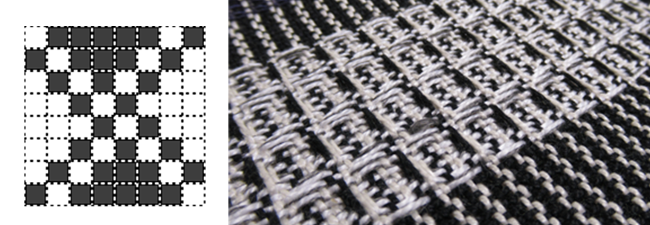
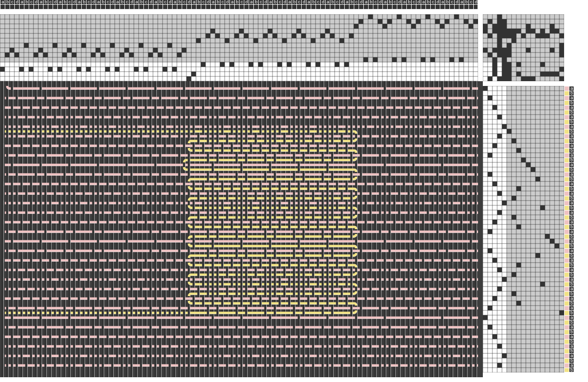
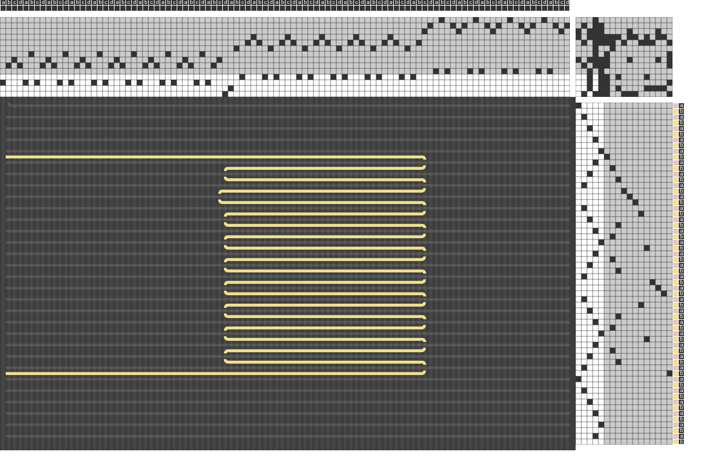
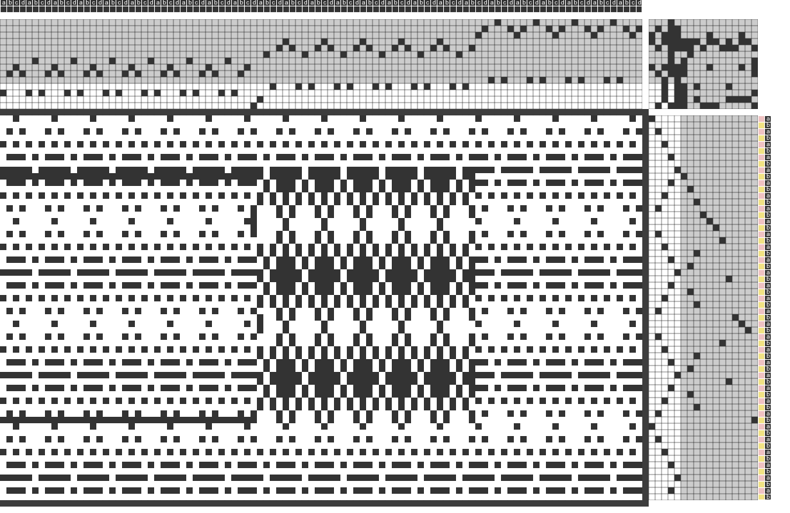
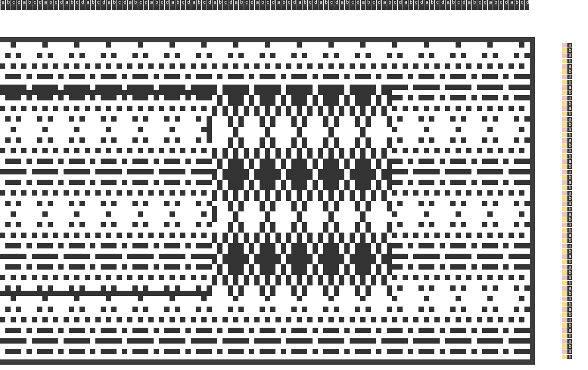

This video walks you through the process of drafting a force sensor using a waffle structure. The images below show details from different phases in the project.

<iframe width="560" height="315" src="https://www.youtube.com/embed/O9fLz6R60NA" title="YouTube video player" frameborder="0" allow="accelerometer; autoplay; clipboard-write; encrypted-media; gyroscope; picture-in-picture; web-share" allowfullscreen></iframe>

 

 

 

