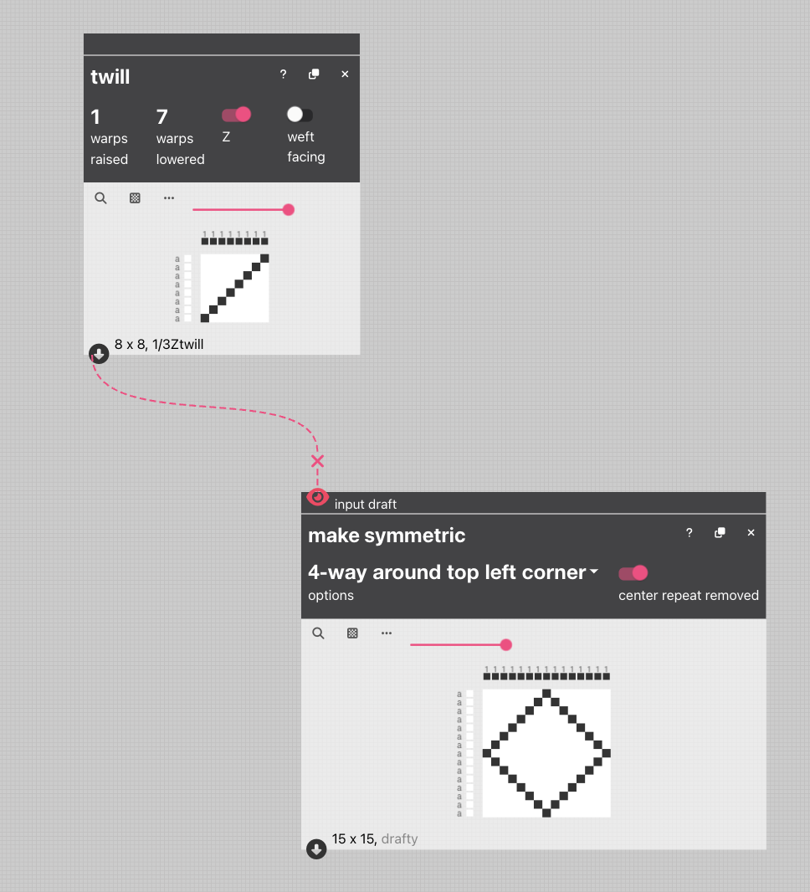
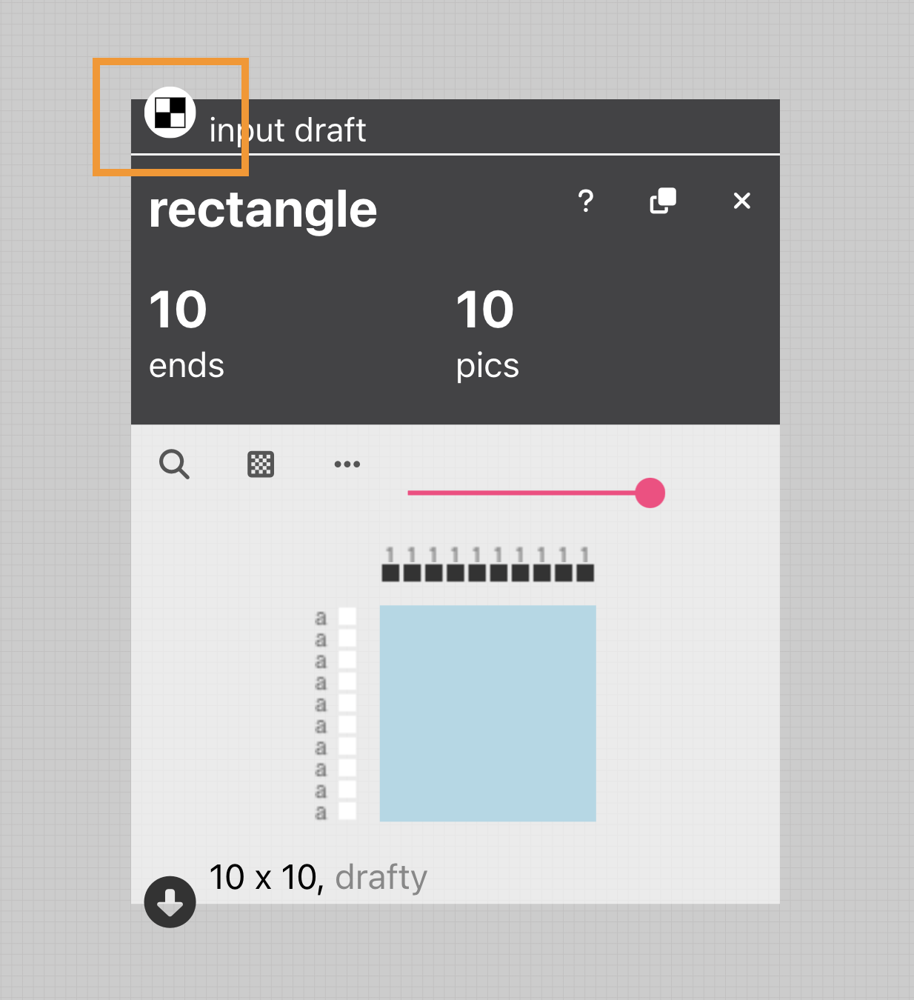
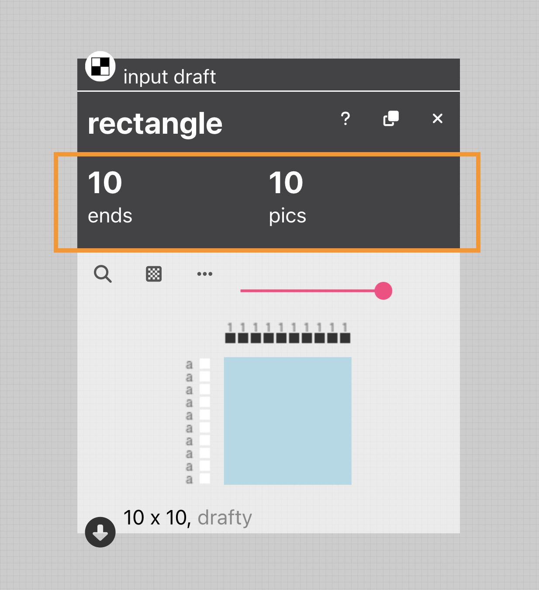
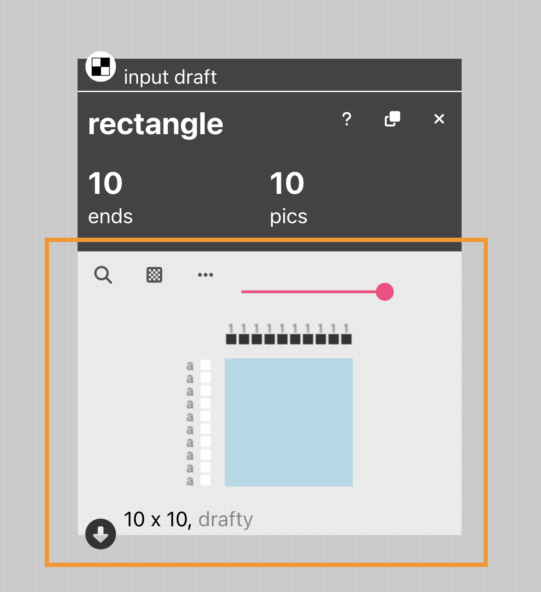
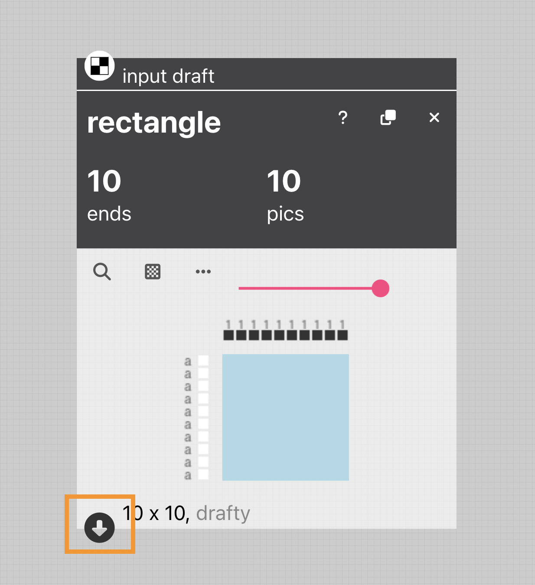

# Operation

Operations are little computational machines that take drafts as inputs, do something to them, and then spit them out as new and different, drafts. An operation consists of several parts:  [inlet(s)](inlet), [parameters](parameter), and a resulting [draft](draft) with an [outlet](outlet).  

In the image above, we see a `twill` operation connected to a `make symmetric` operation. the `twill` operation generates a twill structure. The specific kind of twill structure it generates is determined by the [parameters](parameter) associated with the `twill`  operation.  You can connect the [outlet](outlet) of the `twill` operation to the inlet of the `make symmetric` operation to chain them together. This will allow you to take the twill generated from the twill operation and rotate it around a corner to make it a symmetric pattern. Chaining operations together makes the design flexible so that if you change the parameters of the twill (say, from a 1/3 S twill to a 5/3 Z twill), it will automatically update the symmetric pattern as well. 

This style of making drafts foregrounds the similarities between the actions weavers perform to design different woven structures and patterns, and the way that programmers make computer programs by making small functions and sequencing together. Yet, in AdaCAD, you get cloth instead of code. 

## Understanding the Parts of an Operation

### Inlet

The small icon in the top left corner of the operation is an [inlet](inlet). Anything connected to an inlet will be used as an input to the operation. Some operations have no inlets (e.g like `twill` above) because they don't need an input to generate an output. Some operations have more than one inlet. Some inlets can accept only 1 draft, others can accept many. 

### Parameters

Under the name of the operation, in this case `rectangle` there is a list of [parameters](parameter) that are provided to the operation to inform the draft it will create. In this case, the parameters allow you to specify the number of ends and pics to be used in the generation of a rectangle. You can see the resulting draft has 10 ends and 10 pics. 

### Output Draft

Under the parameters, you can see the [draft](draft) that is generated by the operation. 

### Outlet

If you want to use this [draft](draft) as the input of another operation you can connect its [outlet](outlet), shown here, to the [inlet](inlet) of a different operation. You can connect a single outlet to multiple inlets. To make a connection, you click on the outlet first, then click on the inlet you want it connected to. 
