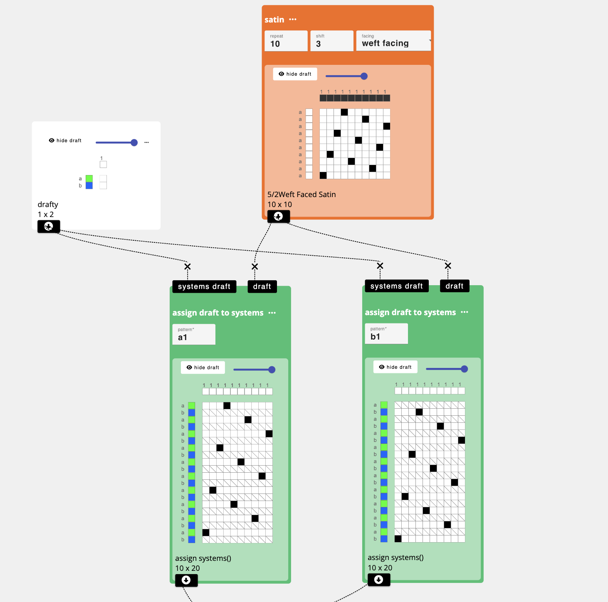
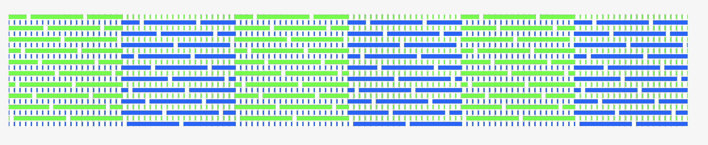

# Shape Changing Cloth using Over-twisted Linen

This tutorial explores the magical shape changing behaviors of overtwisted linen. This tutorial comes directly from [Kathryn Walters'](https://www.kmwalters.com/) PhD research as well as some experiments she explored during her time as an Experimental Weaver in Residence at the Unstable Design Lab. As she wrote in a 2024 publication about the project: 

"Linen fibres swell as they absorb moisture [1](#references). In a high-twist yarn the fibres are locked into place, and their swelling is transferred to the yarn. Textiles woven with this ‘animated’ linen yarn may exploit this property and exhibit hygromorphic behaviour: changing form when wet or exposed to high humidity, and relaxing in dry conditions"

## How it works
Increasing twist angle requires adding extra energy into the yarn through the twisting process. This energy, in excess of what is required to hold the yarn structure together, makes the yarn unstable. It will attempt to reach a lower energy state by untwisting, if one end is free, or by folding and twisting on itself, if there is slack in a length of yarn. When the yarn is woven into a textile, the yarn can no longer move itself to reduce energy, but may have enough energy to curl the corners of the textile, or even cause it to roll.

The other factor that makes it work comes from the nature of the linen fibre. Flax bast cells, chains of which make up linen fibres, are unusual because they have an extremely thick cell wall, containing primarily cellulose, and an extreme height:width ratio of over 1,000 [2]. The cells, and therefore linen fibre and yarn, swell as they absorb water. When a linen yarn with a large twist angle absorbs water, the swelling pushes on the twist, increasing the energy in the yarn.

:::tip

Read the research paper to find out how to can make your own shape changing linen yarns:

Kathryn Walters, Laura Devendorf, Karin Landahl. 2024. Animated Linen: Using high-twist hygromorphic yarn to produce interactive woven textiles. Forthcoming In Designing Interactive Systems Conference (DIS ‘24).

:::

Kathryn experimented and explored several combinations of linen overtwisted to different twist angles, directions, and combinations with weave structures they key to getting strong movement turned out to be: 

1. using yarns with a high twist angle, between 20–40°
2. integrating the linen with weave structures that have just-long-enough floats. In her research, she found that floats greater than 2mm and less than 14mm. Weave structure float length below 2 mm prevents pleating, while floats above 14 mm allow the yarn to escape the weave structure and spiral, reducing the pleating effect. She mainly used weft-faced satin weaves, which have long floats and evenly spaced binding points. 
3. when weaving with multiple wefts in the same row (as in the checked examples below), the wefts were clasped together at the edge of each check, rather than carried across the whole width. This allowed the twisted yarn to be worked in continuously in each region and did not create space for the yarn to move without pulling upon its neighboring yarns. 

The image directly above shows one line of experimentation that looks to how the float length affects the amount of cloth movement. Here, all samples are shown in their wet state and we see that some collapse more than others. 

The image directly above shows alone line of experimentation that looks to how structures affect movement and texture.

## Designing Shape Changing Cloth

Some of the most exciting movement and behaviors emerged when working with contrasting regions of S and Z twisted linen. In the image above, we explored how a weather activated garment might work. in high humidity, the sleeve might contract in upon itself to reveal move skin. The image below shows the specific combination of Z and S twist used in this example. 

In fact, through even more testing, Kathryn found that the arrangement of Z and S also determines if the cloth will fold in on the corners in cinch in from the edges. 

## Drafting Shape Changing Cloth

:::tip

Follow along with this example in AdaCAD 4: [Shape Changing Linen](https://adacad-4-1.web.app/?ex=animatedlinen)

:::

While the structure of this cloth is a simple satin, it gets a bit more complicated when we consider the example just above with alternating regions of Z and S twist. White it is possible to apply tapestry techniques by winding S and Z twist bobbins and manually insert and clasp them in their respective regions across the weft, the way we would approach drafting this in AdaCAD looks to distinguish the regions weaving S twisted bobbins and the regions weaving Z twisted bobbins by assigning them to separate [weft systems](../glossary/weft-system.md). This has the effect of raising only the S twisted regions, and only Z twisting regions on alternating [picks](../glossary/pick.md). 

### Assign S and Z Twisting Regions to Alternating Weft Systems

To implement this in AdaCAD, you would first add the *satin* operation and set the size and floats to match the specifications for your linen. Here, I use a 10-shaft satin as an example. 

Next, you would assign the satin to alternating picks, which we accomplish by assigning them to alternating [weft systems](../glossary/weft-system.md). 

We start by setting up a system's draft (directly above) that specifies that I'm only using 1 warp system but two weft systems, a and b (In the AdaCAD Editor you click the letter to change it to the next subsequent letter). We assign warp and weft colors as a guide to visualize the arrangement of regions. I use green to correspond to S twist, and blue to correspond with Z.

Next,I go back to the workspace and add two *assign draft to systems* operations. I input my systems draft using in the first inlet, and the draft I want to map to a system in the second. I specify "a1" to the [parameter](../glossary/parameter.md) field to tell the operation that I want to map my satin structure to weft system a and warp system 1. I repeat this process for the alternating regions by bringing in the same structure and systems draft, but assigning it to "b1" to indicate that I want the structure placed upon weft system b and warp system 1. 

:::info

You might notice some draft cells with a slash through them. We call these "unset" heddles and they indicate that there is no weft traveling over the warp within this region. 

:::

### Tile S and Z regions across the weft
Now I have two drafts, one that represents S twisting regions on system a and Z twisting regions on system b. Next, I need to arrange these structures into different regions. One way I could do this would be to generate an indexed colored graphic representing my regions in Photoshop and uploading with the *image map* feature. Instead, I'm going to do this using only AdaCAD operations. 

Specifically, I'm going to use *variable width sampler* and *variable length sampler* to create a checkerboard effect. 

I start by using the *variable width sampler*. This operation lets me specify a text based pattern and uses that pattern to create a design. Here, I input:

 `a20 b20 a20 b20 a20`
 
 to indicate that I want to have 20 ends of structure a, followed by 20 ends of structure b, followed by 20 more ends of structure a, followed by 20 more ends of structure b. If I put my draft corresponding to the S twist regions into "a", and Z-twist into "b". I chose 20 as the number of ends for each region because, since each structure repeats across 10 ends, it would divide evenly. If I wanted larger regions, I could use 40 or 50 ends. I could also change the numbers so each region is a different size but in this case, I'm keeping it uniform across 20 ends. The resulting draft is visualized as: 

I repeat this process to make the alternating row, but instead of "a20 b20 a20 b20 a20" I flip the order to:

 `b20 a20 b20 a20 b20`

creating the alternating combination of S and Z twist regions which AdaCAD visualizes as:

### Tile S and Z regions across the warp

Now that we have the two alternating rows we are going to use to create our checkerboard, we can alternating them along the length or warp direction by using the *variable length sampler* operation. This operation will take the two pattern rows I have created above and place them across a specified number of picks. Since each row is 20 picks tall, I chose 20 for simplicity. However, you can adjust this number to make sure that your regions structures come out square. In my case, I use the pattern: 

 `a20 b20 a20 b20 a20`

again but in this operation, it means that I want structure/row a repeated across 20 picks, then b repeated across 20 picks, and so on. 

### Adapt to Your Loom
When we go to the detail/editor view on the final checkered draft, we can change between different loom types to see how many frames and treadles we would need to replicate this design. 

The graphics above show the resulting draft in both a zoomed out and zoomed in state. You can see that the threading follows a fairly standard block setup and uses 20 frames (10 for each satin system). If you wanted to modify this to more or less frames, we could simply go back to our original design and change the size of our satin. For example, if we change it to a 5-shaft satin, we can weave this on 10 frames, and if we change to a 3/1 twill, we can reduce to 8 frames. 

### Exploring Glitch Satin 

Unstable Design Lab PhD [Deanna Gelosi](https://www.deannagelosi.com/) collaborated with Kathryn to explore if computationally generated drafts might reveal new possibilities of cloth movement. While we didn't discover many new possibilities, we did generate some new satin producing functions to play with in AdaCAD. Specifically, *glitch satin* will randomly generate a satin structure across a user-specified number of ends and pics and contains warp and weft faced floats that range between two float lengths supplied by the user (min-float and max-float). A final [parameter](../glossary/parameter.md) called frequency controls determines the how likely the floats are to be longer or shorter end of the range you specified. 

## References

1. Abdul Moudood, Anisur Rahman, Andreas Öchsner, Mainul Islam, and Gaston Francucci. 2019. Flax fiber and its composites: An overview of water and moisture absorption impact on their performance. Journal of Reinforced Plastics and Composites 38, 7 (April 2019), 323–339. https://doi.org/10.1177/0731684418818893

2. Sara J. Kadolph. 2014. Textiles: Pearson New International Edition. Pearson Education, Essex, UK.

3. Ann Richards. 2012. Weaving textiles that shape themselves. The Crowood Press, Ramsbury, UK.