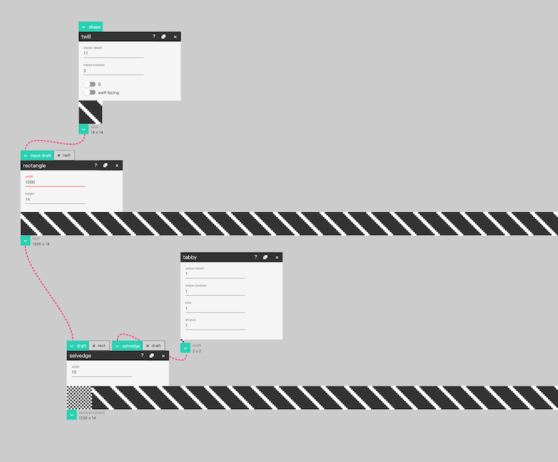
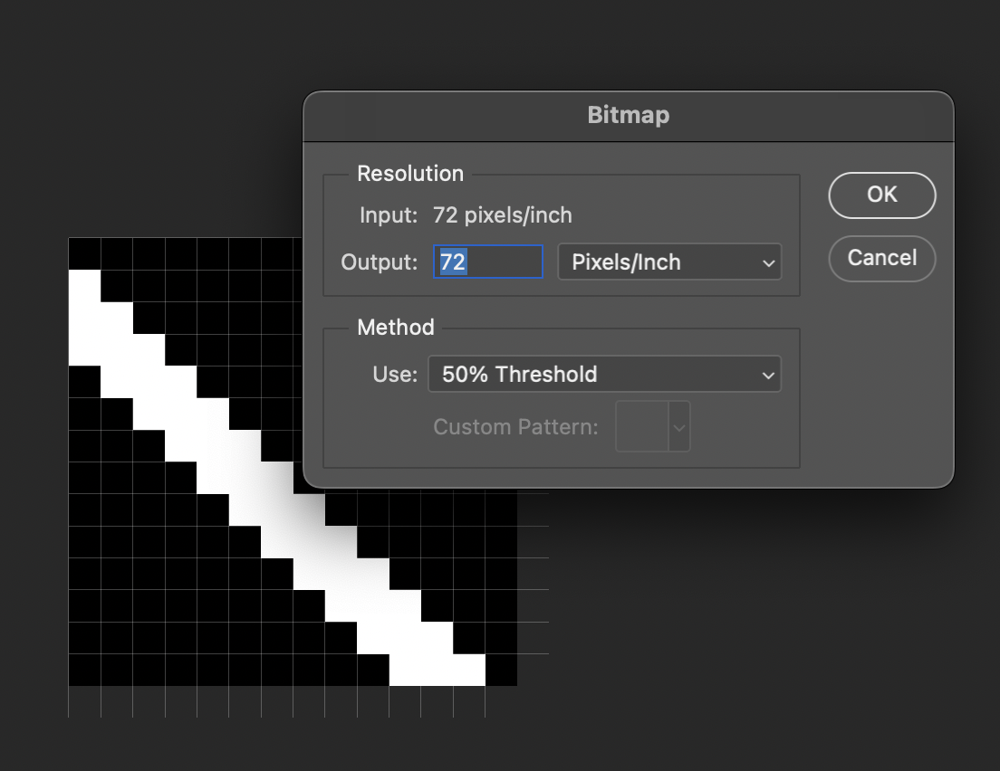

# Make A Draft for the TC2

AdaCAD an be a bit strange for those used to Photoshop and the Woven Pixel because instead of making a blank canvas and filling it with our structures, you start from the structures and "grow" them into the size of the canvas/loom that you are working with. In this tutorial, we do this by using the *twill*, *rectangle* and *selvedge* functions. After designing out draft, we'll export it as a [bitmap image](../glossary/bitmap-image.md) and reformat it so that it works with the TC2's interface. 

## Step 1: Make a Draft to Weave

In this file, we show a sample workflow for quickly producing a repeating pattern of a twill to weave. We generate a twill via a *Twill* operation (top) before connecting it to a *Rectangle* operation. The rectangle operation repeats the twill across a user specified number of picks and ends. Here, we have selected 1200 ends and 14 picks. 1200 because our loom is 1230 ends wide (and we will add 30 ends of selvedges), and 14 because the twill we created will repeat every 14 picks. We take the output of the *rectangle* operation and connect it to the *selvedge* operation to add a user-specified number of ends of selvedge to the design. We connect the [outlet](../glossary/outlet.md) of our rectangle draft to the "draft" [inlet](../glossary/inlet.md) to specify this as the body of our cloth. The *selvedge* operation also takes a second draft into the "selvedge" [inlet](../glossary/inlet.md) that it will use as a repeating structure within the selvedge regions. Here, we use a *tabby* operation as the selvedge structure and specify that we want 15 ends of selvedge on each side of the cloth. The generated draft reflects these parameters and when we look at the size of the design, it is 1230 x 14, which is the size of our loom x the size of the repeat for this structure. Note: AdaCAD beta will repeat the base cloth and/or selvedge structures so they repeat at even intervals. 

There are many other workflows that can make valid drafts for the TC2. For picture weaving, explore the *image map* operation. For sampling multiple structures you can explore *join top*, *join left*, and *variable width sampler* to arrange multiple drafts into drafts for the TC2. 

## Step 2: Download the Bitmap From AdaCAD

You can download the draft by hovering your mouse over the [outlet](../glossary/outlet.md) of the draft you'd like you download and select "download as bitmap." The bitmap exported from AdaCAD uses a .jpg format (because we haven't figured out a way to download directly to BMP or TIFF just yet). You need to formally convert the .jpg that AdaCAD generates to a bitmap format for it to be read, which we show in the next step.

## Step 3: Reformat as a .TIFF file in Photoshop

Each draft created in AdaCAD can be exported as a bitmap image, however, the files exported need to be processed to be converted into true bitmap that can be read by the TC2. This can be accomplished by opening the bitmap generated by AdaCAD in Photoshop, selecting Image->Mode->Greyscale:

Then, selecting Image->Mode->Bitmap. Selecting the bitmap mode will ask you to agree to flatten layers (say OK), then will give you options for resolution. Set resolution to the automatic value (72 Pixels/Inch) and then for the "Method" category, select "50% Threshold". This will take any pixel that is more than 50% black, and make it black, and any that is less than 50% black, and make it white. 

Then hit "Save As" and select "TIFF" as the format and you are ready to use this file on your TC2. 

More information: 
[The Woven Pixel: Designing for Jacquard and Dobby Looms Using Photoshop®
Schlein, Alice, and Ziek, Bhakti Bridgewater Press 2006](https://www.handweaving.net/document-detail/8419/the-woven-pixel-designing-for-jacquard-and-dobby-looms-using-photoshop-schlein-alice-and-ziek-bhakti-bridgewater-press)

## Video Example (made in a previous version of AdaCAD) 

<iframe width="560" height="315" src="https://www.youtube.com/embed/W3Pipzi67wg" title="YouTube video player" frameborder="0" allow="accelerometer; autoplay; clipboard-write; encrypted-media; gyroscope; picture-in-picture; web-share" allowfullscreen></iframe>

