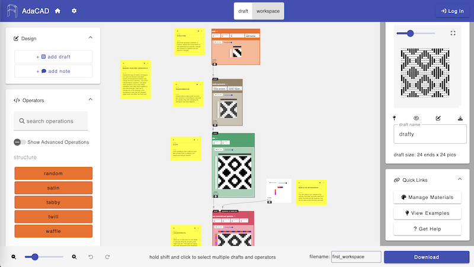

# Compare Versions
We are continually updating AdaCAD to experiment with new features so we offer different version of the software for you to use. Currently, you can use AdaCAD 4 or AdaCAD 3. We outline details of each version below. 

import Tabs from '@theme/Tabs';
import TabItem from '@theme/TabItem';

<Tabs>
<TabItem value="adacad4" label="AdaCAD 4 (beta)" default>

AdaCAD 4.0 is available at [https://adacad-4-1.web.app/](https://adacad-4-1.web.app/). 

This is the "beta" version of the software which means that it is currently being tested few more bugs (which we rely on the community to tell us about!).
</TabItem>

<TabItem value="adacad3" label="AdaCAD 3 (stable)" default>

   

AdaCAD 3.0 is available at [https://adacad.org/](https://adacad.org/). 

This is the "stable" version of the software which means that it has been tested more deeply than the beta version. 

</TabItem>

</Tabs>

## Compare Features 
The following table lists a series of features as well as the availability of that feature in each version of AdaCAD

| Feature    | AdaCAD 3 | AdaCAD 4
| -------- | ------- | -------- |
| Support for Direct Tie, Harness, and Jacquard Looms | yes  | yes |
| Set Custom Number of Frames and Treadles | yes  | yes |
| Save Workspaces as .ada Files to Your Computer  | yes  | yes |
| Save Workspaces to a personal AdaCAD account  | no  | yes |
| Load Workspaces from your Computer to AdaCAD | yes | yes |
| Load Workspaces from a personal AdaCAD account | no | yes |
| Save Drafts as Bitmap, Image, or .WIF file  | yes  | yes |
| Customize the Draft Origin | yes  | yes |
| Select Multiple Elements on the Workspace at Once | no  | yes |
| Draw Directly Upon the Workspace to Make Graphics | yes  | no |
| Define Custom Colors and Materials | yes  | yes |
| Visualize a Draft as Floats with Colors | yes  | yes |
| Support for Different Material Sizes | no  | no |
| Add Notes to Workspace | yes | yes |
| Examples Available in the Software | yes | yes |
| Undo/Redo | yes (only on changes made on workspace) | yes (everywhere) |
| Zoom In / Zoom Out | yes  | yes |

