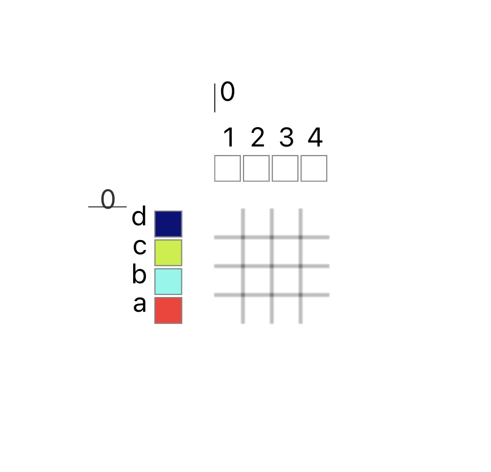

# Layer Notation

Layer notation emerged in conversation with [Kathryn Walters](https://www.kmwalters.com/pattern), who wanted AdaCAD to help her manage complex structures that could arbitrarily map warp and weft systems to different layers, layer orders, or even different numbers of layers (e.g. a structure that goes from 2 to 4 to 3 layers for instance.) Beyond her immediate needs, we found it to be a useful system for describing the relationship between different cloth layers. 

Layer notation essentially describes the behavior of layers in a cloth independent of the structures that will be mapped onto the layers. Put another way, it is a way or organizing weft and warp systems so that they bind into layers in specific ways. 

## Layer Notation Format
To use the Layer Notation, you must first know the relationship between different warp and weft systems in your cloth. Specifically how many different warp and weft systems my cloth will use. 

The image above represents the warp and weft system mappings for a piece of cloth. Specifically, it contains four warp systems (labeled 1, 2, 3, 4) and four weft systems (labeled a b c d). As a rule of thumb, when I work with multiple layers, I create as many warp systems as there are layers.

Next, I consider the relationship between warp/weft systems and layers. I then describe each set of systems associated with a layer as a group within parenthesis. So for example: 

- `(a1b2c3d4)` places all warps and wefts on a single layer.
- `(a1b2)(c3d4)` places systems a1 and b2 on the top layer and c3 and d4 on the second, bottom, layer.
- `(a1)(b2c3d4)` places systems a1  on the top layer and b2, c3 and d4 on the second, bottom, layer.
- `(a1)(b2)(c3)(d4)` places system a1 on the top layer, b2 on the second, c3 on the third, and d4 on the fourth layer.
- `(c3)(d4)(a1)(b2)` places system c3 on the top layer, d4 on the second, a1 on the third, and b2 on the fourth layer.

The power of layer notation is its flexibility. Any set of warp and weft can be assigned to any layer. 

## Rules
Certain rules must be followed in order to ensure layer notation works correctly: 

1. all layer groups must include at least one letter (e.g. a) followed by a number (1) and be enclosed in parenthesis. 
    - valid: `(a1)`, `(a1b2)`
    - invalid: `()`, `(1a)`
2. each weft and warp system may only be assigned to one layer group. 
    - valid: `(a1)(b2)`, `(a1b2)`
    - invalid: `(a1)(b1)`, `(a1)(a2)`

3. Exception: if you would like to float a weft system between layers, you may do so by specifying the weft system and not a warp system. For example `(a1)(b)(c2)` will float weft system b between layers 1 and 2. 

