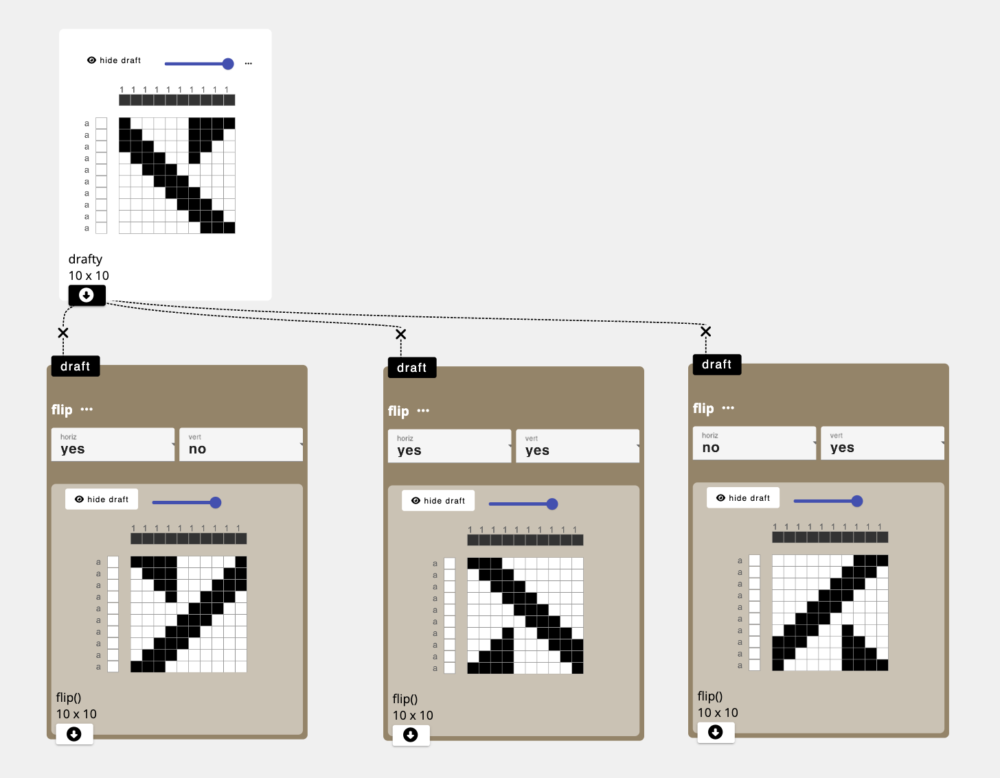

# flip

## Parameters
- `horiz`: reflects the draft from left to right
- `vert`: reflects the draft from top to bottom 

## Description
Generates an output draft that mirrors the input draft from left to right and/or top to bottom as the parameters indicate.

## Application
Can be used to create structures that include rotations of a basic motif

## Developer
adacad id: `flip`
