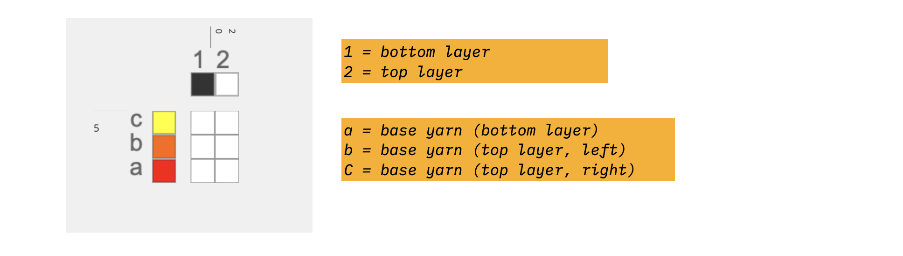

# Woven Force Sensor

In this tutorial, we are walking you through the process of creating robust force sensors. We refined and tested this design while making the [A Fabric that Remembers](https://unstable.design/a-fabric-that-remembers/) project. Our design features the use of a woven pocket structure filled with conductive felt.  We describe our design process in detail in a [2022 publication entitled Introduction to Weave Structure for HCI](../../about/resources/introtoweavestructure.pdf) 

:::tip

Follow along with this example in AdaCAD 4: [Force Pocket](https://adacad.org/?ex=forcepocket)

:::

## Operations Used
<OpLink name="imagemap"/><OpLink name="assign_systems"/><OpLink name="overlay_multiple"/>

## How it Works
We consider a force sensor to be any assembly of materials that produces reliable changes in electrical resistance based on the amount of force applied. In this example, our sensor is made by way of a conductive felt: when the felt is compressed, the conductive fibers come into close contact, thereby reducing electrical resistance. When released, the fibers return to their uncompressed state with a relatively high electrical resistance. The woven structure serves as a container for the felt. Specifically, the woven structure creates a felt sandwich whereby the top and bottom of the pocket contain separate conductive traces (one on top and one on bottom) and the felt in the middle changes resistance. When we connect a multimeter to the conductive yarns integrated into the top and bottom of the pocket, we can measure the changes in resistance when the pocket is pressed. The design also includes a pocket opening, allowing easy replacement of the felt pad if needed. 

To understand this construction, we will "work up" from the basic structures and techniques involved before arriving at our final structure

## Drafting a Pocket
First, we can think about making a pocket in AdaCAD. One way we can do this is using the  <OpLink name="imagemap"/> operation. To use this operation, we would create a 2-color [indexed color](../../reference/glossary/indexed-color-image.md) image where 1 color will correspond to a 2-layer region and a second color will correspond to a single layer or bound two layer structure. 

If we upload the image above to the <OpLink name="imagemap"/> operation in AdaCAD, we can assign any single layer structure to the red regions and any two layer structure to the yellow regions. Upon weaving, a pocket will form. 

One thing to consider here is how to make the single and double layer structures compatible in terms of how densely the weft will pack. Do do this, I'm going to start by defining my warp and weft [systems](../../reference/glossary/system.md). Two create two layers, I'm going to use two warp systems (1 and 2). I'm also going to use two weft systems (a and b). 

I'm going to them use this systems draft as an input to my <OpLink name="notation"/>, which will allow me create drafts that use this system information to place different structures on different layers. For my two layer region, I will use the pattern `(b2)(a1)`. This will create two layer draft, the first on systems b2 and the second on systems a1. I can then connect structures to each inlet to determine which structures I want on the top and bottom layer. For the single layer region, I'll use the pattern `(b2 a1)`, which means to apply a structure over all draft cells in a single layer.  

One final consideration is that we weave this structure this pocket will be inset into the cloth, meaning that anything inserted in the pocket would have to be inserted via the shed at weaving time. 

To make the pocket accessible, lets create an opening. 

## Drafting a Pocket Opening
To create an opening on one side of the pocket opening, we use partial weft insertions. Specifically, instead of weaving one weft across the full width, we insert the weft and pull it out at a certain spot along the width. I then repeat the process with a second weft, inserting from the other side of the cloth and pulling it out at the same location. As long as I do not "clasp" the wefts around each other, an opening will form. To represent this on our image map, I "split" the pocket region into two. The border between the two pocket regions form the location of the pocket opening. 

To ensure that I pull the wefts out at precisely the right location, I represent these partial insertions in my draft by using 2 weft systems instead of one. So, where I used wefts a and b above, I will now use wefts a, b, and c. `a` will represent the bottom of the pocket that does not open, and `b` and `c` will represent the left and right sides of the pocket opening. 

To make this, I replace my image map with an image that has regions that can take different structures on the left and right sides. I then update my systems map to include system `c`. I also update my <OpLink name="notation"/> to create four different structures instead of just 2: 

- Single layer (red regions) - `(b2 a1)` 
    - - weaves on a and b, c is left blank, indicating no weft insertion on that weft
- Single layer (green regions) - `(c2 a1)`
    - - weaves on a and c, b is left blank
- 2 layer (yellow regions, left) - `(b2)(a1)`
    - - same as before
- 2 layer (blue regions, right) - `(c2)(a1)`

By splitting out the left and right sides of the pocket opening onto adjacent structures we can ensure that the bottom (a1) weaves continuously while the top face of the cloth opens along the vertical line between the yellow and green regions. 

## Adding in Conductive Pads 

We're almost there, our last step is to add some conductive traces on the underside of the top layer and another trace on the top face of the bottom layer. We can use the same image map from the last step, though, we'll modify the drafts that fill the regions to include our 2 new weft systems (which I'll call `d` and `e`). 

When we update our system draft, it will update for all structures, ensuring that the system map follows the same sequence along the entire cloth even if, on some picks, we do not raise any heddles (and thus, skip an insertion on this line). 

We'll just plan to have the conductive inserted into the region on the image map that is currently yellow (the bulk of the pocket). To do this,  I'm also going to update the `layer notation` function to the pattern sequence `(b2 d2)(a1 e1)` to indicate that both systems b and d will weave on the top layer and systems a and e will weave on the bottom layer. Now, I need to create a draft that will map to systems a and e on the bottom and b and d on the top. 

On the bottom, we will still want our base structure to be the same, meaning that if our base structure for the pocket is tabby, we'll want system a weaving tabby. To make a strong conductive pad inside the pocket, we'll use a weft-faced structure, like a 1/4 twill, to create a conductive pad that sits upon the top face of the lower pocket (making the conductive mostly invisible on the visible bottom of the cloth). 

To do this we create an intermediate structure before mapping into our <OpLink name="notation"/>. Specifically, we'll create a systems map for the bottom of the pocket specifically (a and e on 1). Then, we'll assign our tabby to a1 using <OpLink name="assign_systems"/>. We'll also create a second  <OpLink name="assign_systems"/> to map our weft-facing twill to system e1. To fuse these separate system assignments into a single assignment, we use <OpLink name="overlay_multiple"/>. 

This creates a draft of the relationships between a and e, which we can then feed into the (a1 e1) inlet in our <OpLink name="notation"/> operation used to map to the yellow regions.

For the top face (systems b, d, and 2) we do the same, only using a warp faced twill instead of a weft faced twill to ensure that the conductive sits on the bottom side of the top of the pocket. When we repeat that process together and connect it all together, you'll get something that looks like this: 

and a draft like this: 

