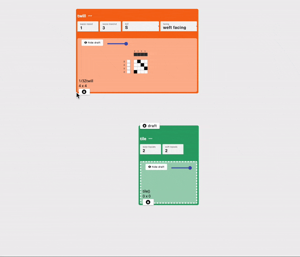

# Dataflow Drafting

In AdaCAD, drafts can be generated and modified algorithmically by creating dataflows. This form of design (of generating designs via algorithms rather than explicitly drawing them) is called [parametric design](../../reference/glossary/parametric-design.md). In a parametric design workflow individual operations can be chained together to sequentially manipulate drafts according to specific user-defined parameters. This process might be unusual for many but it offers the ability to be playful (e.g. randomly chain things together and see what kinds of structures they make) or, to encode complex structures in ways that help make the logic understandable and easily adjustable to different looms or yarns. 

To help you make your own custom dataflow, this page will help you: 

1. [Develop an understanding of operations](#understanding-operations)
2. [Explore the kinds of operations AdaCAD offers](#kinds-of-operations)
3. [Connect operations together into a dataflow on the AdaCAD workspace](#chaining-operations-into-a-dataflow)
4. [Explore additional Resources](#more-resources)

We also offer this video overview of the process of making dataflows: 

<iframe width="560" height="315" src="https://www.youtube.com/embed/kqIYEEV04kM?si=9pgVrze9bFJbVu4K" title="YouTube video player" frameborder="0" allow="accelerometer; autoplay; clipboard-write; encrypted-media; gyroscope; picture-in-picture; web-share" allowfullscreen></iframe>

## Understanding Operations
You can think of AdaCAD Operations as guitar effects pedals. Just as a guitar effects pedal takes a sound signal into an input port, modifies it based on the value of the knobs and the internal hardware of the pedal, and outputs the modified sound via the output port, operations in AdaCAD take drafts into their ["inlets"](../../reference/glossary/inlet.md), modify those drafts according to the operation's code and user specified [parameters](../../reference/glossary/parameter.md) and outputs the modified draft via the ["outlet"](../../reference/glossary/outlet.md). And just as multiple guitar pedals can be chained together to further augment the sound, AdaCAD operations can be chained together to further augment the drafts. 

The figure below shows how this interaction takes place within the AdaCAD workspace with the [stretch](../../reference/operations/stretch.md). The stretch operation pictured below receives the input draft into it's inlet. The user then changes  "warp-repeats" and "weft-repeats" [parameters](../../reference/glossary/parameter.md) to indicate the number of time they want each warp end and weft pic to be repeated. When the value of the parameter changes, AdaCAD update the output draft.  

## Kinds of Operations
AdaCAD currently offers over 60 different operations. You can explore every operation by vising [Reference->Operations(A-Z)](../../reference/operations/index.md) in the sidebar on the left of the page. Operations are organized into different categories based on their typical use within a drafting process. These categories are also color-coded on the interface. 

- [**Structure (Orange)**](../../reference/operations/index.md#structure) Operations: such as [tabby](../../reference/operations/tabbyder.md), [twill](../../reference/operations/twill.md), and [satin](../../reference/operations/satin.md) generate structures that obey the rules of a given family.
- [**Transformation (Tan)**](../../reference/operations/index.md#transformation) Operations: such as [invert](../../reference/operations/invert.md), [shift](../../reference/operations/shift.md), and [make symmetric](../../reference/operations/makesymmetric.md) modify an input draft according to the specific rules of the transformation applied. 
- [**Cloth (Dark Green)**](../../reference/operations/index.md#cloth) Operations: such as [rectangle](../../reference/operations/rectangle.md), [tile](../../reference/operations/tile.md), and [image map](../../reference/operations/imagemap.md) are intended to be used to arrange and/or repeat different structures across the surface of a cloth. 
- [**Compound (Bright Green)**](../../reference/operations/index.md#compound) Operations: such as [interlace wefts](../../reference/operations/interlace.md), [assign draft to systems](../../reference/operations/assign_systems.md), and [splice in pics](../../reference/operations/splice_in_wefts.md) support joining different structural elements together into compound weave structures characterized by the use of multiple weft and warp systems and/or layers.
- [**Dissect (Blue)**](../../reference/operations/index.md#dissect) Operations: such as [deinterlace wefts](../../reference/operations/deinterlace.md), split a single draft into multiple drafts according to some criteria. 
- [**Compute (Deep Violet)**](../../reference/operations/index.md#compute) Operations: such as [overlay](../../reference/operations/overlay.md) and [overlay](../../reference/operations/mask.md), apply different forms of computational, binary, and/or mathematical functions to the modification of drafts. 
- [**Helper (Violet)**](../../reference/operations/index.md#helper) Operations: such as [selvedge](../../reference/operations/selvedge.md) automate common drafting techniques to ensure good woven and cloth structure.
- [**Color Effects (Magenta)**](../../reference/operations/index.md#color-effects) Operations: such as [set weft materials](../../reference/operations/apply_weft_materials.md) allow you to specify materials in order to describe different color effects on the woven cloth
- [**Drafting Styles (Camel)**](../../reference/operations/index.md#drafting-stles) Operations: such as [make drawdown from threading, tieup, and treadling](../../reference/operations/floor_loom.md) allow you to convert of one style of drafting to another, based on the requirements of specific equipment

<!-- 

A typical dataflow might connect operations of different types in a particular order. For instance, the dataflow usually begins with the creation of a structure that is transformed and expanded or repeated over the cloth. Color sequences can be added at the end to support visualizing the visual affects of different warp and weft yarn color combinations. 

<a class='button_open primary' href="https://adacad.org/?ex=first_workspace" target="_blank">Open the "Getting Started" Workpace</a> to play around with this sequence for yourself
 -->

## Chaining Operations into a Dataflow

You create a dataflow by connecting the [outlet](../../reference/glossary/outlet.md) of one operation or draft node to the [inlet](../../reference/glossary/inlet.md) of and operation node. To create a connection, start by clicking the outlet of one node (node a - twill in the example below) to the inlet of another (node b - tile in the example below). This action tells AdaCAD to take the draft created node a and use it as an input to the operation at node b. Node b then runs the operation, and manipulates the draft in accordance with that operations specific code and user-defined parameters. You can export the draft created by any node as a bitmap, image, or .wif file by double-clicking the draft and selecting the format you'd like to download. Additionally, you can open any draft generated in the dataflow in the editor for further tweaking by double-clicking and selecting "open in editor" 

Multiple operations can be chained together into a dataflow, as shown in the image above. A typical dataflow connects operations of different types in a particular order. For instance, the dataflow usually begins with the creation of a structures that are transformed,  expanded or repeated over the cloth. Color sequences can be added at the end to support visualizing the visual affects of different warp and weft yarn color combinations. At the end of the workflow, the draft is usually adapted to meet the specifications of your loom. For a TC2, you can use the [rectangle](../../reference/operations/rectangle.md) operation to repeat your design over a region the size of your loom (for us, it's 2640 ends). For a dobby or floor loom, you can pipe the final draft into the ['generate floor loom threading and treadling from drawdown'](../../reference/operations/floor_loom.md) to generate three drafts representing the threading, treadling, and tieup required to reproduce the design. 

After you have created a dataflow, start to play. Anything you change will ripple down the entire flow, changing your result!

## More Resources

- Learn more about Dataflows in the [Glossary](../../reference/glossary/dataflow.md)
- Play with pre-made dataflows for common weaving tasks with [Templates](../templates/picture-weaving.md). 
- Learn about advanced dataflows we created to support our projects in [Examples](../examples/lattice-tutorial.md). 
- if you like programming, explore how [you can write your own operations](../../develop/makeanoperation.md).
- want to explore link between algorithms and draft making? Feel free to [download our paper that describes drafting, structures, and operations in the context of making woven force sensors](../../about/resources/introtoweavestructure.pdf). Pages 3 - 11 include a workbook for people to follow to learn for themselves. 
- To better understand the potential benefits of designing with dataflows you can read our [2023 publication, AdaCAD: Parametric Design as a New Form of Notation for Complex Weaving](../../about/research.md#adacad-parametric-design-as-a-new-form-of-notation-for-complex-weaving-chi-2023). 

<!-- 
### Benefits of Designing with Dataflows
Our idea to use this dataflow approach to drafting emerged from two shared experiences: 

(1) a frustration with clicking point paper cells, particularly with making complex structures
(2) the realization that we, and other weavers, were implicitly performing algorithmic design and programming when drafting cloth. Weave drafts follow algorithms, or specific rules for how they place interlacements in relation to one another. These algorithms reveal different patterns in the draft, and subsequently, different structural and mechanical features in the cloth. 

For example of a simple operation performed by weavers is what we call, *invert* (shown above in example a). *Invert*  changes all the black cells in a draft to white and vice versa. Weavers often perform this operation when working with unbalanced structures and contrasting colors in the warp and weft. In these cases "inverting" the draft has the effect of making the warp or weft color more dominant in a region of the cloth. 

Another example is a *stretch* operation (shown above in example b), which repeats each interlacement across a user-specified number neighboring of warps and wefts. A weaver might do this if they find that their cloth is not weaving square (e.g. it's building more in the length then width). They can correct this imbalance by adding warp repeats, effectively stretching the structure across the width so it can square up with the height. AdaCAD contains numerous operations to do common and unusual things to drafts. 

As a computer scientist by training, Laura implemented the dataflow approach because to her, writing the code was faster than clicking the pixels. Additionally, it opened up new ways of exploring the design space for weaving by creating generative workflows that could create a variety of different drafts that all obeyed the same set of rules and relationships that would be required to make cloth of a particular type. 

In presenting this approach to other weavers, and building out new features in the software, we learned that the dataflow approach also has some benefits in that it documents the rationale behind a given design....not just the outcome. The rationale, visible in the dataflow, can be used to share a design with someone else or to simply enable someone to identify where a specific error occurred within their design without starting the draft again from scratch. We describe these results in detail in our [2023 publication, AdaCAD: Parametric Design as a New Form of Notation for Complex Weaving](../../about/research.md#adacad-parametric-design-as-a-new-form-of-notation-for-complex-weaving-chi-2023). 
 -->
