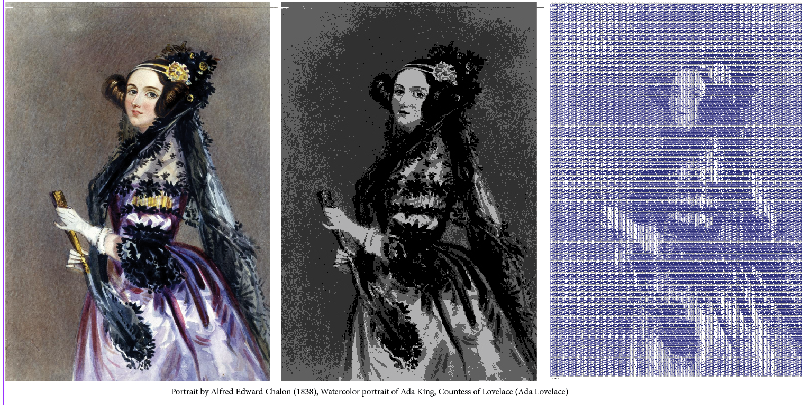
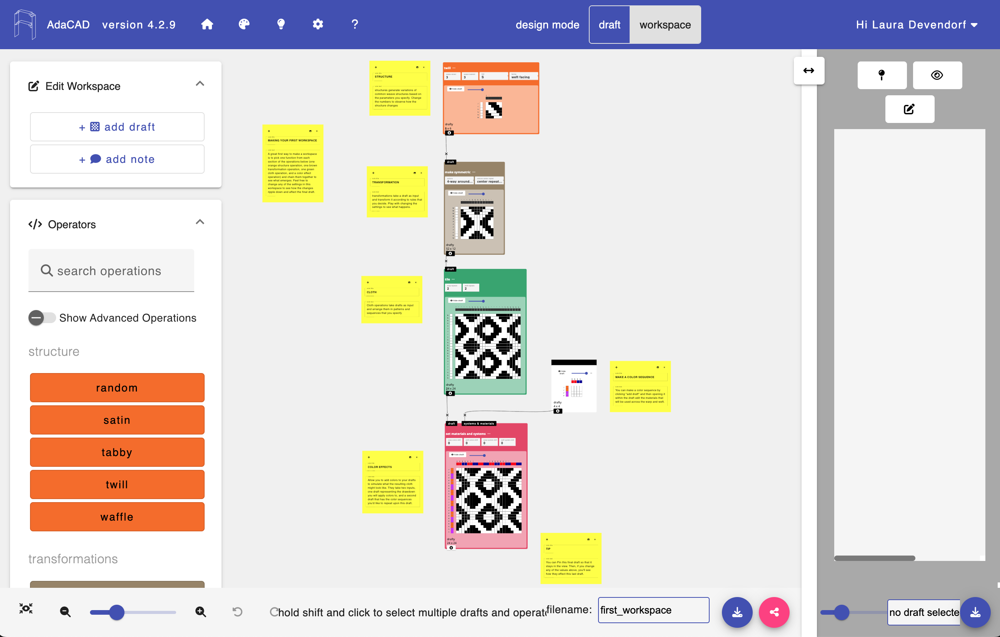

import Tabs from '@theme/Tabs';
import TabItem from '@theme/TabItem';

# Getting Started
At a high level, using AdaCAD involves the following steps: 

1. **Open an AdaCAD Workspace:** To start using AdaCAD, visit [adacad.org](https://adacad.org/).Looking for an older version of AdaCAD? Find it on the [compare versions](../../about/compare_versions.md) page. 

2. **Create a Draft:** There are two ways you can make a draft in AdaCAD: In what we call [traditional drafting](./editor.md) of drafting on point paper or by  [dataflow drafting](./dataflow.md) You can switch between these two modes by using the "design mode" toggle in the header. 

3. **Weave the Draft:** Once you have created a draft, [weave it on your loom](./weave.md). You can export drafts from AdaCAD to upload to computerized looms such as the TC2 or AVL Compudobby Loom. You can also manually follow patterns to setup analog looms.

4. **Contribute:** We'd love to see what you made and to share it with the community. The best way to do this is to join the [AdaCAD Discord Community](https://discord.com/invite/Be7ukQcvrC) and share it via the 'project sharing' channel. Alternatively, you can email your design and creation to unstabledesignlab@gmail.com or share it on Instagram by tagging [#adacad](https://www.instagram.com/explore/tags/adacad/). 

Below, we'll walk through these steps in the context of your choice of project which you can select below:

<Tabs>
<TabItem value="image" label="Figure Weaving for Jacquard" default>

In this example, we'll generate a workflow for uploading an image and assigning shaded structures to different color regions of the image. 

**What You'll Need**
- An indexed color image. If you don't have one handy, you can download one [here](./img/ada_indexed_color.png)
- A blank workspace at [adacad.org](https://adacad.org). 

**Process**
1. Select or Search for the [`image map`](../../reference/operations/imagemap.md) operation from the list of operations on the left sidebar. If it is not showing up, make sure "Show Advanced Operations" is selected. After you select the operation, it will be added into your workspace. 

2. Add your image to the image map operation by clicking the "Choose File" button in the image map operations [parameters](../../reference/glossary/parameter.md) list. After clicking, a window will open that lets you select an image file from your computer. Navigate to the index colored image you'd like to use and then hit "upload" in the operation parameters. 

*After you hit upload AdaCAD will start processing the image behind the scenes. It reads the image, analyses the colors, and updates the width and height parameters on the operation to match the size of your image. For every unique color that AdaCAD locates in the image file, it creates an [inlet](../../reference/glossary/inlet.md) associated with that color.  If you think it did this incorrectly, or that it generated more colors than you intended, click the View/Edit Image button to open a window that will allow you to group colors together so they behave as one*

2. Now you are going to add structures to fill the different color regions of your image. We'll do this by creating different shaded satins. Select or search for the [`shaded satin`](../../reference/operations/shaded_satin.md) from the operations menu to add it to the workspace. Modify the [parameters](../../reference/glossary/parameter.md) until you reach your desired satin. 

3. When you reached your desired satin draft, connect the [outlet](../../reference/glossary/outlet.md) of the shaded satin operation and connect it to an [inlet](../../reference/glossary/inlet.md) on the image map operation. Since each inlet is associated with a different color in the image, the draft you connect to the inlet will correspond to the draft the fills those color regions of the image. 

</TabItem>
<TabItem value="sampler" label="Drafting for Harness Looms" default>
</TabItem>
</Tabs>

## Step 1: Open an AdaCAD Workspace

<!-- <a class='button_open secondary' href="https://adacad.org/" target="_blank">Click Here to Open a Workspace</a> -->

To start using AdaCAD, visit [adacad.org](https://adacad.org/).

Looking for an older version of AdaCAD? Find it on the [compare versions](../../about/compare_versions.md) page. 

## Step 2: Create a Draft
There are two ways you can make a draft in AdaCAD: Draft Mode and Workspace Mode. You can switch between these two modes by using the "design mode" toggle in the header. 

<!--  -->

### In "Draft" Design Mode, Create Drafts by Clicking on a Point Paper Interface

In this mode, you can create a draft of specific dimensions and for different loom types by marking cells in the threading, treadling and tieup, or, by modifying the drawdown and generating the threadings. 

### In "Workspace" Design Mode, Generate a Drafts using a Dataflow

In this mode, you connect [operations](../../reference/glossary/operation.md) together to generate and manipulate drafts according to that operation's rules and [parameters](../../reference/glossary/parameter.md).Learn more about this process in [Getting Started -> Make a Dataflow](dataflow.md). 

In the image above a ["twill"](../../reference/operations/twill.md) operation generates a twill draft according to the user-defined rules. The twill draft generated is then piped into the ["make symmetric"](../../reference/operations/makesymmetric.md) operation, where it is rotated around a user-selected selected corner. Then, that symmetric draft is piped into the ["tile"](../../reference/operations/tile.md) operation where it is repeated along several ends and picks a user-specified number of times. Lastly, the tiled draft, and a draft representing a sequence of colors to repeat along the ends and pics are combined using the ["set materials and systems"](../../reference/operations/apply_materials.md) operations. If you want to see any draft generated within the dataflow in more detail, you can just double click it and then select 'open in editor". 
<!-- <a class='button_open primary' href="https://adacad.org/?ex=first_workspace" target="_blank">Open the "Getting Started" Workpace</a> -->

## Step 3: Weave! 

Once you have created a draft, [weave it on your loom](./weave.md). You can export drafts from AdaCAD to upload to computerized looms such as the TC2 or AVL Compudobby Loom. You can also manually follow patterns to setup analog looms.

## Step 4: Share and Contribute
We'd love to see what you made and to share it with the community. The best way to do this is to join the [AdaCAD Discord Community](https://discord.com/invite/Be7ukQcvrC) and share it via the 'project sharing' channel. Alternatively, you can email your design and creation to unstabledesignlab@gmail.com or share it on Instagram by tagging [#adacad](https://www.instagram.com/explore/tags/adacad/). 

AdaCAD is an open-source project, hoping to blossom into an open-source eco-system, which means we are looking to the community to help develop this project. While we work to get more establish different modes of contribution you can help by sharing your designs with us, editing or updating our documentation (via the "Edit this Page" feature on the bottom of every page), [adding your own operations to AdaCAD](../../develop/makeanoperation.md) and providing feedback to us via Discord, Github, or unstabledesignlab@gmail.com. 

## More Resources 
To make AdaCAD accessible to weavers and other weave-curious folks, we do our best to develop content that shows both how to use AdaCAD and offers exciting examples and artifacts generated in our research lab. Here are a few other resources you might look to for instruction: 

- [Unstable Design Lab YouTube Channel](https://www.youtube.com/playlist?list=PLy2lIjrar_02XiqfJG8kLpeWOyCtDXeFJ)
- [Explore AdaCAD Examples](../../category/examples)
- [Play with AdaCAD Template Workspaces](../templates/quick-tc2.md)
- [Join and Browse Conversations in the AdaCAD Discord Community](https://discord.com/invite/Be7ukQcvrC) 
- [Lookup Unknown or Confusion Terms in the Glossary](../../category/glossary/)
- [Explore All the Current Operations](../../reference/operations/index.md)
