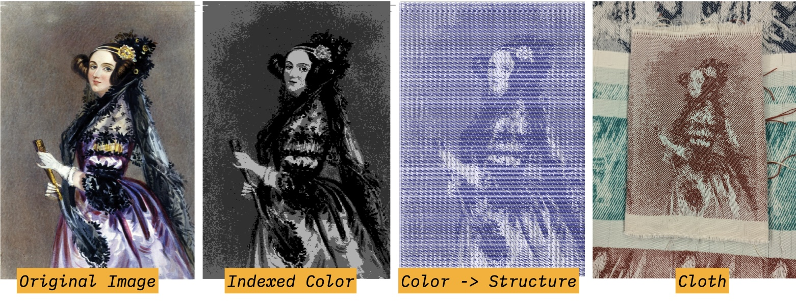

# Make Figured Weaving Drafts

Generate a workflow for uploading an image and assigning shaded structures to different color regions of the image. 

### What You'll Need
- An indexed color image. If you don't have one handy, you can download one [here](./img/ada_indexed_color.jpg)
- A blank workspace at [adacad.org](https://adacad.org). 

### Process 

:::tip
You can make the entire file yourself following the instructions below or simply open our [pre-made figure weaving template](https://adacad.org) and play. f
:::

1.  Select or Search for the [`image map`](../../reference/operations/imagemap.md) operation from the list of operations on the left sidebar. If it is not showing up, make sure "Show Advanced Operations" is selected. After you select the operation, it will be added into your workspace. 

2. Add your image to the image map operation by clicking the "Choose File" button in the image map operations [parameters](../../reference/glossary/parameter.md) list. After clicking, a window will open that lets you select an image file from your computer. Navigate to the index colored image you'd like to use and then hit "upload" in the operation parameters. 

*After you hit upload AdaCAD will start processing the image behind the scenes. It reads the image, analyses the colors, and updates the width and height parameters on the operation to match the size of your image. For every unique color that AdaCAD locates in the image file, it creates an [inlet](../../reference/glossary/inlet.md) associated with that color.  If you think it did this incorrectly, or that it generated more colors than you intended, click the View/Edit Image button to open a window that will allow you to group colors together so they behave as one*

2. Now you are going to add structures to fill the different color regions of your image. We'll do this by creating different shaded satins. Select or search for the [`shaded satin`](../../reference/operations/shaded_satin.md) from the operations menu to add it to the workspace. Modify the [parameters](../../reference/glossary/parameter.md) until you reach your desired satin. 

3. When you reached your desired satin draft, connect the [ <FAIcon icon="fa-solid fa-circle-arrow-down" size="1x" /> outlet](../../reference/glossary/outlet.md) of the shaded satin operation and connect it to an [ <FAIcon icon="fa-solid fa-circle-arrow-down" size="1x" /> inlet](../../reference/glossary/inlet.md) on the image map operation. Since each inlet is associated with a different color in the image, the draft you connect to the inlet will correspond to the draft the fills those color regions of the image. 

4. Repeat step 2 and 3 by either (a) adding more shaded satin operation from the operations menu or (b) duplicating your existing shaded satin by double clicking the operation or hitting the <FAIcon icon="fa-solid fa-ellipsis" size="1x" /> 
 button and then selecting <FAIcon icon="fa-solid fa-copy" size="1x" /> duplicate. 

*Repeat this process for every inlet, until every region of your image is filled with drafts.*

5. Now you format this image so you can weave it on your loom (which we are assuming is a TC2 loom). To do this, you'll need to create a draft with a width that is the same as the number of ends on your loom. For instance, if your loom is 2640 ends wide, you'll need to somehow modify the draft coming out of image map to be 2640 wide. 

- Option 1 - Stretch the Image: you can adjust the width parameter on [`image map`](../../reference/operations/imagemap.md) to be the width of your loom. This effectively expands your input image to the full loom width and then reassigns each of the shaded satin drafts to the expanded regions. It does not do this proportionally, you so would need to calculate the number of picks you'd like to use for the height so that it weaves square. 

- Option 2 - Tile the Image: You can add the [`rectangle`](../../reference/operations/rectangle.md) operation to your workspace and connect the [<FAIcon icon="fa-solid fa-circle-arrow-down" size="1x" /> outlet](../../reference/glossary/outlet.md) of the [`image map`](../../reference/operations/imagemap.md) operation and connect it to an [<FAIcon icon="fa-solid fa-circle-arrow-down" size="1x" /> inlet](../../reference/glossary/inlet.md)  of the  [`rectangle`](../../reference/operations/rectangle.md). Changes the [parameters](../../reference/glossary/parameter.md) for pics and ends to your desired settings. Instead of stretching the image, rectangle repeats the input draft along the width of an empty rectangle. Therefore, you could update ends to be 2640 to match your loom, and then adjust pics to match the height of your input draft (which is visible on the bottom, left corner of the operation). 

- Option 3 - Pad the Image by Adding a Wide Selvedge: If you only want the image to weave in the center of the cloth, surrounded by a margin of a second structure you would search for and select the [`selvedge`](../../reference/operations/selvedge.md) operation and add it to your workspace. Connect the [<FAIcon icon="fa-solid fa-circle-arrow-down" size="1x" /> outlet](../../reference/glossary/outlet.md) of the [`image map`](../../reference/operations/imagemap.md) operation and connect it to an [<FAIcon icon="fa-solid fa-circle-arrow-down" size="1x" /> draft inlet](../../reference/glossary/inlet.md) of [`selvedge`](../../reference/operations/selvedge.md) operation. Next, determine the structure you'd like to use as the selvedge. The simplest way to do this is probably to add a [`tabby`](../../reference/operations/tabbyder.md) operation and connect the [<FAIcon icon="fa-solid fa-circle-arrow-down" size="1x" /> outlet](../../reference/glossary/outlet.md) of the [`tabby`](../../reference/operations/tabbyder.md) operation and connect it to an [<FAIcon icon="fa-solid fa-circle-arrow-down" size="1x" /> selvedge inlet](../../reference/glossary/inlet.md) on the [`selvedge`](../../reference/operations/selvedge.md) operation. By default, the selvedge operation adds 12 ends of the draft connected to the selvedge inlet to each side of the draft connected at the draft inlet. If you wanted to expand this to span your entire loom you would need to change that number to:  `(your loom's width - width of the image draft) / 2`. 

6. Next steps: Once you have a draft that's ready to weave, following the instructions to [weave AdaCAD Drafts on TC2 digital looms](./weave_tc2.md). If you find that your imagery is not weaving square (e.g. the image is stretched out in the length or width), you can change the file to compensate for the stretching in a few ways. First, you can follow the suggestion listed as Option 1 above, and simply change the width/height parameters on the `image map` operation to account for the amount it is stretched on loom (e.g. if the height is stretched too long, you can "squish" the image height by reducing the number in the height parameter). 

**Keep Playing**

All done with the steps above? Keep playing by considering challenging yourself by changing the kinds of structures you are using within the image. Operations like [`twill`](../../reference/operations/twill.md), [`complex twill`](../../reference/operations/complextwill.md), and [`random`](../../reference/operations/random.md) can all be modified for the purposes of shading. 

<!-- Play with different color sequences by adding a changing the systems & materials input to 
set materials and systems -->

## More information: 
[The Woven Pixel: Designing for Jacquard and Dobby Looms Using Photoshop®
Schlein, Alice, and Ziek, Bhakti Bridgewater Press 2006](https://www.handweaving.net/document-detail/8419/the-woven-pixel-designing-for-jacquard-and-dobby-looms-using-photoshop-schlein-alice-and-ziek-bhakti-bridgewater-press)

