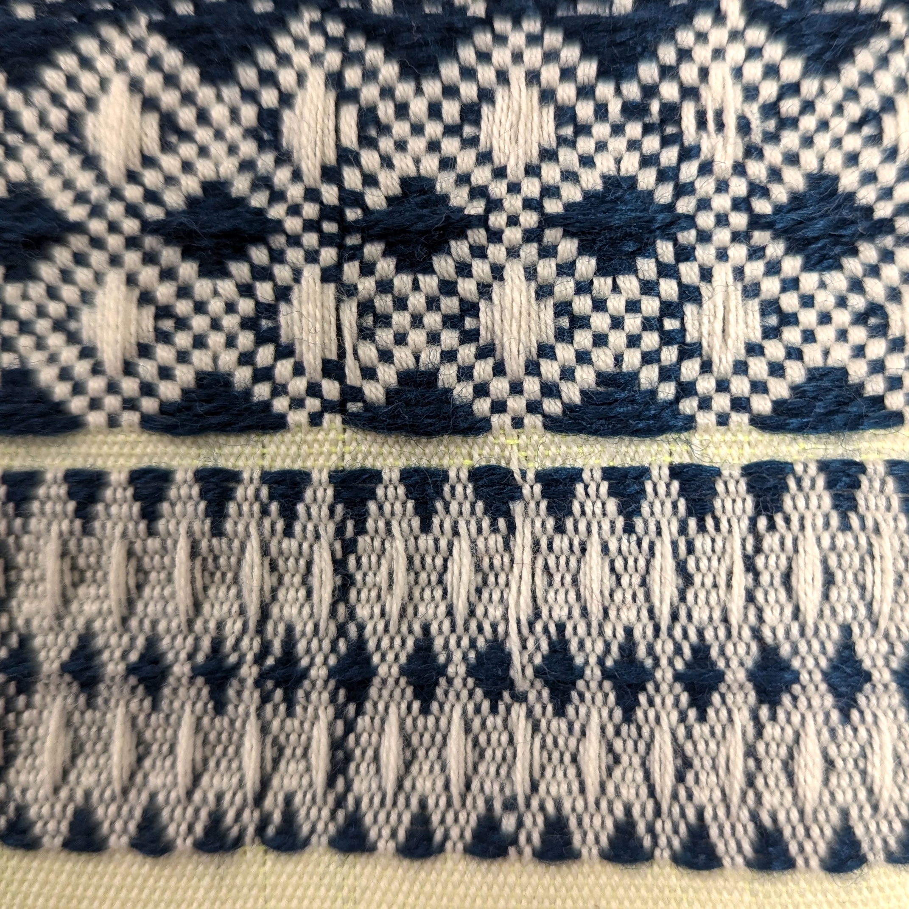

# Tutorials

Tutorials offer step by step instructions to help you build your own workspace.

<a href="figured_weaving_tc2">

    

    
    

    

    ## Figured Weaving
    Create drafts by filling regions of an image with shaded weave structures. 

    

</a>

<a href="block_threading">

    

    
    

    

    ## Generating Threading Sequences

    Create, modify and play with drawdowns created by threadings composed of different blocks.  

    

</a>

<a href="weave_tc2">

    

    
    

    

    ## Generate Drafts and Weave Them on a TC2

    A simple dataflow for testing structures on that can be woven on a TC2 Digital Jacquard Loom.   

    

</a>

<a href="weave_avl">

    

    
    

    

    ## Generate Drafts and Weave Them on a CompuDobby

    Using the Draft Editor to generate .WIF files for weaving on an AVL CompuDobby loom.

    

</a>
