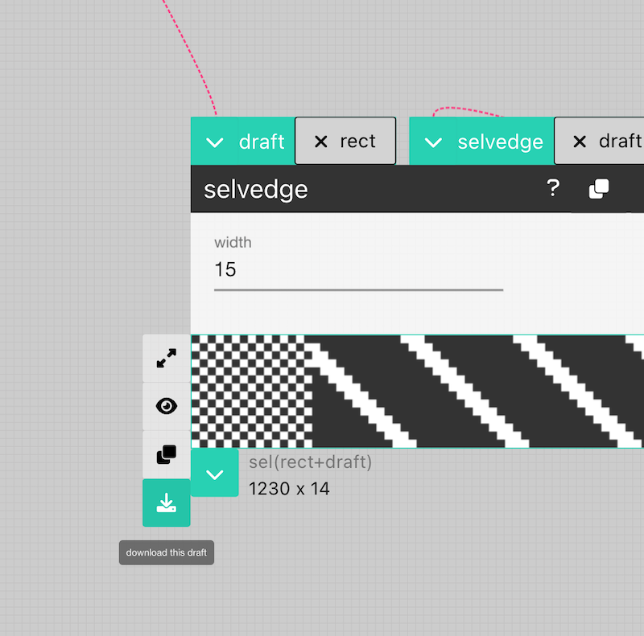
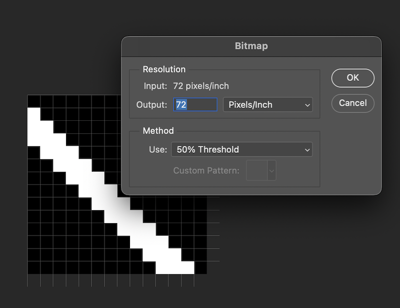

# Generate Files and Weave on a TC2

AdaCAD  exports [bitmap image files](../../reference/glossary/bitmap-image.md) that you can directly load and weave them a [TC2](#weave-drafts-on-a-tc2) Digital [Jaquard](../../reference/glossary/jacquard-loom.md) Loom

## Weave Drafts on a TC2

import Tabs from '@theme/Tabs';
import TabItem from '@theme/TabItem';

<Tabs>
  <TabItem value="adacad4" label="AdaCAD 4" default>

  ### Video
        In AdaCAD 4, we are able to download bitmap images that can be directly loaded onto the TC2 (e.g. no need to convert the file format in Photoshop). The video below walks you though this process. 

        <iframe width="560" height="315" src="https://www.youtube.com/embed/zrmt8_4p7y4?si=Y4TSVZ82WfKvN4GE" title="YouTube video player" frameborder="0" allow="accelerometer; autoplay; clipboard-write; encrypted-media; gyroscope; picture-in-picture; web-share" allowfullscreen></iframe>  

###  Step-By-Step (Create File)

:::tip

Follow along with this example in AdaCAD 4: [Drafting for Jacquard, Lesson 1](https://adacad.org?ex=TC2_lesson1)

:::

1. To make a draft for the TC2, we're going to create a [draft](../../reference/glossary/draft.md) via a [dataflow](../../reference/glossary/dataflow.md) on the [workspace](../../reference/interface/workspace.md) that matches the size of your loom (e.g. as many [ends](../../reference/glossary/end.md) as your loom is configured to weave and as many [picks](../../reference/glossary/pick.md) as you need to complete or repeat your the pattern.)  In this example, we're going to create a draft that just repeats a single structure across the width of our cloth. You can choose your favorite structure from any of the operations listed in the [structure](../../reference/operations/index.md#structure). To add this structure to the workspace, click the name of the structure you'd like to use in the [operations list](../../reference/interface/workspace.md#b-add-operations-to-workspace) on the left sidebar of the workspace view. Play with the [parameters](../../reference/glossary/parameter.md) of the structure operation you chose until you find something that suits you. 

2. Next, click on the [`rectangle`](../../reference/operations/rectangle.md) operation from the [operations list](../../reference/interface/workspace.md#b-add-operations-to-workspace). After the rectangle operation is added to the workspace, change the parameters so that the `ends` [parameter](../../reference/glossary/parameter.md) set to the number of ends of your loom and the number of picks required for the structure to repeat evenly. 

3. Connect/click the [<FAIcon icon="fa-solid fa-circle-arrow-down" size="1x" /> outlet](../../reference/glossary/outlet.md) from the draft created by the structure you selected to the [<FAIcon icon="fa-solid fa-circle-arrow-down" size="1x" /> inlet](../../reference/glossary/inlet.md) on the rectangle operation. Now, you should see the structure repeated as many times as it can along the width of your draft. If the draft created by the rectangle operation is too long or crops the number of picks of your structure, increase or decrease the  `picks` [parameter](../../reference/glossary/parameter.md) until it fits. 

4. *OPTIONAL* If you'd like to add a selvedge to the draft, you can do so by selecting or search for the [`selvedge`](../../reference/operations/selvedge.md) operation from the operations list on the left sidebar. If it is not showing up, make sure "Show Advanced Operations" is selected. Additionally, select a structure from the operations list that fits what you'd like to use as the selvedge structure. Most often this is [`tabby`](../../reference/operations/tabbyder.md) or some derivative. Connect/click the [<FAIcon icon="fa-solid fa-circle-arrow-down" size="1x" /> outlet](../../reference/glossary/outlet.md) from the draft created by the rectangle operation you selected to the [<FAIcon icon="fa-solid fa-circle-arrow-down" size="1x" /> draft inlet](../../reference/glossary/inlet.md) on the selvedge operation. Next connect/click the [<FAIcon icon="fa-solid fa-circle-arrow-down" size="1x" /> outlet](../../reference/glossary/outlet.md) from the structure you'd like to use in the selvedge to the [<FAIcon icon="fa-solid fa-circle-arrow-down" size="1x" /> selvedge inlet](../../reference/glossary/inlet.md) on the selvedge operation. Now, you should see your selvedge structured repeated on either side. Increase or decrease the number in the selvedge operation ends to make the region wider or smaller. What you might notice, now, is that your final draft is wider (e.g. has too many ends) for your loom. Decrease the number in the ends parameter of the rectangle operation until it fits your loom.  

## Step-By-Step (Upload to the Loom)

5.  Download the draft you'd like to weave by double-clicking the draft and selecting "Download as Bitmap". This will save a bitmap where-ever your computer stores downloads from the web in a .jpg format.The default name for every draft is "drafty" so file will be named drafty.jpg. You can also give your draft and the file a custom name by selecting the draft and changing the name within the [draft viewer](../../reference/interface/viewer.md#d-view-and-download-tools) before you hit the download button.

6. Open this file using the TC2 software. When it prompts you that your file has "More than 2 colors in Pattern". Push the "Bilevel" button. 

7. Start weaving. 

8. Edit and repeat. You'll notice in the sample we recorded, the structure is compressed in the width (e.g. it did not weave square). To fit this, we usually add a [`stretch`](../../reference/operations/stretch.md) between the structure and the rectangle operation. This allows us to stretch the structure to compensate for the compression we observe during weaving. 

</TabItem>

<TabItem value="adacad3" label="AdaCAD 3">
    
        ### Step 1: Download the Bitmap From AdaCAD

        

        You can download the draft by hovering your mouse over the [outlet](../../reference/glossary/outlet.md) of the draft you'd like you download and select "download as bitmap." The bitmap exported from AdaCAD uses a .jpg format (because we haven't figured out a way to download directly to BMP or TIFF just yet). You need to formally convert the .jpg that AdaCAD generates to a bitmap format for it to be read, which we show in the next step.

        ### Step 2: Reformat as a .TIFF file in Photoshop

        Each draft created in AdaCAD can be exported as a bitmap image, however, the files exported need to be processed to be converted into true bitmap that can be read by the TC2. This can be accomplished by opening the bitmap generated by AdaCAD in Photoshop, selecting Image->Mode->Greyscale:

        

        Then, selecting Image->Mode->Bitmap. Selecting the bitmap mode will ask you to agree to flatten layers (say OK), then will give you options for resolution. Set resolution to the automatic value (72 Pixels/Inch) and then for the "Method" category, select "50% Threshold". This will take any pixel that is more than 50% black, and make it black, and any that is less than 50% black, and make it white. 

        

        Then hit "Save As" and select "TIFF" as the format and you are ready to use this file on your TC2. 
  </TabItem>
</Tabs>

