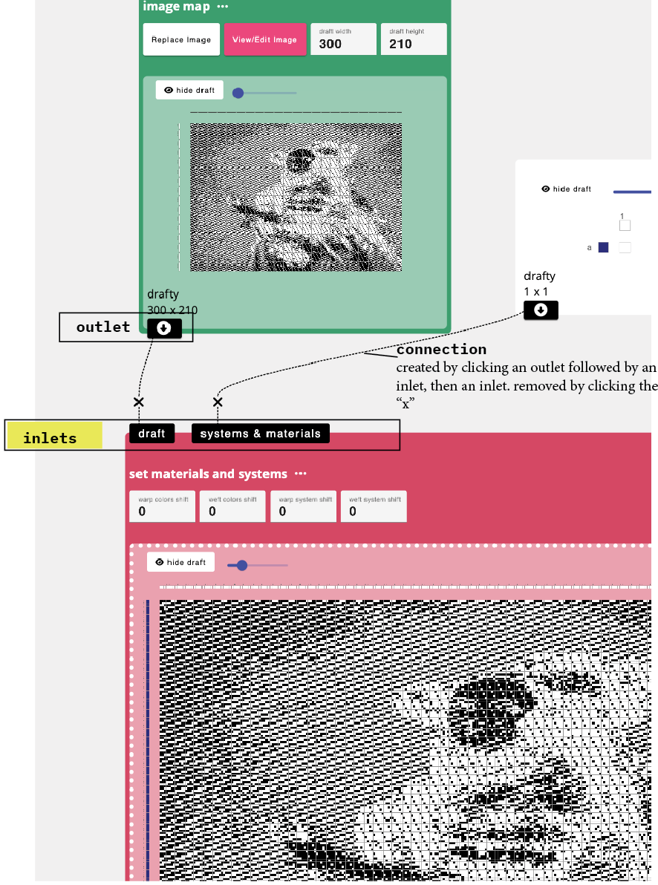

# Inlet

An inlet is a part of an [operation](./operation.md). Specifically, it used to form connections between nodes, such that the draft associated with the node connected to an [outlet](./outlet.md) can be used as input to this operation. Put another way, an inlet is a port that accepts input to an operation. The draft connected to the inlet is then manipulated by the operation. 

Different operations accept different kinds and numbers of inlets. If an operation is only intended to work with one input, it will only have one inlet. If it accepts a large number of inputs, it will keep generating a new inlet everytime one is connected. If it combines information from two drafts, it will offer two inlets. Some operations, such as [twill](../operations/twill.md) and other structure generators have no inlets, indicating that they are used only to generate drafts, not modify an input draft. 

## Kinds of Inlets
The inlets, in many cases, are labeled to describe the kind of information that is collected from the connected draft. For example, inlets labeled ('systems & materials') specify that only the information about warp and weft systems and materials is used (and the drawdown is ignored).

In the image above the inlets allow for two connections to the ['set materials and systems'](../operations/apply_materials.md) operation. The operation, then, takes the materials and systems information from teh draft connected to the "materials and systems" inlet, and then applies it to the draft connected to the draft inlet, essentially assigning a color sequence to the chosen draft. 

## Dynamic Inlets
In most cases, the inlets for an operation are fixed, meaning that the value of the parameters does not affect the value of parameters. However, in some 'dynamic' operations inlets are generated dynamically based on the text input. For example, [`variable length sampler`](../operations/sample_length.md) allows the user to input a series of letter/number pairs. The specific  sequence of letters generates inlets and then the operation repeats those structures for the amount of weft picks specified. 

