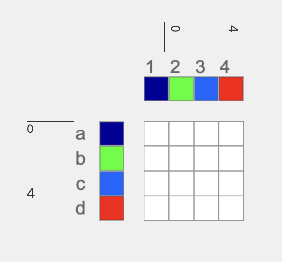

# Layer Notation

Layer notation emerged in conversation with [Kathryn Walters](https://www.kmwalters.com/pattern), who wanted AdaCAD to help her manage complex structures that could arbitrarily map warp and weft systems to different layers, layer orders, or even different numbers of layers (e.g. a structure that goes from 2 to 4 to 3 layers for instance.) Beyond her immediate needs, we found it to be a useful system for describing the relationship between different cloth layers. 

Layer notation essentially describes the behavior of layers in a cloth independent of the structures that will be mapped onto the layers. Put another way, it is a way or organizing weft and warp systems so that they bind into layers in specific ways. 

## Layer Notation Format
To use Layer Notation, you must first know the relationship between different warp and weft systems in your cloth. Specifically how many different warp and weft systems my cloth will use and the sequencing of those systems across the cloth.



The image above represents the warp and weft system mappings for a piece of cloth. Specifically, it contains four warp systems (labeled 1, 2, 3, 4) and four weft systems (labeled a b c d). The colors are assigned for visual clarity. AdaCAD weft systems are always labeled with letters, and warp systems with numbers. AdaCAD supports up to 26 weft systems (the letters a - z) and an unlimited number of warp systems. 

The next element of layer notation considers the relationship between warp/weft systems and layers. Each set of systems associated with a layer should be grouped within parenthesis. So for example: 

### Example 1, All Systems on A Single Layer
`(a 1 b 2 c 3 d 4)` places all warps and wefts on a single layer (see image below). If tabby is connected, it will repeat the tabby structure across all warps and wefts. 

.png)

`(a b c d 1 2 3 4)` eventhough the letters and numbers are in a different order, it will result in the same arrangement as above (all warps and wefts on a single layer)

.png)

### Example 2, Grouping into 2 Layers

- `(a 1 b 2)(c 3 d 4)` places weft systems a and b and warp systems 1 and 2 on the top layer and weft systems c and d and warp systems 3 and 4 on the second, bottom, layer.

- `(a 1)(b c d 2 3 4)` places systems a1  on the top layer and b2, c3 and d4 on the second, bottom, layer.

(bcd234).png)

### Example 3, Four Layers

- `(a1)(b2)(c3)(d4)` places system a1 on the top layer, b2 on the second, c3 on the third, and d4 on the fourth layer.

(b2)(c3)(d4).png)


- `(c3)(d4)(a1)(b2)` places system c3 on the top layer, d4 on the second, a1 on the third, and b2 on the fourth layer.

(d4)(a1)(b2).png)


### Example 4, Floating Between Layers
- `(a b 1 2) c (d 3 4)` - in this example, weft systems a and b, and warp systems 1 and 2 will weave on the top layer. weft system d and warps 3 and 4 will weave on the bottom layer. Between the top and bottom layers, weft c will float, interlacing on neither the top or bottom layers. 


## Rules
Certain rules must be followed in order to ensure layer notation works correctly: 

1. every weft system and every warp system in the systems draft must be included in the pattern string. Unused warp and weft systems will be marked with unset heddles
    - valid: `(a 1 b 2 c 3 d 4)`, `(a b 1 2 c d 3 4)`, `(a 1) b c d 2 3 4`
    - invalid: `(a1)`, `(1ab2)`
2. each () group needs to include at least one weft system and one warp system
    - valid: `(a 1)(b 3 c 2 d 4)`, `(a b 1) c ( 2 d 3 4)`
    - invalid: `(abcd)(1234)`, `(a b 1)(c)( 2 d 3 4)`
3. the same warp system/weft system cannot be used more than once
    - valid: `(a 1)(b 3)(c 2)(d 4)`
    - invalid: `(a 1 b 3)(b 3)(c2)(d4)`

### Notes
- layers will be assigned only as needed--lifts and lowers on upper layers will only be added when required to create a lower layer
- a letter or number outside of the () will be interpreted as a float at that order in the warp/weft layer stack


## Algorithm 
The follow block of pseudo code explains how the algorithm places structures and creates layers. 

```jsx

let parsed_array = parse('(a1)c2(c3)') = ['(a1)', 'c2', '(c3)']

let above = [{warpsys[], weftsys[]}] 

Foreach item in parsed array
    let warp_systems = [{all the numbers in item}]
    let weft_systems = [{all the letters in item}]
    
    if item contains '()' // this means it's a distinct layer group. 
        map item to warp_systems and weft_systems //place the structure connected to the parsed unit onto those subset of warp/weft systems defined in warp_systems and weft_systems
    else //Anything outside of () will be interpreted as floats between layers. 
         do nothing //(as this will float)

    updateLayers()
        //adds heddle lifts on the current weft systems if the warp system is included in above (e.g. lifts the previous layer out of the way)
        //adds heddle lower on the previously seen wefts that belong to this warp system (to ensure that they are lowered out of the way when weaving upper layers. )

    above.concat({warp_systems, weft_systems}) //add the warp and weft systems in this layer to above.

```


