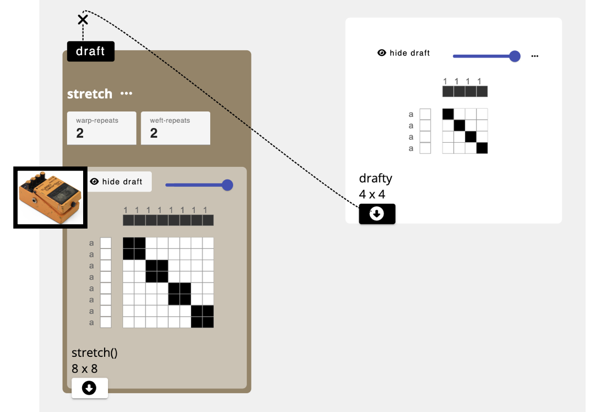

# Operation
Operations are little computational machines that take drafts as inputs, do something to them, and then spit them out as new and different, drafts. An operation consists of several parts:  [inlet(s)](inlet), [parameters](parameter), and a resulting [draft](draft) with an [outlet](outlet). Chaining operations together creates a [dataflow](./dataflow.md) 

## Understanding Operations
You can think of AdaCAD Operations as guitar effects pedals. Just as a guitar effects pedal takes a sound signal into an input port, modifies it based on the value of the knobs and the internal hardware of the pedal, and outputs the modified sound via the output port, operations in AdaCAD take drafts into their ["inlets"](../../reference/glossary/inlet.md), modify those drafts according to the operation's code and user specified [parameters](../../reference/glossary/parameter.md) and outputs the modified draft via the ["outlet"](../../reference/glossary/outlet.md). And just as multiple guitar pedals can be chained together to further augment the sound, AdaCAD operations can be chained together to further augment the drafts. 

The figure below shows how this interaction takes place within the AdaCAD workspace with the [stretch](../../reference/operations/stretch.md). The stretch operation pictured below receives the input draft into it's inlet. The user then changes  "warp-repeats" and "weft-repeats" [parameters](../../reference/glossary/parameter.md) to indicate the number of time they want each warp end and weft pic to be repeated. When the value of the parameter changes, AdaCAD update the output draft.  

## Kinds of Operations
AdaCAD currently offers over 60 different operations. You can explore every operation by vising [Reference->Operations(A-Z)](../../reference/operations/index.md) in the sidebar on the left of the page. Operations are organized into different categories based on their typical use within a drafting process. These categories are also color-coded on the interface. 

- [**Structure (Orange)**](../../reference/operations/index.md#structure) Operations: such as [tabby](../../reference/operations/tabbyder.md), [twill](../../reference/operations/twill.md), and [satin](../../reference/operations/satin.md) generate structures that obey the rules of a given family.
- [**Transformation (Tan)**](../../reference/operations/index.md#transformation) Operations: such as [invert](../../reference/operations/invert.md), [shift](../../reference/operations/shift.md), and [make symmetric](../../reference/operations/makesymmetric.md) modify an input draft according to the specific rules of the transformation applied. 
- [**Cloth (Dark Green)**](../../reference/operations/index.md#cloth) Operations: such as [rectangle](../../reference/operations/rectangle.md), [tile](../../reference/operations/tile.md), and [image map](../../reference/operations/imagemap.md) are intended to be used to arrange and/or repeat different structures across the surface of a cloth. 
- [**Compound (Bright Green)**](../../reference/operations/index.md#compound) Operations: such as [interlace wefts](../../reference/operations/interlace.md), [assign draft to systems](../../reference/operations/assign_systems.md), and [splice in pics](../../reference/operations/splice_in_wefts.md) support joining different structural elements together into compound weave structures characterized by the use of multiple weft and warp systems and/or layers.
- [**Dissect (Blue)**](../../reference/operations/index.md#dissect) Operations: such as [deinterlace wefts](../../reference/operations/deinterlace.md), split a single draft into multiple drafts according to some criteria. 
- [**Compute (Deep Violet)**](../../reference/operations/index.md#compute) Operations: such as [overlay](../../reference/operations/overlay.md) and [overlay](../../reference/operations/mask.md), apply different forms of computational, binary, and/or mathematical functions to the modification of drafts. 
- [**Helper (Violet)**](../../reference/operations/index.md#helper) Operations: such as [selvedge](../../reference/operations/selvedge.md) automate common drafting techniques to ensure good woven and cloth structure.
- [**Color Effects (Magenta)**](../../reference/operations/index.md#color-effects) Operations: such as [set weft materials](../../reference/operations/apply_weft_materials.md) allow you to specify materials in order to describe different color effects on the woven cloth
- [**Drafting Styles (Camel)**](../../reference/operations/index.md#drafting-styles) Operations: such as [make drawdown from threading, tieup, and treadling](../../reference/operations/floor_loom.md) allow you to convert of one style of drafting to another, based on the requirements of specific equipment

<!-- 

In the image above, we see several [`shaded satin`](../operations/shaded_satin.md) operations generating drafts which are connected to an [`image map`](../operations/imagemap.md) operation. the `shaded satin` operations generates shaded satin structures. The specific kind of shaded satin structure it generates is determined by the [parameters](parameter) associated with the `shaded satin`  operation.  You can connect the [outlet](outlet) of the `shaded satin` operation to the inlet of the `image map` operation to chain them together. This will allow you to take the satin generated from the `shaded satin` operation and rotate and apply it to all the pixels of a given color identified by the [`inlet`](./inlet.md). Chaining operations together makes the design flexible so that if you change the parameters of the satin, it will automatically update the image map as well. 

This style of making drafts foregrounds the similarities between the actions weavers perform to design different woven structures and patterns, and the way that programmers make computer programs by making small functions and sequencing together. Yet, in AdaCAD, you get cloth instead of code.  -->

## Understanding the Parts of an Operation

### Inlets
Inlets allow you to add drafts to an operation, so they can be modified according to the operations [parameters](./parameter.md) and code. You connect a draft to an inlet by clicking the [outlet](./outlet.md) of one node and connecting it to the [inlet](./inlet.md) of an operation. Some operations have 

### Parameters
Under the name of the operation, in this case `set materials and systems` there is a list of [parameters](parameter) that are provided to the operation to inform the draft it will create. 

### Output Draft
Under the parameters, you can see the [draft](draft) that is generated by this operation. 

### Outlet
If you want to use this [draft](draft) as the input of another operation you can connect its [outlet](outlet), shown here, to the [inlet](inlet) of a different operation to make a connection. You can connect a single outlet to multiple inlets. To make a connection, you click on the outlet first, then click on the inlet you want it connected to. 

