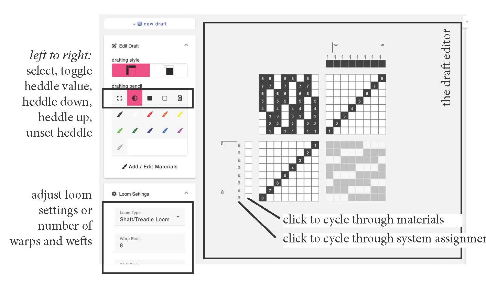

# Draft Editor
In this mode, you can create a draft of specific dimensions and for different loom types by marking cells in the threading, treadling and tieup, or, by modifying the drawdown and generating the threadings. 

## Overview

## How To

### Change the Draft Based on Your Loom Type

### Change The Number of Frames or Treadles

### Change the Number of Warps and Wefts

### Add Colors

### Change or Edit Colors

### Assign Warp and Weft Systems

### Copy/Paste Draft Regions

### Generate Drawdowns by Editing Threading, Tieup and Treadling

### Generate Threading, Tieup and Treadling by Editing the Drawdown

### Save the Draft as a Bitmap, Image or .WIF

### Navigate the Draft Editor

