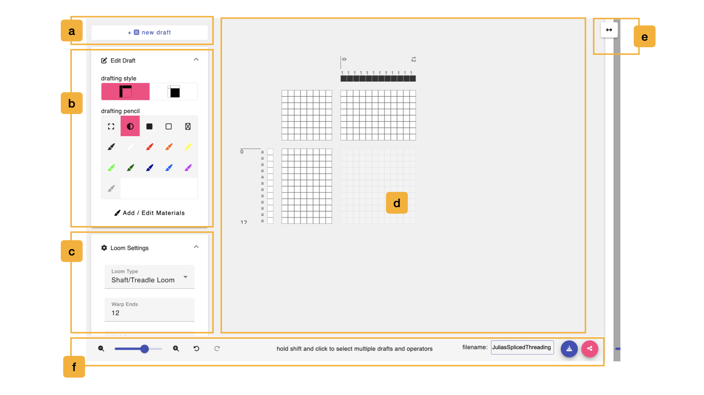
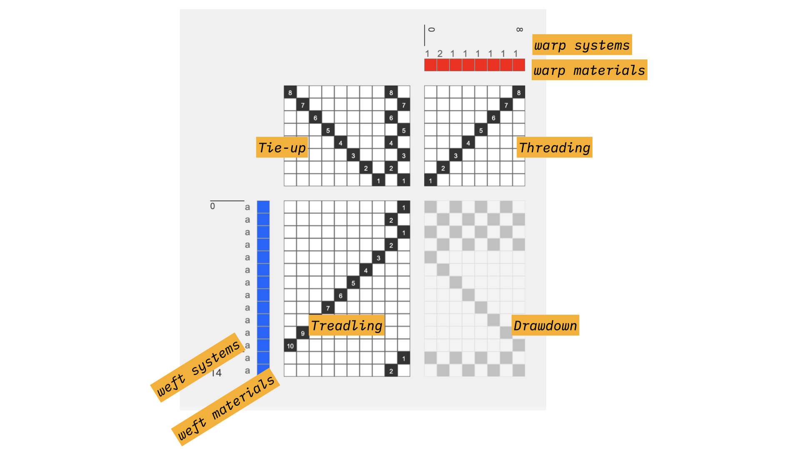
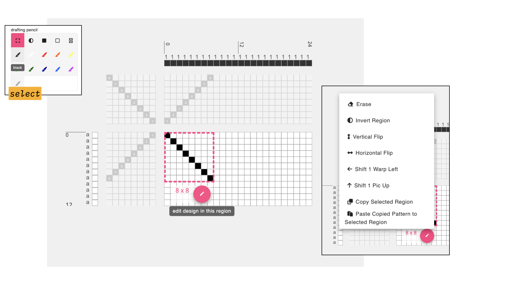
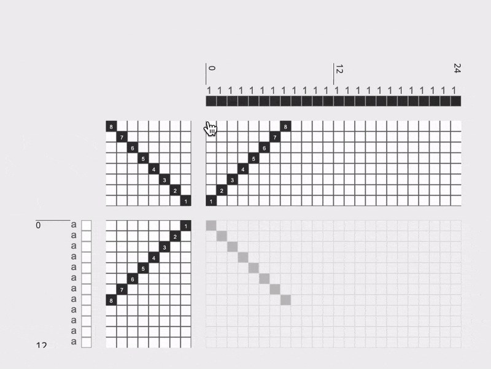
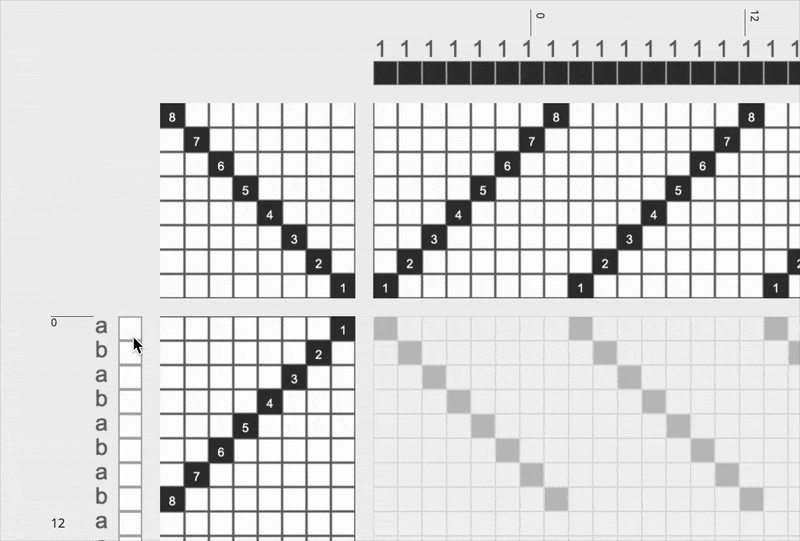

# Draft Editor
In this mode, you can create a draft of specific dimensions and for different loom types by marking cells in the threading, treadling and tieup, or, by modifying the drawdown and generating the threadings. 

## Overview

## a. Start a New Draft
-  \+ <FAIcon icon="fa-solid fa-chess-board" size="1x" /> add draft, will create a new blank draft within the editor. Behind the scenes, the old draft and this new one you are creating are both added to the Workspace, should you need to access them again. 

## b. Editing Tools

- The **Drafting Style Toggle** switches between the two [drafting styles](../glossary/drafting-style.md) that the editor supports. In the first, the drawdown is generated based on the edits made in the threading, treadling, and tie-ups. In the other, the threading, treadling and tie-ups will be generated by edits in the drawdown.

- The **Drafting Pencils** include a selection of tools that you can use to design upon the draft in the draft editor. 
    - <FAIcon icon="fa-solid fa-expand" size="1x" /> **Select**: allows you to select and modify regions of the draft. This works on all part of the draft, including the materials and systems (e.g. if you'd like to copy a color sequence across all warps)
    - <FAIcon icon="fa-solid fa-adjust" size="1x" /> **Toggle**: toggles the value of a given draft cell. If the cell is black, it turns the cell white and vice versa. If used on the materials or systems, it will toggle through all available colors and/or systems in use. 
    - <FAIcon icon="fa-solid fa-square" size="1x" /> **Set Cell to Heddle Up**: set the value of a given draft cell to black (meaning heddle raised). If used on the materials or systems, it will toggle through all available colors and/or systems in use. 
    - <FAIcon icon="far fa-square" size="1x" /> **Set Cell to Heddle Down**: set the value of a given draft cell to white (meaning heddle lowered). If used on the materials or systems, it will toggle through all available colors and/or systems in use. 
    - <FAIcon icon="far fa-times" size="1x" /> **Set Cell to Unset**: set the value of a given draft cell to unset (meaning that  raised). If used on the materials or systems, it will toggle through all available colors and/or systems in use. 
    - <FAIcon icon="fa-solid fa-paintbrush" size="1x" /> **Apply Material**: applies the selected material/color to the draft. If applied to the warp and weft materials, it simply paints the color in the selected region. If it is drawn on other parts of the draft, it will assign both the pic and end associated with the selected cell to the selected color. 
    - <FAIcon icon="fa-solid fa-paintbrush" size="1x" /> **Add / Edit Materials**: This button opens a window that shows the current Materials Library. In this view, you can add, delete or edit the colors that are available to use while drafting.

## c. Adjust Loom and Draft Settings
This panel let you control how the draft is represented based on the type and features of the loom you are using. 

- **Loom Type**: AdaCAD currently supports three types of looms: jacquard, dobby/direct tie, and shaft/treadle looms. 

Changing the loom type changes the view as shown above.
    - **Shaft/Treadle**: this view is configured with an editable tie-up, threading and treadling. Only one treadle can be selected on each pic. 
    - **Direct Tie / Dobby**: this view is configured with a threading and lift plan, acknowledging that on each pic, more than one frames could be raising in tandem. The tie-up is fixed with one frame associated/attached to each "pedal". 
    - **Jacquard**: because a jacquard loom does not operate with frames (e.g. every heddle is individually controllable), this view only shows the [drawdown](../glossary/drawdown.md)
    - **Warp Ends**: changing this value changes the number of ends on the draft in the draft editor.  
    - **Weft Pics**: changing this value changes the number of pics on the draft in the draft editor.  
     - **Density Units**: specify if the density should be measured in ends per inch or ends per 10cm. 
    - **Density**: do not change the view of the draft in teh editor, but can be used to calculate the width of the cloth. This value is also considered in how the [simulation](./viewer.md) is rendered. 
    - **Width**: This value shows the predicted width of the cloth, based on the current number of warp ends and the density. Changing this value will change the number of warp ends such that the resulting cloth, woven at the specified density, would result in the specified width. 
    - **Frames**:  the total number of frames to be represented on the draft. Field is hidden if the loom type is set to Jacquard. 
    - **Treadles**: the total number of treadles to be represented on the draft. This field is hidden if the loom type is set to Jacquard or Direct/Tie/Dobby. 

## d. Draft Editor
The draft editor offers a space to point-and-click draft cells in order to design cloth. The specific way that the draft is rendered, and the options for editing allowed depend on the [loom type](#c-adjust-loom-and-draft-settings) selected. The origin for this view (e.g. the position of the first end and first pick) is placed on the top left by default. This can be changed in the  <FAIcon icon="fa-solid fa-gear" size="1x" /> settings menu on the [topbar](./topbar.md#b-application-settings-and-support)

You can click draft cells to change their values, and the value change depends on the currently selected [draft pencil](#c-adjust-loom-and-draft-settings).

### Selecting and Modifying Areas of the Draft 
If you would like to change regions of a design, you can click and drag the regions you'd like to modify or copy using the <FAIcon icon="fa-solid fa-expand" size="1x" /> select pencil. After dragging to select a region of the draft, a pink circular button appears that you can click to reveal a menu of options. 

### Changing Systems and Materials

- **Materials/Colors**: You can associate each warp end or weft pick with a color. To assign or change the color associated, you can either draw with one of the <FAIcon icon="fa-solid fa-paintbrush" size="1x" />  material draft pencils or simply just click upon any material cell on the draft. When you click, it will cycle through each of the colors currently available in your materials library. 

- **Warp and Weft Systems**: If you are weaving with multiple warp and weft [systems](../glossary/system.md), or making a draft that requires that you specify systems (e.g. [layer notation](../operations/notation.md) or [assign drafts to systems](../operations/assign_systems.md)) you can click on the warp or weft system to change it. Warp systems are represented as numbers and weft systems as single letters. This means you can have an infinite number of warp systems but only 26 different weft systems.

Each time you click on the letter or number associated with a pick or end, it will increase the value by one. It will only increase to one value beyond the highest value used. So, if your draft uses weft systems 1 and 2, you would click through values 1, 2, 3 before it started repeating on 1 again. Put another way you cannot assign something to warp system 4 if you haven't first assigned something to systems 1, 2, and 3.

## e. Resize Window
You can press this button and drag to the left or right to expand/contract the amount of the screen that is devoted to the Draft editor. 

