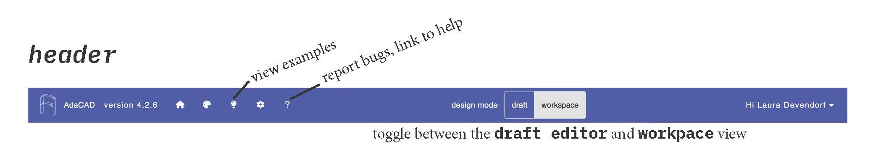

# Topbar

The topbar consists of a series of menus and functions that manage the AdaCAD application overall. 

## Overview

## How To: 

### Switch Design Modes

### View Examples

### Report Bugs

### Get Help

### Import Workspaces from your Computer

### Save Workspaces to your Computer

### Save Workspaces on AdaCAD's Server

### Manage/Edit/Delete Workspaces on AdaCAD's Server

### Share Workspaces

### Login/Logout
