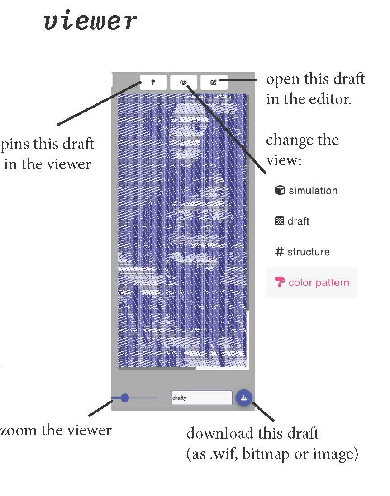

# Viewer

The viewer allows you to view a specific draft in a variety of formats. 

## Overview

## How To

### Zoom In / Out

### Download or Save the Draft Being Visualized

### Open the Current Draft in the Editor

### View Simulation

### View a Structural Rendering

### View a Rendering with Colors

### View the Draft