# Operations

AdaCAD offers over 50 [operations](../glossary/operation.md) that you can build into [dataflows](../glossary/dataflow.md) to generate drafts. This page groups operations by their function, previews their design, and links to the full details of each operation (which you can also find on the left sidebar).

<!-- consider sets: 
basic / advanced
synth
profile drafting
floor and shaft loom
imagery
sampling
compound/complex -->

## Structure 

A weave structure is the order or pattern of interlacement between the warp and weft threads. There are different families of woven structure that share core properties, such as plain weave, twill, and satin. Each of the operations is capable of generating structures that obey the rules of a given family. 

 | operation name  | examples |
 | ------- | ------- | 
| [all possible structures](./combos) |  |  
| [complex twill](./complextwill) |  | 
| [glitch satin](./glitchsatin) |  |  
| [random](./random) |  |  
| [satin](./satin) |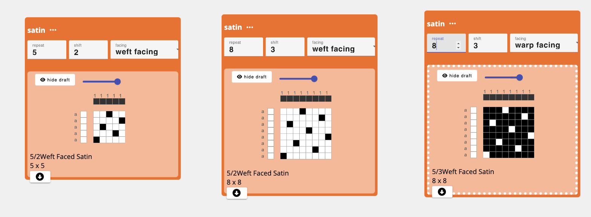 |  
| [satin-ish](./satinish) | 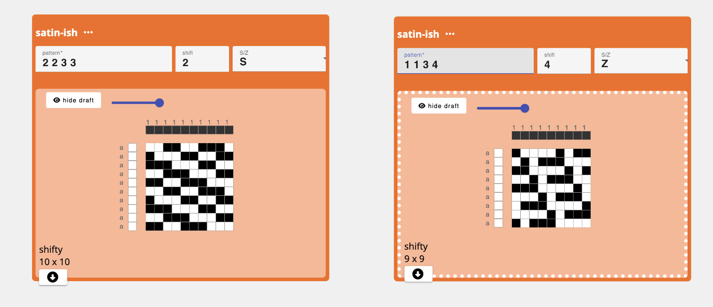 |  
| [sawtooth](./sawtooth) |  |  
| [shaded_satin](./shaded_satin) | 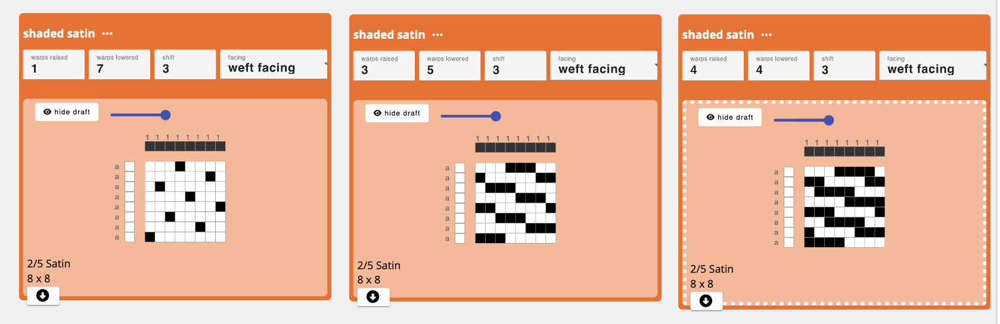 |  
| [sine wave sampler](./sine) |  |  
| [tabby](./tabbyder) |  |  
| [twill](./twill) |  |  
| [waffle](./waffle) |  |  
| [waffle-ish](./waffleish) | 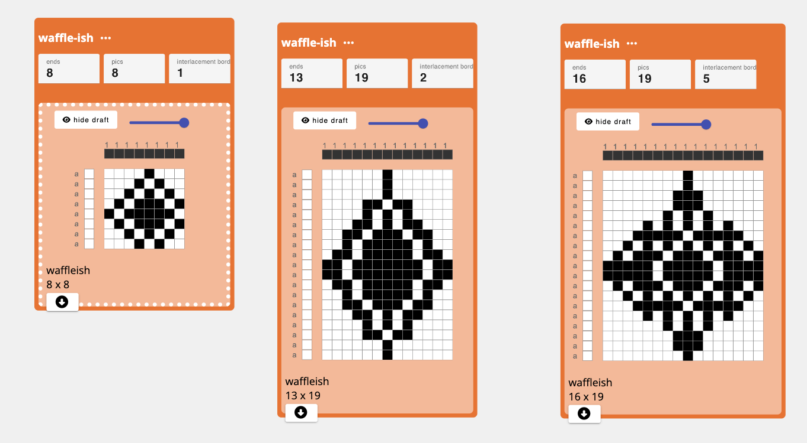|  
| [undulating twill](./undulatingtwill) | 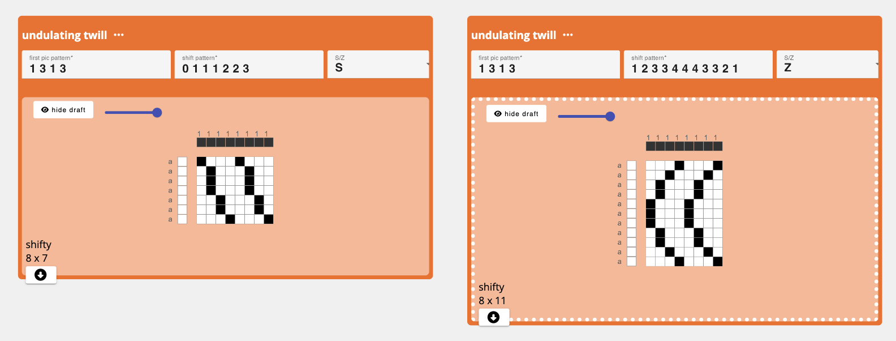 |  
| [upload draft](./bwimagemap) | 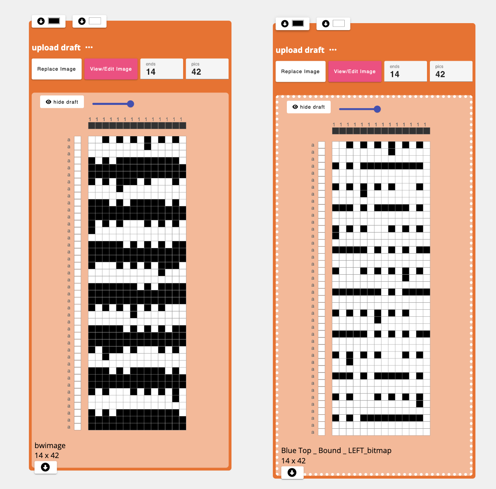 |  

## Transformation 
Transformation operations take an input structure or draft and transforms it in some way.

| operation name  | examples |
 | -------- | ------- | 
| [invert](./invert) | 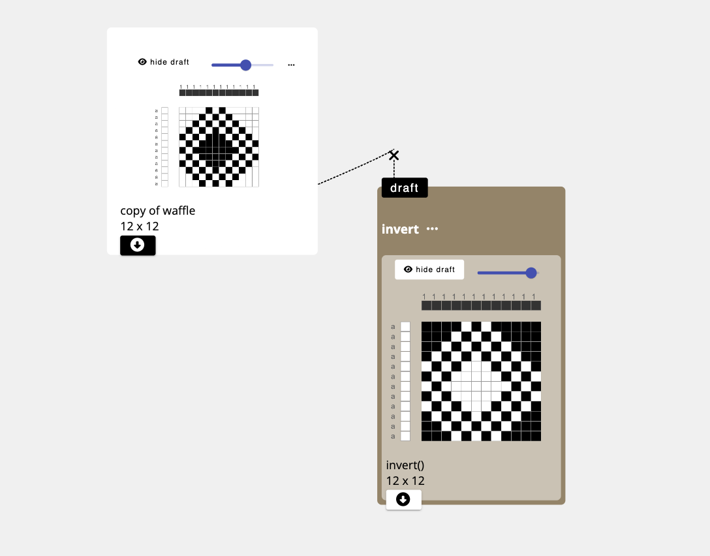 |  
| [flip](./flip) |  |  
| [shift](./shift) | |  
| [rotate](./rotate) |  |  
| [make symmetric](./makesymmetric) |  |  
| [slope](./slope) | 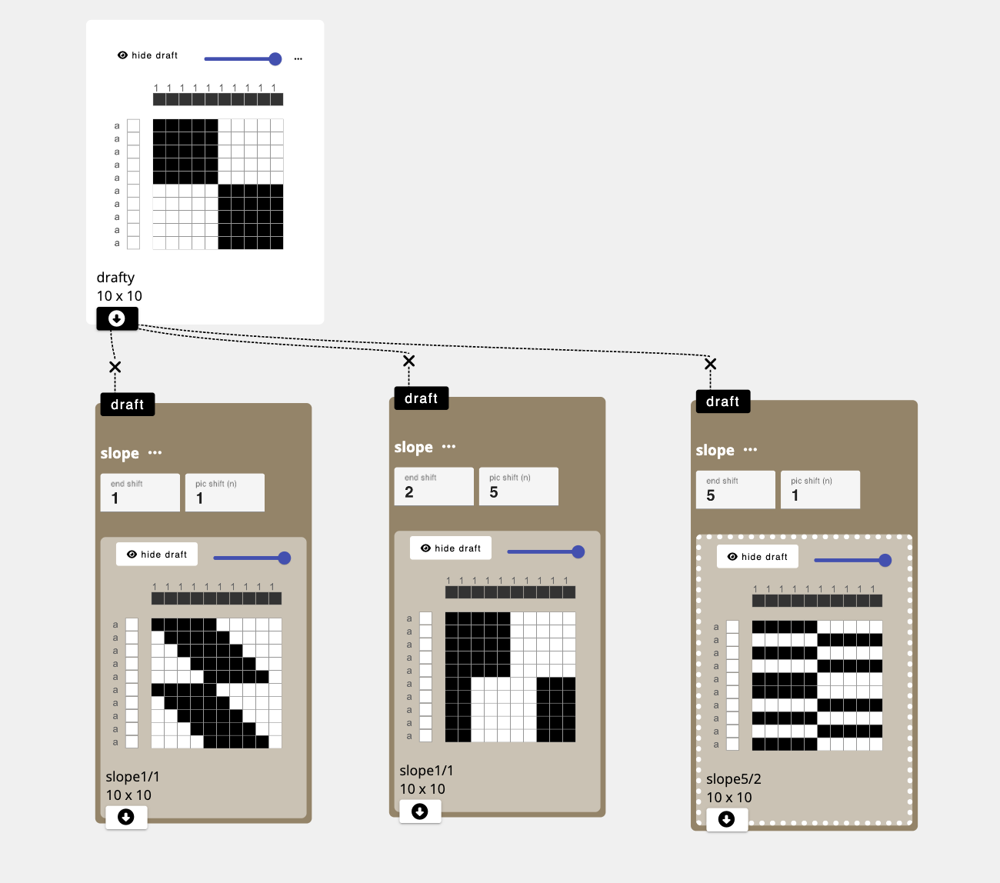 |  
| [stretch](./stretch) | |  
| [clear](./clear) | 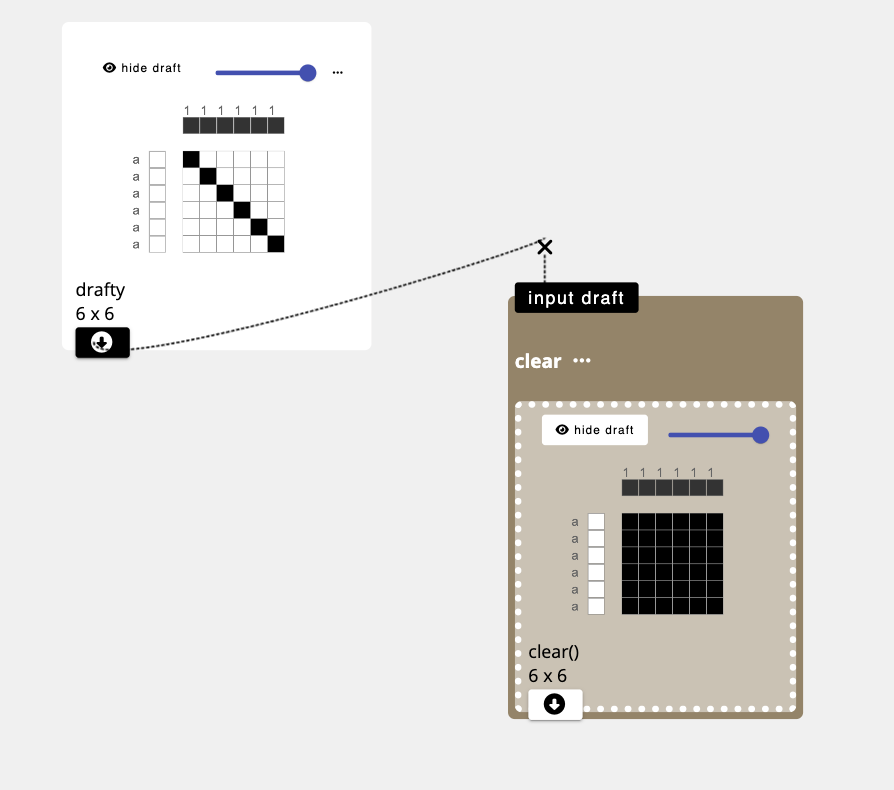|  
| [set unset interlacements to](./set_unset) |  |  
| [set interlacements of type to unset ](./set_down_to_unset) |  |  
| [crop](./crop) | 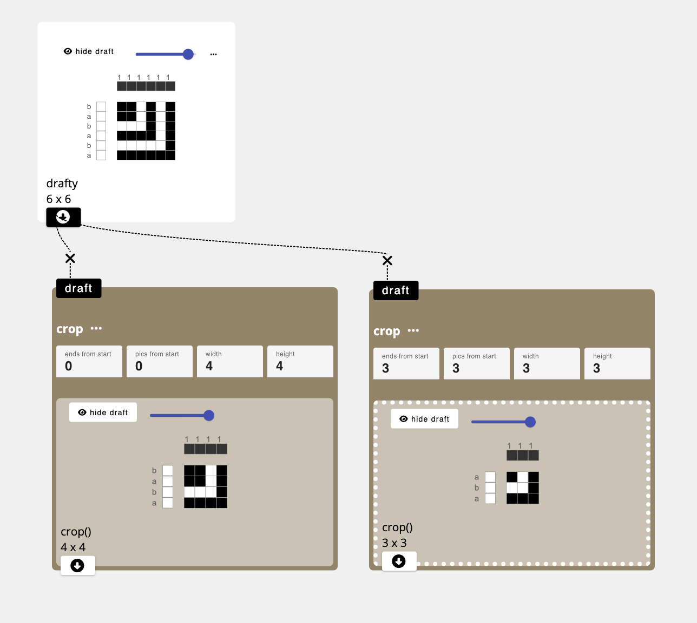 |  
| [trim](./trim) | 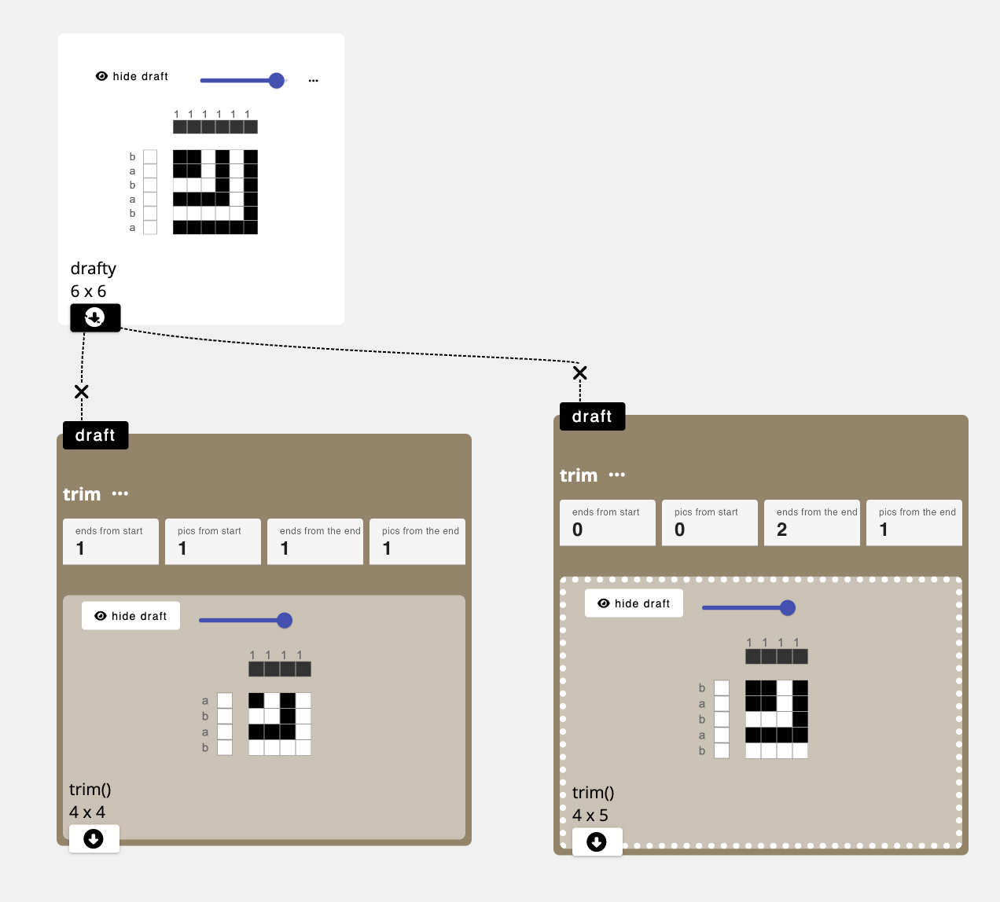 |  
| [margin](./margin) | |  
| [undulate wefts](./undulatewefts) |  |  
| [undulate warps](./undulatewarps) |  |  

## Cloth 
Cloth Operations describe the arrangements of pattern regions in an overall draft or cloth. Regions defined by the cloth design parameters can be filled with input drafts. 

 | operation name  | examples |
 | -------- | ------- | 
| [rectangle](./rectangle) |  |  
| [tile](./tile) |  |  
| [chaos sequence](./chaos) | |  
| [pattern across warp](./warp_profile) |  |  
| [pattern across weft](./weft_profile) |  |  
| [variable width sampler](./sample_width) | |  
| [variable length sampler](./sample_length) |  |  
| [fill](./fill) | 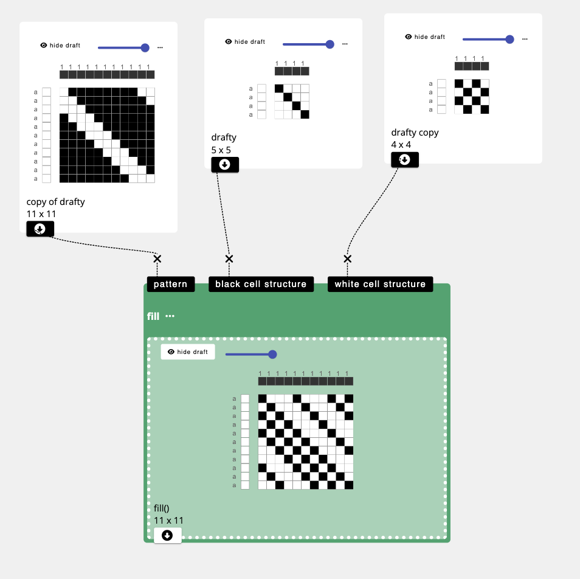 |  
| [image map](./imagemap) | 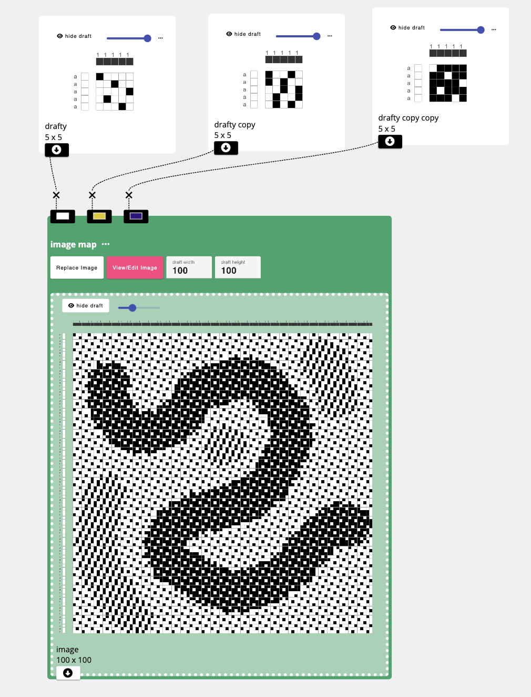 |  
| [join left](./join_left) |  |  
| [join top](./join_top) |  |  

## Compound
Compound operations support joining different structural elements together compound weave structures characterized by the use of multiple weft and warp systems and/or layers.

 | operation name  | examples |
 | -------- | ------- | 
| [interlace wefts](./interlace) |  |  
| [interlace warps](./interlacewarps) | 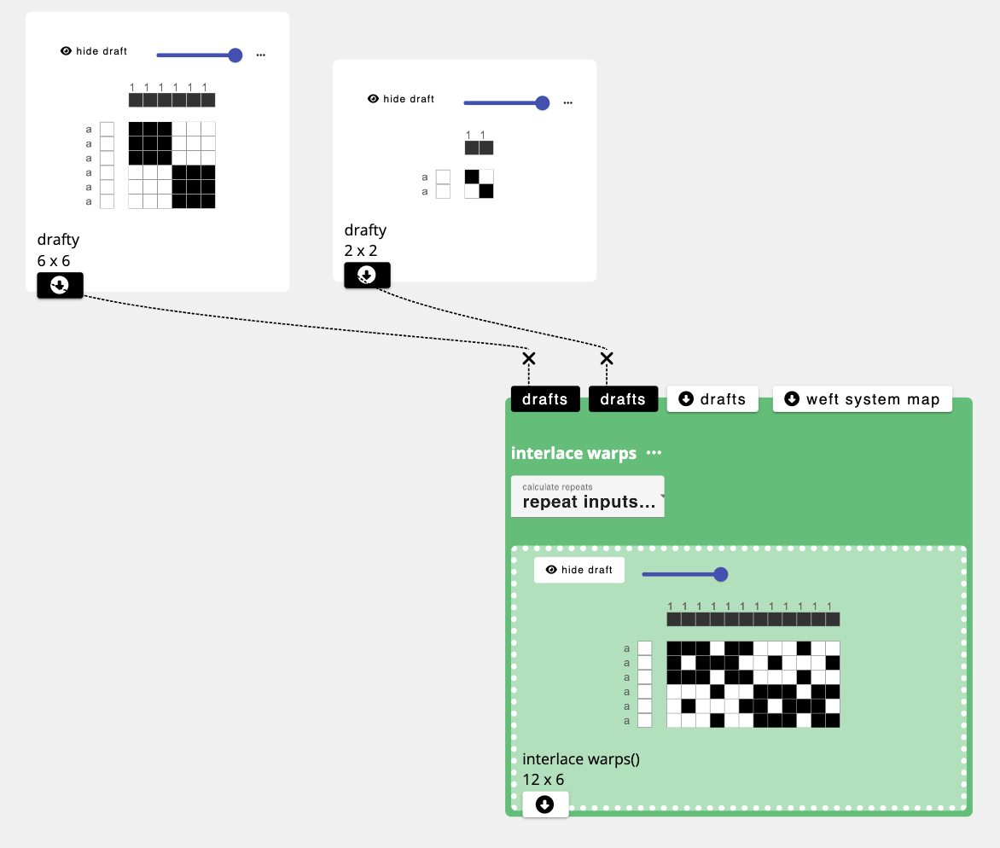 |  
| [overlay multiple](./overlay_multiple) |  |  
| [splice in wefts](./splice_in_wefts) |  |  
| [splice in warps](./splice_in_warps) | |  
| [layer](./layer) |  |  
| [layer notation](./notation) |  |  
| [assign draft to system](./assign_systems) |  |  

## Dissect
Describes operations that split apart a single input draft into multiple outputs according to some criteria.

 | operation name  | examples |
| -------- | ------- | 
| [deinterlace wefts](./deinterlace) |  |  

## Compute
Computer operations apply different forms of computational, binary, and/or mathematical functions to the production and modification of drafts.

 | operation name  | examples |
 | -------- | ------- | 
| [set atop, (a, b) => b](./atop) |  |  
| [overlay, (a,b) => (a OR b)](./overlay) |  |  
| [mask, (a,b) => (a AND b)](./mask) |  |  
| [cut, (a, b) => (a NAND b)](./cutout) |  |  
| [diff, (a, b) => (a NEQ b)](./diff) |  |  

## Helper
Operations that automate common drafting techniques to ensure good woven and cloth structure.

 | operation name  | examples |
 | -------- | ------- | 
| [selvedge](./selvedge) |  |  
<!-- | [bind weft floats](./bind_weft_floats) |  |   -->
<!-- | [bind warp floats](./bind_warp_floats) |  |   -->

## Color Effects
Supports the specification of materials in order to describe different color effects on the woven cloth

 | operation name  | examples |
 | -------- | ------- | 
| [set materials and systems](./apply_materials) |  |  
| [set weft materials](./apply_weft_materials) |  |  
| [set warp materials](./apply_warp_materials) |  |  

## Drafting Styles
Supports the conversion of one style of drafting to another, based on the requirements of specific equipment

 | operation name  | examples |
 | -------- | ------- | 
| [generate floor loom threading and treadling](./floor_loom) |  |  
| [generate direct tie loom threading and lift plan](./direct_loom) |  |  
| [make drawdown from threading, tieup, and treadling](./drawdown) |  |  
| [make drawdown from threading and lift plan](./directdrawdown) |  |  