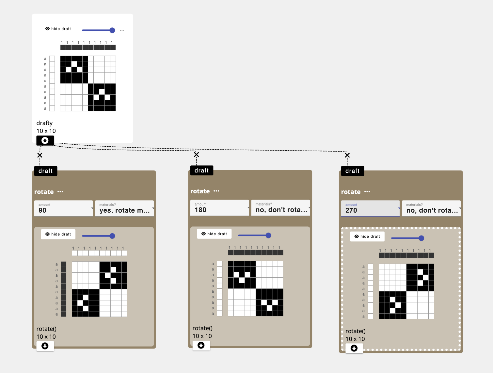

# rotate
Generates an output draft that is the same as the input draft, but rotated by the amount specified. 

## Parameters
- `amount`: the number of degrees by which to rotate the input draft (in 90 degree increments). 
- `materials?`: In the case where you are rotating a design by 90 or 270 degrees, you are given the option to also rotate the materials (e.g. make the warp colors into the weft colors and vice versa), or leave them the same as the original. 

## Application
To create patterns and motifs that involve a rotated element

## Developer
adacad id: `rotate`
