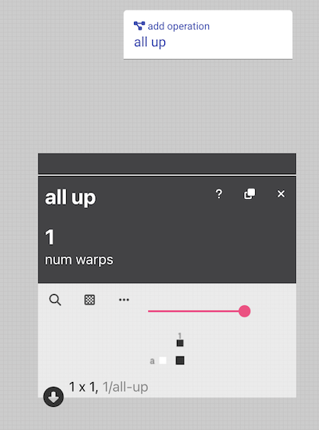

# How to Make an Operation


# Overview

To make an operation, you need to make create or make changes to four files:

| Type | Path | Status |
| --- | --- | --- |
| An operation | ```src/app/core/operations/<operation-name>/<operation-name.ts> ```| Create |
| An operation service  | ```src/app/core/provider/operation.service.ts``` | Update |
| An operation description | ```src/assets/json/op_descriptions.json``` | Update |
| An operation classification | ```src/assets/json/op_classifications.json``` | Update |


# Tutorial: Creating the "All Up" Operation
This is a walkthrough of the simplest operation: an `all up` operation that lifts all warps. It starts with the minimum elements to make a component. Note the customized areas that create the behavior for `all up` .




## 1. Create the Operation File
To start, we navigate to  the `operations` folder, and create this file, named file `allup.ts`, within a folder called `allup`. 


```tsx
import { NumParam, OpParamVal, OpInput, Operation } from "../../model/datatypes";
import { getOpParamValById } from "../../model/operations";
import { Sequence } from "../../model/sequence";
import { initDraftFromDrawdown } from "../../model/drafts";


const name = "all_up";
const old_names = [];

//PARAMS
const warps:NumParam =  
    {name: 'num warps',
    type: 'number',
    min: 1,
    max: 10,
    value: 1,
    dx: "all warps lifted"
};

const params = [warps];

const inlets = [];

const perform = (param_vals: Array<OpParamVal>, op_inputs: Array<OpInput>) => {
    const num_up: number = getOpParamValById(0, param_vals);

    let first_row = new Sequence.OneD();
    first_row.pushMultiple(1, num_up);

    let pattern = new Sequence.TwoD();
    pattern.pushWeftSequence(first_row.val());

    return Promise.resolve([initDraftFromDrawdown(pattern.export())]);
}

const generateName = (param_vals: Array<OpParamVal>, op_inputs: Array<OpInput>) : string => {
    const num_up: number = getOpParamValById(0, param_vals);
    return num_up + '/all-up';
}

export const all_up: Operation = {name, old_names, params, inlets, perform, generateName};
```

### Understanding this File

The imports to this file bring in custom defined types and helpers that allow us to define our operation and manipulate the cells in a draft. 

```tsx
import { NumParam, OpParamVal, OpInput, Operation } from "../../model/datatypes";
import { getOpParamValById } from "../../model/operations";
import { Sequence } from "../../model/sequence";
import { initDraftFromDrawdown } from "../../model/drafts";
```

Next, we assign this an internal name. This won't be the name shown to the user, just a unique name that we can use to refer to this operation within the code. The old names field is only used if there is an existing operation that you would like to replace with this operation.  

```tsx
const name = "all_up";
const old_names = [];
```


Now we get to define the [parameters](../reference/glossary/parameter) that this operation will use to generate or modify a draft. These fields are used to create user-inputs on screen and can take on several types outlined in the [operation](../reference/glossary/operation.md) reference section. Here we are going to have our `all up` operation take on input parameter, a number, that is used to describe the number of warps in the structure.

```tsx
//PARAMS
const warps:NumParam =  
    {name: 'num warps',   //this name that will be visible to the user
    type: 'number',       //this describes the kind of parameter 
    min: 1,               //the minimum value for this parameter
    max: 10,              //the maximum value for this parameter
    value: 1,             //the default value 
    dx: "all warps lifted" // a description of this parameter to be used on the auto-generated "help" page
};

const params = [warps]; //push all the parameters to an array called params.

```
Next, we describe the kind and number of inputs that a user can add to this operation. Since this operation will not take any inputs, we initialize a blank array.  

```tsx
const inlets = [];
```

Now the most important part: the code that runs anytime someone adds, changes or performs this operation. This function will be called anytime AdaCAD detects the need for the drafts to recompute.  

To ensure interoperability, this function must take and produce inputs and outputs the same time. Specifically, the perform operation is called with an array of `OpParamVal` objects. This array contains data about the parameters and values currently set on the operation. It also takes in an array of `OpInputs` objects. These hold every draft that has been connected to an inlet/input to the operation.

The perform function also returns a [`Promise`](https://developer.mozilla.org/en-US/docs/Web/JavaScript/Reference/Global_Objects/Promise) for an Array of Drafts. We use javascript's `Promise` because it allows us to ensure that one function completes before the next operation is performed. For this reason, you don't just return an array of drafts that you want this operation to create, but a `Promise.resolve()` that contains the array of drafts that you created. 

Internally, this perform function uses the helper class [Sequence](./reference/sequence/sequence.md) to generate and manipulate values that will be turned into a draft. You can think of a OneD sequence as a row in a draft, with 1 representing a lifted heddle and 0, a lowered heddle. A TwoD sequence is a collection of rows (e.g. multiple picks in a draft). The benefit of using Sequence, rather than a 2D array of numbers, is that the Sequence class supports sequential manipulations and also supports conversion from number sequence to AdaCAD's draft and cell objects. 

```tsx
const perform = (param_vals: Array<OpParamVal>, op_inputs: Array<OpInput>) => {

    const num_up: number = getOpParamValById(0, param_vals);

    let first_row = new Sequence.OneD();
    first_row.pushMultiple(1, num_up); //in num_up = 3, this pushes [1, 1, 1] to the sequence

    let pattern = new Sequence.TwoD();
    pattern.pushWeftSequence(first_row.val());  

    return Promise.resolve([initDraftFromDrawdown(pattern.export())]); R
}
```

Each operation also has to have a "generateName" function that creates a name to be assigned to the draft created by this operation.

```tsx
const generateName = (param_vals: Array<OpParamVal>, op_inputs: Array<OpInput>) : string => {
    const num_up: number = getOpParamValById(0, param_vals);
    return num_up + '/all-up';
}
```

Lastly, and most important, you package all the functions and variables you defined above into an [`Operation`](./reference/operation/operation.md) object. 

```tsx
export const all_up: Operation = {name, old_names, params, inlets, perform, generateName};
```

## 2. Register the Operation with the Operation Service

Once the operation is complete, add it to the operation service. This angular service keeps a record of all the Operation objects available for use within AdaCAD. Essentially, AdaCAD won't know that you've created the all up operation unless you've added it here. 

First, import the `all_up` operation that was just created.

```tsx
import { all_up } from '../operations/all_up/all_up';
```

Next, push the Operation created in the `all_up` file to a list of operations stored called `ops`

```tsx
this.ops.push(all_up);
```

## 3. Write an Operation Description 

Then, add an operation description that defines the operation and its application. The operation will not show up on the AdaCAD interface without a description in  ```src/assets/json/op_descriptions.json``` 

```tsx
{
   "name":"all_up",                           //make sure this is the same as the "name" field in your operation
   "tags": ["advanced"],                      // if the advanced tag is added it will only show up if users has selected to show advanced operations
   "displayname": "all up",                   //this is the name that will show to users on the interface
   "description": "All warps lifted.",        // a description of what this operation does
   "description": "All warps lifted.",        // a description of what this operation does
   "application": "Generates all warps lifted." //an example application for this operation
}
```

## 4. Classify Your Operation
All operations in AdaCAD belong to a category and these categories and associated operations are listed on the interface. Adding the operation to a classification like structure is the last place in AdaCAD to include all_up. You can add your operation to an existing category or add a new category of your own: 

```tsx

{
    "category_name": "structure",
    "description": "A weave structure is the order or pattern of interlacement between the warp and weft threads. There are different families of woven structure that share core properties, such as plain weave, twill, and satin. Each of the operations is capable of generating structures that obey the rules of a given family",
    "op_names":[
        ...
        "all_up"
     ]
}

```

<!-- Src/app/core/operation

mkdir <yourname>
make file <yourname>.ts

That file needs to follow this template
<Create Template>
	--types of data can be found in DataTypes
	-name – must be unique

Param name is what will show on screen

Add to params array in the order you would like them displays on screen

Add inlets in the order you would like them to appear across the width. 

Push to ops.service.ts

Src/assets/json/op_classifications.json
	Insert the name in the “name” field


Src/assets/json/op_descriptions.json
Name: (same as the name assigned in your ts. 
Displayname: “what will be shown 
 -->
<!-- 

```js title="twill.ts"
import { first } from "rxjs/operators";
import { createCell, getCellValue } from "../../model/cell";
import { BoolParam, Draft, NumParam, Operation, OpInput, OpParamVal } from "../../model/datatypes";
import { initDraftFromDrawdown, initDraftWithParams, setHeddle, warps, wefts } from "../../model/drafts";
import { getOpParamValById } from "../../model/operations";
import { Sequence } from "../../model/sequence";


const name = "twill";
const old_names = [];

//PARAMS
const warps_raised:NumParam =  
    {name: 'warps raised',
    type: 'number',
    min: 0,
    max: 100,
    value: 1,
    dx: ""
};


const warps_lowered: NumParam = 
    {name: 'warps lowered',
    type: 'number',
    min: 0,
    max: 100,
    value: 3,
    dx:""
}

const sz: BoolParam = 
        {name: 'S/Z',
        type: 'boolean',
        falsestate: 'S',
        truestate: 'Z',
        value: 0,
        dx: ''
        }

const facing: BoolParam = 
    {name: 'facing',
    type: 'boolean',
    falsestate: "weft facing",
    truestate: "warp facing",
    value: 0,
    dx: ''
    }


const params = [warps_raised, warps_lowered, sz, facing];

//INLETS

  const inlets = [];


const  perform = (param_vals: Array<OpParamVal>, op_inputs: Array<OpInput>) => {

      const raised: number = getOpParamValById(0, param_vals);
      const lowered: number = getOpParamValById(1, param_vals);
      const sz: number = getOpParamValById(2, param_vals);
      const facing: number = getOpParamValById(3, param_vals);


      let first_row = new Sequence.OneD();
      first_row.pushMultiple(1, raised).pushMultiple(0, lowered);

      if(facing) first_row.invert();


      let pattern = new Sequence.TwoD();
      let shift_dir = (sz) ? -1 : 1;
      for(let i = 0; i < (raised+lowered); i++){
        pattern.pushWeftSequence(first_row.shift(shift_dir).val());
      }


      return Promise.resolve([initDraftFromDrawdown(pattern.export())]);

  }   


const generateName = (param_vals: Array<OpParamVal>, op_inputs: Array<OpInput>) : string => {
    const raised: number = getOpParamValById(0, param_vals);
    const lowered: number = getOpParamValById(1, param_vals);
    const sz: number = getOpParamValById(2, param_vals);
    const dir: string = (sz) ? "S" : "Z";
  return raised+"/"+lowered+dir+'twill';
}


export const twill: Operation = {name, old_names, params, inlets, perform, generateName};
``` -->
