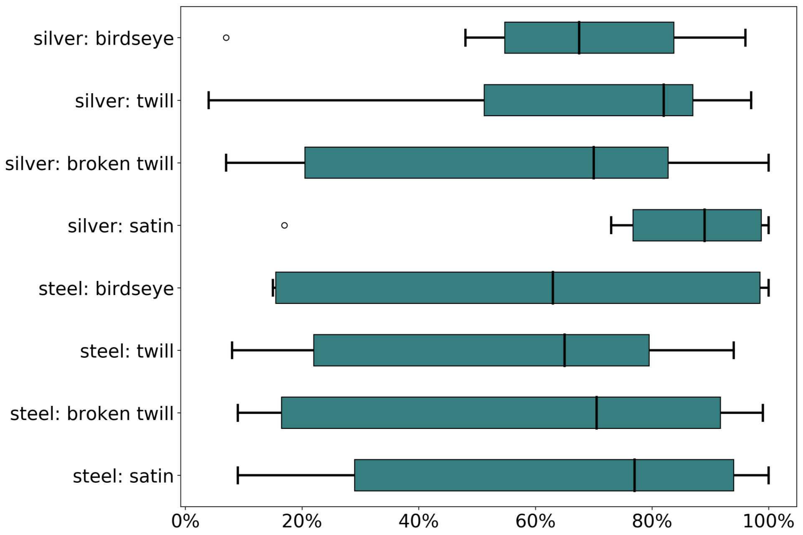

<iframe width="560" height="315" src="https://www.youtube.com/embed/Z8sA4OFuccQ" title="YouTube video player" frameborder="0" allow="accelerometer; autoplay; clipboard-write; encrypted-media; gyroscope; picture-in-picture; web-share" allowfullscreen></iframe>

This video shares more information on how we generated drafts to test the effectiveness of different structures for weaving dry electrodes, based on the research by <a target="_blank" href="https://scholar.google.com/citations?user=hhbNjTcAAAAJ&hl=en">Katya Arquilla</a>. In Katya's research, she was interested in using weaving to create non-adhesive electrodes to monitor the electrical signals created by ones heart beat. With the guidance of the lab and a timely visit by <a target="_blank" href="https://www.cathrynamidei.com/">Cathryn Amidei</a>, Katya tested several structures for the electrodes, attempting to maximize contact with the skin using long floats, while reducing "noise" in the signal that would be created by the yarns moving. She tested the following structures: 1/15 sateen, 1/15 twill, 1/15 broken twill, and 1/15 birdseye structure, with both steel and silver yarns. She woven them on the lab's TC2, which is warped at 30 epi. 

This image shows an overview of the patterns tested

Here is a detail of the twill variation, showing how the conductive yarns are integrated with the base yarns

The image above shows the detection rates of each swatch (how many heartbeats the electrodes could detect). This revealed that satin structures yeilded the most reliable detections, she reasoned this is because they can make good surfce contact with the skin. Her findings showed that "silver thread may be less prone than steel thread to detecting false positives, which is a benefit for using these electrodes in conjunction with an automated detection system." and "the silver thread integrated into the 1/15 sateen structure provided data that was only slightly noisier than data collected with adhesive electrodes on most subjects and able to produce the smaller parts of the ECG waveform that allow the measurement of HRV. We expected to see more differences between the patterns and we think one possibility for the small differences has to do with the size at which we tested. We suspect that testing larger sizes of each pattern would reveal more variability between the patterns." (quoting a draft in preparation). 

<i>Full citation for the research performed with these electrodes: Arquilla, Katya, Laura Devendorf, Andrea K. Webb, and Allison P. Anderson. 2021. "Detection of the Complete ECG Waveform with Woven Textile Electrodes" Biosensors 11, no. 9: 331. https://doi.org/10.3390/bios11090331</i>
