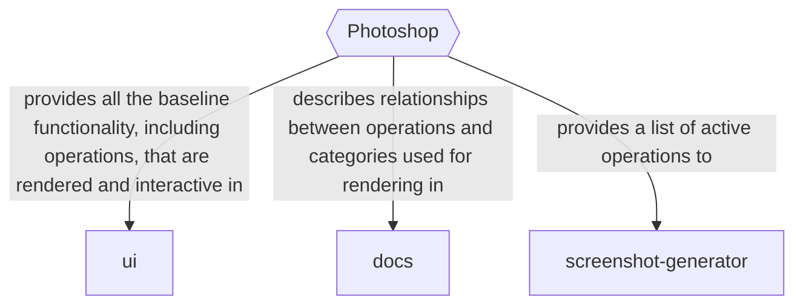

# Frequently Asked Questions
...and answers to questions that may not have been asked, but are good to know about anyway

## I don't have a TC2, Can I use AdaCAD?
Yes, while there are many features that take advantage of the complex patterning capabilities of the TC2 loom, we also support design for dobby and treadle-style looms. 

## I like making drafts, but I don't know how to weave, where might I learn to weave? 
AdaCAD is really a bitmap pixel editor that knows something about the requirements and methods weavers commonly use in drafting. You can interpret the drafts however you like. That said, if you are interested in learning to weave, prepare to invest some time and energy! We reccommend taking a course or finding local resources where you can access looms near you. 

## Can I use AdaCAD with other tools. 
Yes, we have learned that weavers have a complex suite of tools and preferences for those tools. AdaCAD is designed to be interoperable with other systems. For example, we support importing and exploring .WIF files created by any software. 

- .WIF import
- .WIF export

Additionally, we have designed the system with the knoweldge that many people will liekly work across AdaCAD and an image editing tool like Photoshop. We think it can be helpful to design your structures in AdaCAD before exporting them as bitmaps, which you can import as patterns in Photoshop. If you have an existing library of structures, you can also import them into a workspace using a Bitmap import feature. 

-- exporting bitmaps

## I've heard AdaCAD is buggy and unreliable
Yeah, sorry about that. We have made significant effort to improve the quality and reliability of the software. If it's been 6 months since you list tried it, try again. We (the developers of AdaCAD) are not a company. We're just a very small group of people who also have jobs in academia that are demanding! You can help us by reporting bugs that you encounter via Github or Discord. We are also an open-source project, so if you have the capacity to chip in, there are pathways for you to provide additional resources, code, and or help other community members.  

Here'd an idea of that workflow: 

## Working Across .WIF Files
