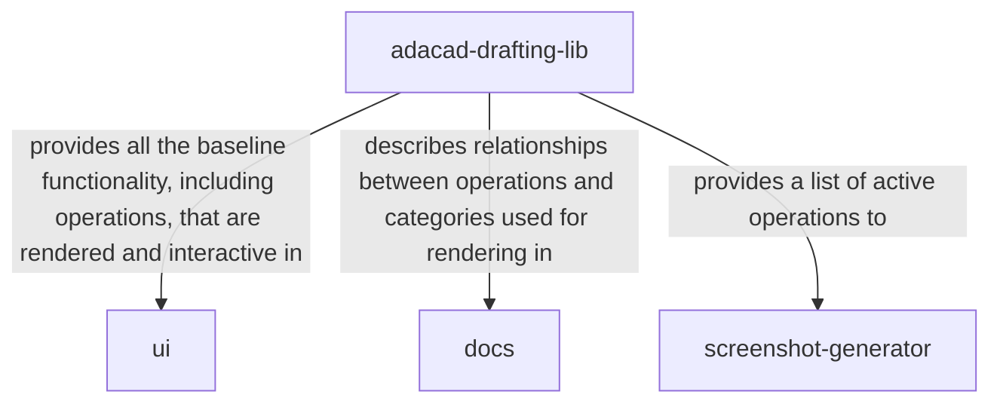

# AdaCAD Code Structure

The AdaCAD project is organized into a collection of projects that draw from the adacad-drafting-lib, a typescript library containing code and data structures for storing, simulating, and manipulating draftings. 


The is accessible via [GitHub](https://github.com/UnstableDesign/AdaCAD) and is organized as follows: 

- packages
    + __adacad-drafting-lib__: a collection of data structures for storing and manipulating drafts, written in TypeScript and hosted on [npm](https://www.npmjs.com/package/adacad-drafting-lib)
- projects
    + __ui__: an user interface to the adacad-drafting-lib, written in Angular and hosted at [adacad.org](https://adacad.org/)
    + __docs__ - provides documentation for the ui as well as the adacad-drafting-lib, written using Docusaurus and hosted at [docs.adacad.org](https://docs.adacad.org)
    + __screenshot-generator__ - a helper script to generate screenshots for all of the operations hosted in the adacad-drafting-lib for the documentation


## Accessing and Updating our Code

We welcome use of our resources as well as contributions by external developers. If you are interested in or curious about this process, we encourage you to join the [AdaCAD Discord Community](https://discord.com/invite/Be7ukQcvrC) where you can discuss ideas and approaches directly with the developers. 

### Clone the repository

To get a local copy of AdaCAD:

```bash
git clone https://github.com/UnstableDesign/AdaCAD.git
cd AdaCAD
```

To contribute changes, fork the repo on GitHub, then clone your fork (replace `YOUR_USERNAME` with your GitHub username):

```bash
git clone https://github.com/YOUR_USERNAME/AdaCAD.git
cd AdaCAD
git remote add upstream https://github.com/UnstableDesign/AdaCAD.git
```

### Pull the latest code

Before starting work or submitting a pull request, pull the latest changes from the main repo:

```bash
git checkout main
git pull upstream main
```

If you use a fork, push the updated `main` to your fork: `git push origin main`.

### Submit a pull request

1. Create a new branch for your work: `git checkout -b your-branch-name`
2. Make your changes, then commit: `git add .` and `git commit -m "Short description of your change"`
3. Push the branch to your fork: `git push origin your-branch-name`
4. On GitHub, open your fork, select the branch you pushed, and click **Compare & pull request** to create a PR against `UnstableDesign/AdaCAD` `main`.
5. Fill in the PR title and description, then submit. A maintainer will review and merge or request changes.


## Installing Projects

After cloning the AdaCAD repo, we suggest that you run the install script located in the base directory to produce all the required assets and dependencies for development by running: 

```ts
./install.sh
```

This will build all of the resources required for development in the correct sequence to prevent breaks. Alternatively, you are welcome to navigate to the base directory of each component project and install them individually in the following order: 

1. **build** the library to create the /dist directory that will be required by the other projects. This will ensure that your all assets run off your local build rather than the published library. 

```ts
cd ./packages/adacad-drafting-lib/
npm install
```

after making changes and updates be sure to run 

```ts
npm run build
```
to make sure those changes are accessible to the other projects. 

2. build the user interface to install any required modules. 

```ts
cd ./projects/ui
npm install -g @angular/cli
npm install --legacy-peer-deps
```

If you receive an error about a missing environments, autogenerate a blank file using angular built in functions. We do not share our environments file because it contains access code for our database and deployments.  As a result, you will not have access to the adacad-database where user files are stored and shared during development. 

```ts
ng generate environments
```
to preview you local code, run

```ts
ng serve
```


**3. Build the docs if you would like to update and preview changes to our documentation site.**

```ts
cd ./projects/docs
npm install
```
to preview you local documentation site, run

```ts
npm run start
```

**4. Install the requirements for the screenshot generator**

```ts
cd ./projects/screenshot-generator
npm install
```

to run the generator, use: 

```ts
npm run build
```

## Where to Make Edits

### AdaCAD Drafting Library
*work in this project if you want to: add new operations (all operations in the library will be automatically accessible in the ui), create new functionality for rendering or manipulating weave drafts* 

The AdaCAD Drafting Library contains the core functionality of AdaCAD without of the UI implementation. Thus, you can access and import the library to work directly in typescript, without having to touch the complex and overwhelming angular code that is used to manage the UI. This goal is to enable better testing, documentation, and integration of our data structures, operations and functions into broader projects.

For Full Documentation see: [AdaCAD Drafting Library](../lib-api/)

#### dependencies



### AdaCAD User Interface
*work in this project if you want to: create a new interactive feature for the interface, fix a ui bug* 

The AdaCAD Drafting Library contains all of the functions and features of AdaCAD that are specific to how a user will load/save/interact and design drafts. This includes user interface components for representing operations as visual elements on screen, as well as data structures that represent the dataflows created on screen. 

#### dependencies 
 ```mermaid
graph TD;
    A[ui]-->|pulls from and extends|B[adacad-drafting-lib];
    A-->|renders content for the|D[screenshot-generator]
```


### AdaCAD Docs

*work in this project if you want to: fix a typo in our documentation, add your own documentation ideas and supports, add your own examples!*

The docs are designed to support both users and developers and serve as a central hub for resources about AdaCAD. 

#### dependencies
 ```mermaid
graph TD;
    A[docs]-->|hosts hand-written guides for the|B[ui];
    A-->|automatically generates documentation for |D[adacad-drafting-lib]
    A-->|hosts the assets used by and generated from|E[screenshot-generator]
```


