import {OpLink} from '@site/src/components/OpLink';

# Data Weaving

Generate and manipulate drafts with numeric data. Our process uses data as visual inspiration and we take creative interpretations  to balance the data with the overall aesthetic and feel of the cloth

:::tip
Play with the ideas in this tutorial using our example AdaCAD workspace:
[https://adacad.org/?share=77982905](https://adacad.org/?share=77982905)
:::

## Operations Explored
<OpLink name ="undulatewefts" /><OpLink name='sample_length' />

## Loom Used Focus
- 24-Shaft AVL Workshop CompuDobby warped with a straight draw. 

## What You'll Need

- A blank workspace at [adacad.org](https://adacad.org) or you can load our pre-made template at [https://adacad.org/?share=77982905](https://adacad.org/?share=77982905)

## Motivation
In this tutorial we'll explore how we can take numeric data and use the data to shape the draft as well as manipulations of a draft across the

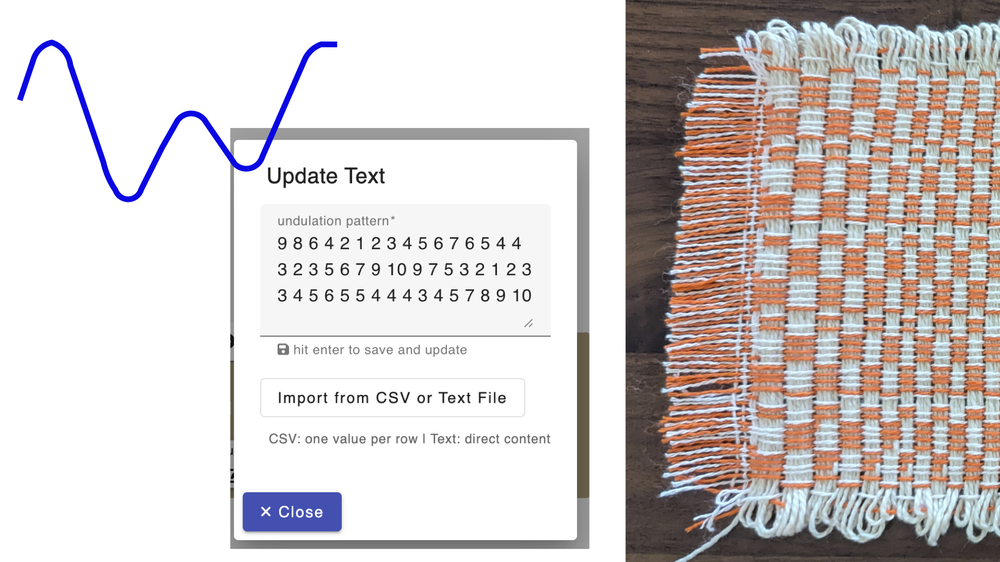
 

To start:  

1. This process is going to work by uploading a dataset to any AdaCAD operation that can accept text input. So, to start, add the  <OpLink name="undulatewefts" /> operation to your workspace. What this is going to do is shift each pick in a draft by an amount specified in the "pattern" parameter. So if I have the sequence, 1 2 1 2 1, it will shift the first pick by 1, the second pick by 2, the third pick by 1 and so on, in the order of the pattern. With this idea in mind, lets think of some data that would create interesting shifting patterns...

2. Think about a data stream that you'd like to work with. I like to think of the shapes of data to start, in terms of how the values of the numbers shift. For example, are they rhythmic like tides, traffic patterns or seasonal temperatures or are they generally increasing or decreasing, like the hight of a seedling over a growing season, or the height of a toddler, or the amount of milk left in the fridge during one week. I wanted to work with something rhythmic, and I miss swimming in the ocean, so I thought of tides and navigated over to [NOAA's Tides and Current's Database](https://tidesandcurrents.noaa.gov/noaatidepredictions.html?id=TWC0419) and then found the nearest data point, which was in San Clemente California. 

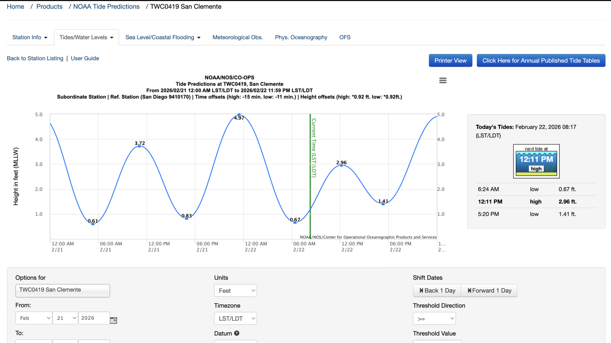

3. Now, we can manually translate this data into a list of numbers in the pattern field of the <OpLink name="undulatewefts" /> function, or, I can load it into an Excel file and export it as a .csv file. Here is how I did the translating between the graph and a list of numbers used for AdaCAD: 
- This graph only shows the peaks and valleys, and only uses lines to show shifts in between. I made a spreadsheet where each row represent one hour, then I broke the time between a peak and value into a series of 6 hours and manually filled in the numbers that roughly corresponded to the position of the line at that point. 

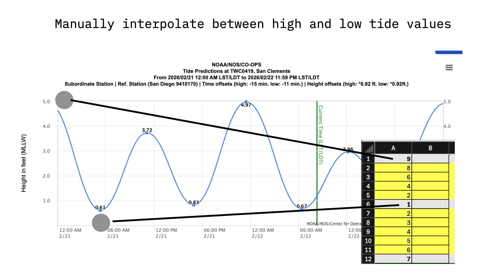

- We see the data here goes from a high value of 4.97 to a low of 0.61. AdaCAD only works in whole numbers (you can't shift a pick by a fraction), so the first thing I needed to do was round these to whole numbers. 
- If the most we are going to shift a pick by is 5 ends, then the pattern changes might be too subtle to detect. For this reason, I multiplied the values by 2. 
- Excel is my love language, so I sued color coding to correspond to the nature of the values. Grey cells mark and peak or valley, yellow mark daytime hours, green nighttime hours. The color coding has no influence on AdaCAD....but it makes me happy and helped me grasp what the data meant and think about how I would use it to inform a draft. 
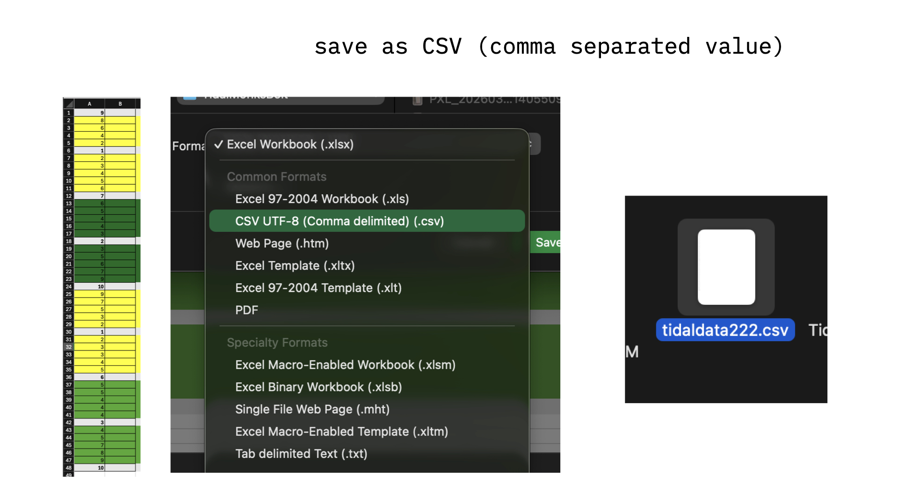

4. Export or save your data file as a ".CSV" file. This is a text based data format that represents each row/column as a list of values separated by commas. Each row is marked by a return at the end of the line. Thus, if we look at the .csv file for this data, we see a vertical list of numbers. 

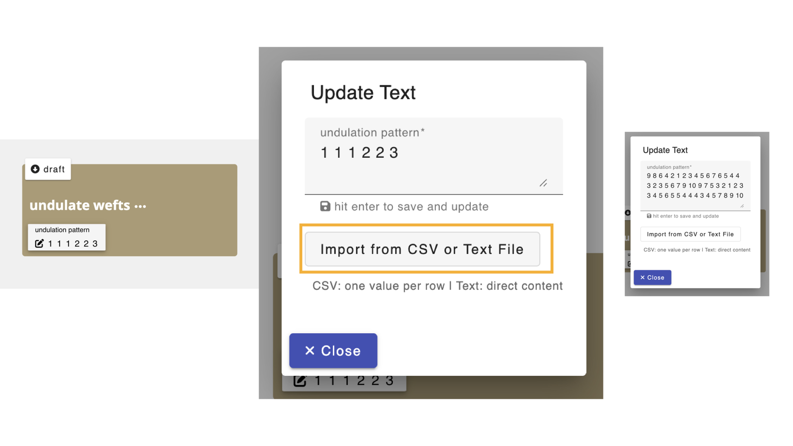
5. Click on the pattern parameter on the <OpLink name="undulatewefts" /> operation, then select "import from .CSV or text file" and voila! your numbers are in the operation and can be used to manipulate input drafts 

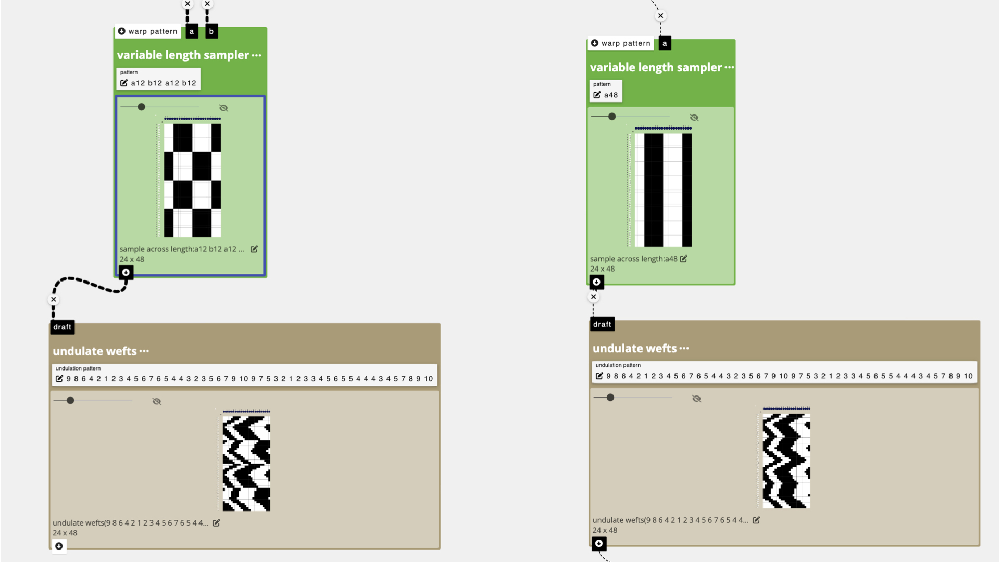

## Sample 1: Undulate Wefts A

To start,  I was interested in playing with structures kind of like Monk's belt so I created a single pick of raised and lowered heddles that I could repeat and shift in different ways. 

In the first try, I used <OpLink name="sample_length" /> to alternate between the regular pattern and the inverted pattern every 12 picks (roughly corresponding to day/night values represented in my data).  I took the output from teh sample length operation and connected it to the inlet of <OpLink name="undulate_wefts" />. I don't actually remember how I assigned structures to the black and white regions, but when I wove it I got this:

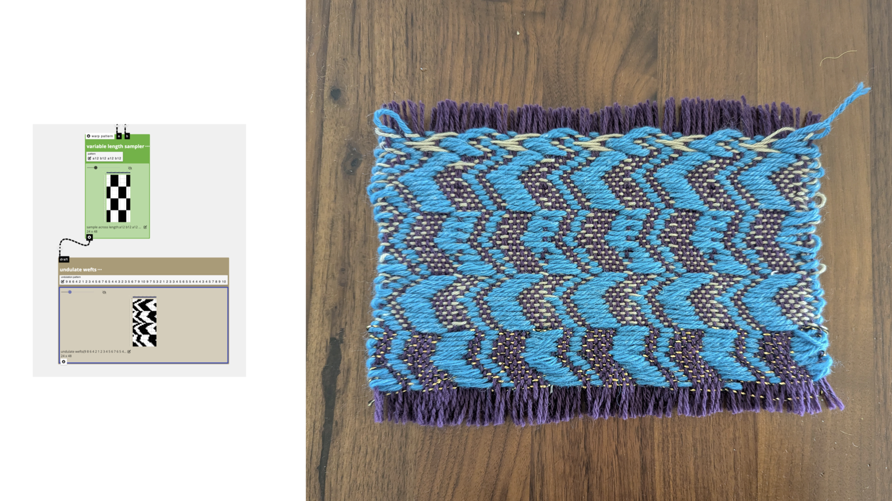

## Sample 2: Undulate Wefts B

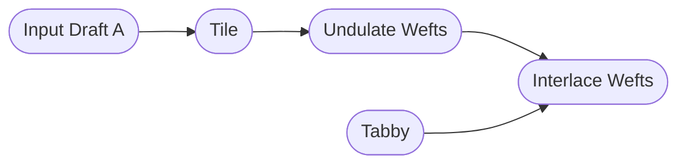

 I felt that the first sample was too chaotic and strange to view, so decided to just repeat one input structure across 48 rows to correspond to the 48 hours represented in the data set. I took the output from this operation and connected it to the inlet of <OpLink name="undulate_wefts" /> to create a shifting pattern. Then, I interlaced the pattern rows with <OpLink name="tabby" />tabby using <OpLink name="interlace" /> to give the cloth structure while letting long floats define the pattern. I wove the pattern wefts with a thick and puffy toxic green yarn, and the tabby/binding wefts with a varigated green wool (leftover from a sock knitting project) 

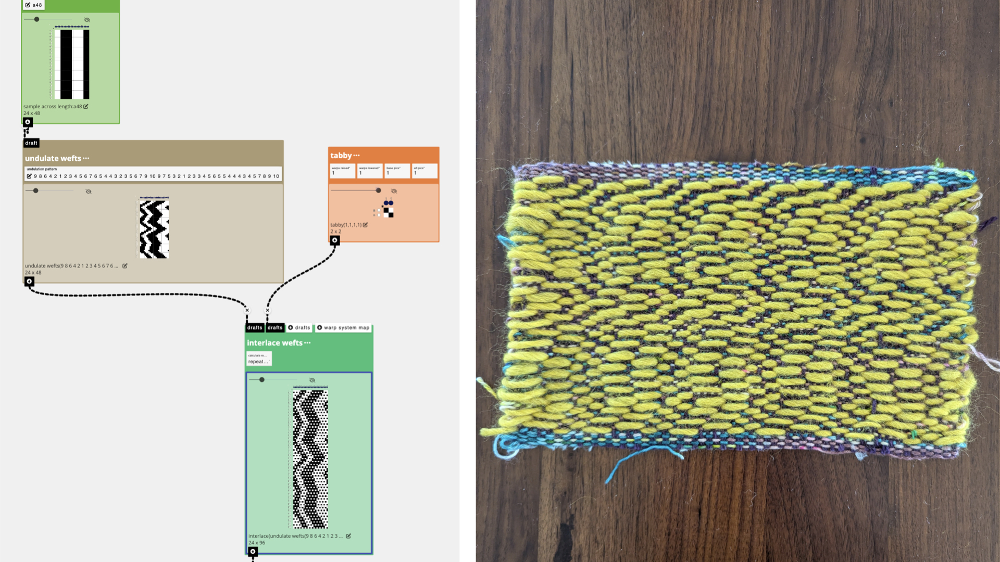

## Strategy 3: Sample Length to Stretch and Compress the Design

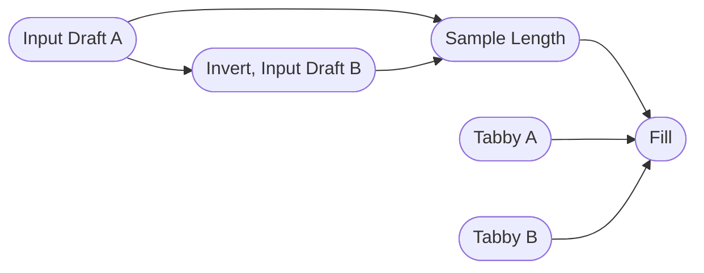

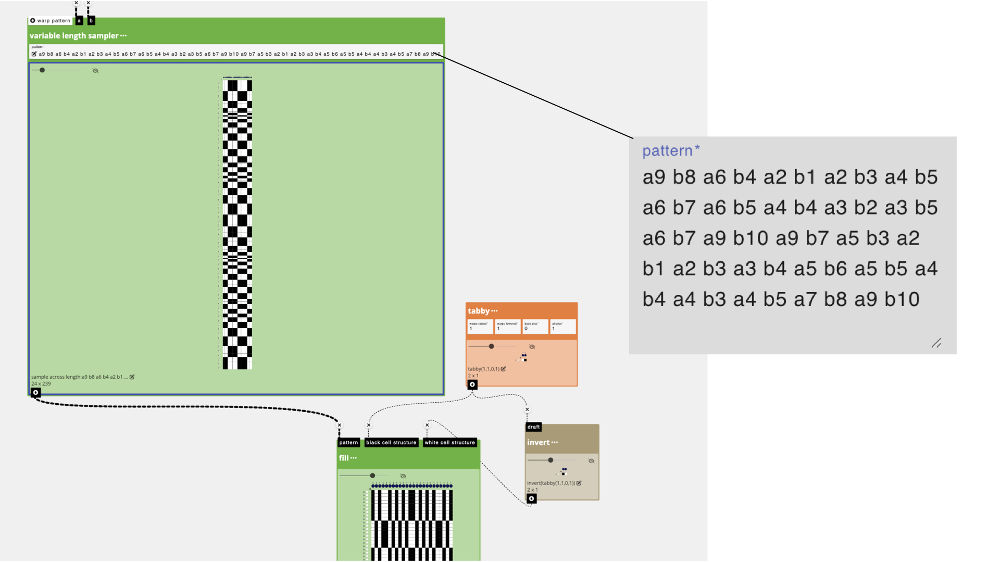

I rewarped the loom between samples to use an alternating color scheme. This would allow me to select different sub-sets of warps to create blocks of warp floats. 

I started with the same single pick input drafts that I created for the previous samples, but instead of shifting their left/right position with undulate wefts, I decided to alternate them based on the data using <OpLink name="sample_length" />. To do this, I uploaded my same data into the pattern parameter, then manually added an "a" or "b" in front of each number, in an alternating fashion. What this would translate to is a design where pattern a would be repeated for 9 wefts, then pattern b for 8 wefts, and so on. The visual effect would be one where the design is stretched or compressed based on the data. Higher tide values would correlate to bigger blocks and smaller values to shorter color blocks.

I used <OpLink name="fill" /> to translate the draft created from <OpLink name="sample_length" /> into a weaving pattern that would alternate the blocks between my warp colors (orange and pink). For instance, black blocks would be translated as "orange" blocks (e.g. would create warp floats on orange warps), and white as "pink" (e.g. warp floats on pink warps). 

Here is my first sample and the visualization based on weaving with a dark blue weft....which I sadly ran out of. 

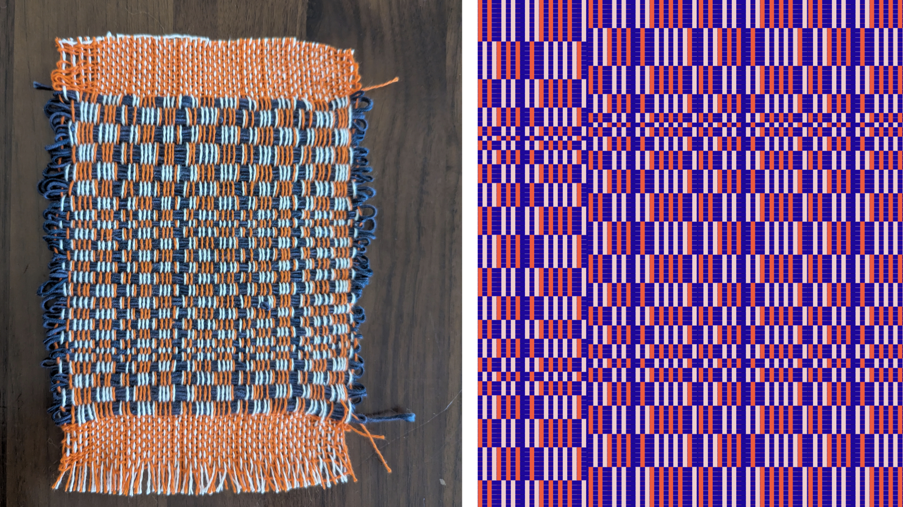

I wove the complete sample with a cream colored pearl cotton instead: 

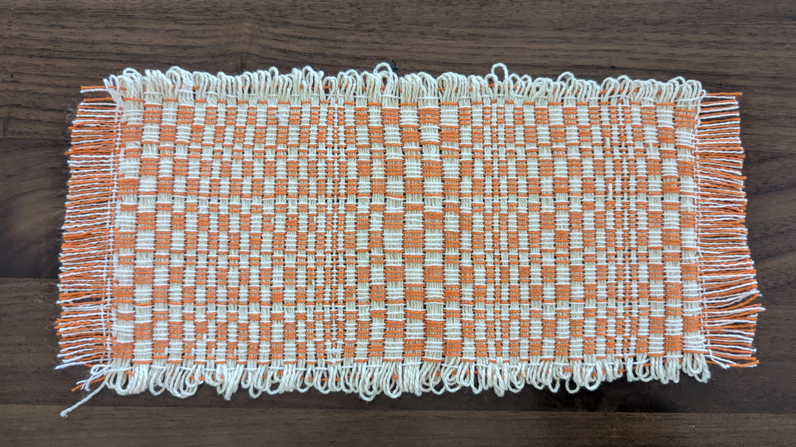
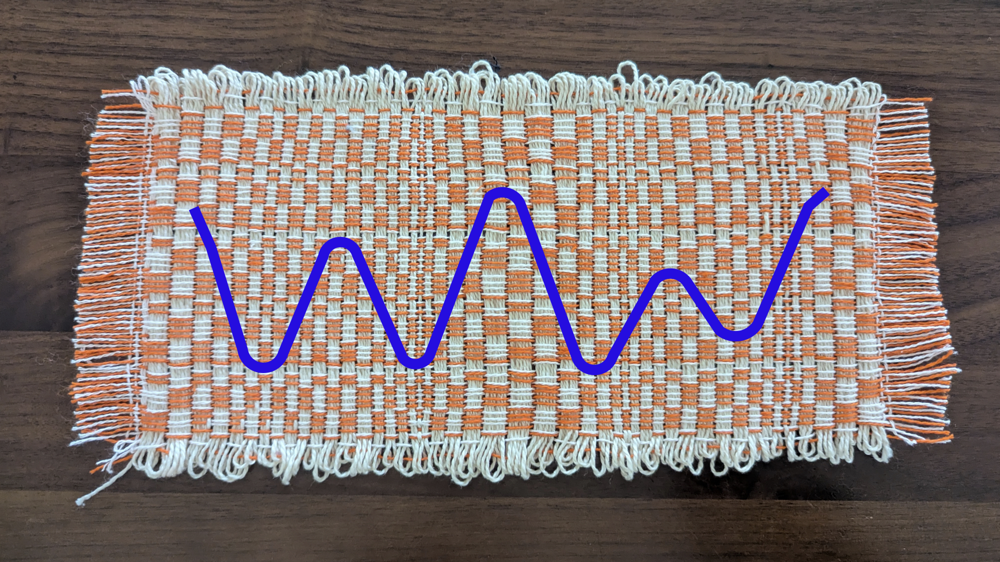

:::tip
For more specific instructions about exporting and weaving on Dobby Looms, you can read our tutorial: [Weaving on Dobby Looms](./weave_avl.md)

For a more detailed example of how you can use the <OpLink name='directdrawdown' /> operation to use these drafts as lift plans for dobby weaving, check out the [Weaving Drafts as Graphics](./draft-as-graphic.md) tutorial. 
:::

