import {OpLink} from '@site/src/components/OpLink';

# Using Drafts as Graphics

Sometimes we end up creating a draft whose pattern we really love and want to "see" in the final cloth. This tutorials offers a few possible ways of translating interesting drafts into cloth designs that will retain that draft as a visual graphic in the cloth.  

:::tip
Play with the ideas in this tutorial using our example AdaCAD workspace:
[https://adacad.org/?share=14197547](https://adacad.org/?share=14197547)
:::

## Operations Explored
<OpLink name = "bitfield" /> <OpLink name = "selector" /><OpLink name = "interlace" /><OpLink name = "stretch" /><OpLink name = "crop" /><OpLink name = "fill" />

## Loom Used Focus
- 24-Shaft AVL Workshop CompuDobby warped with a straight draw. 

## What You'll Need

- A blank workspace at [adacad.org](https://adacad.org). Or 
you can just use our prepopulated template at [https://adacad.org/?share=14197547](https://adacad.org/?share=14197547).

## Motivation

Cloth does not always look like it's draft. Sometimes, especially with beginning weavers, we get enamored with a particular design that we've created in black and white pixels and expect that design to translate to woven cloth only to be disappointed when the cloth falls apart and doesn't really look like what we intended. Alternatively, sometimes we create compelling and generative visual patterns using AdaCAD operations and then struggle with what those mean in terms of the cloth. For example, consider this draft created by the <OpLink name="bitfield" />  operation. 

It's interesting visually, but if we were to directly translate each pixel to a warp and weft thread, and depending on our density, we would probably get a cloth result where the pattern is no longer as crisp and compelling. 

This tutorial offers a few strategies for using these visually compelling drafts as starting points and manipulating them in ways that preserve their graphic integrity in cloth. I'm also going to do this with an eye towards weaving the patterns on non-jacquard looms. 

To start:  

1. Select or search for the  <OpLink name='bitfield' /> operation from the list of operations on the left sidebar. If it is not showing up, make sure "Show Advanced Operations" is selected. After you select the operation, it will be added into your workspace. <OpLink name='bitfield' /> creates patterns from algebraic expressions and bit-wise operations, click the link to see the full description and examples of how it can be used. 

2. Because I'm working on 24 shafts, I have to first pick a section of the draft to stretch and repeat. To do this, I use the <OpLink name="crop" /> operation to find a 24x24 region of the bitfield draft that I'd like to Weave. Select or search for the  <OpLink name='crop' /> operation from the list of operations on the left sidebar. Connect the [ <FAIcon icon="fa-solid fa-circle-arrow-down" size="1x" /> outlet](../../reference/glossary/outlet.md) of the bitfield operation and connect it to an [ <FAIcon icon="fa-solid fa-circle-arrow-down" size="1x" /> inlet](../../reference/glossary/inlet.md) on the crop operation. Adjust the [parameters](../../reference/glossary/parameter.md) to your specifications. For our loom, we can only work with a 24 unique ends so we use 24 as our crop size. 

:::tip
To get a sense of how my final cloth will look when a draft is repeated. I connect the output from crop to a <OpLink name="tile" /> operation. I then  `pin` the output from the tile operation to the viewer so that as I change parameters upstream, I can see how they will change the pattern tiling. After pinning the tile output, I like to use the arrow keys to adjust the `pics from start` and `ends from start` on the <OpLink name="crop" /> to move cropping window until I found something visually interesting.

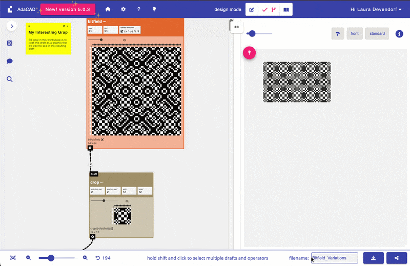
:::

## Strategy 1: Stretch

You can make weaves, and their graphics, chunkier and more visible using the <OpLink name="stretch" /> operation. Stretch repeats each end and pick in a draft according to your preferences. So, if you are working on a high density warp, you might stretch your design 4x across the warps (end-wise) so that groups of 4 warps act like a single warp. I usually start by determining the warp stretch I want and then adjusting the weft stretch so that the outcome weaves square. 

a. Select or search for the  <OpLink name='stretch' /> operation from the list of operations on the left sidebar. Connect the [ <FAIcon icon="fa-solid fa-circle-arrow-down" size="1x" /> outlet](../../reference/glossary/outlet.md) of the crop operation and connect it to an [ <FAIcon icon="fa-solid fa-circle-arrow-down" size="1x" /> inlet](../../reference/glossary/inlet.md) on the stretch operation. Adjust the [parameters](../../reference/glossary/parameter.md) to your specifications. For us, I liked the slightly blocker texture of the graphic when I stretched the draft by 2 along the ends and pics. Since this doubles the size of the output, and I'm limited to 24 shafts, I go back and update my crop window to 12x12 so that, after stretching, the design is 24 x 24. 

As a preview, here is what the output of this dataflow produced when woven with a thick and fluffy green singles yarn. It's super soft and squishy and I love how the floats translated to big textured lumps. Would be nice for a scarf perhaps: 

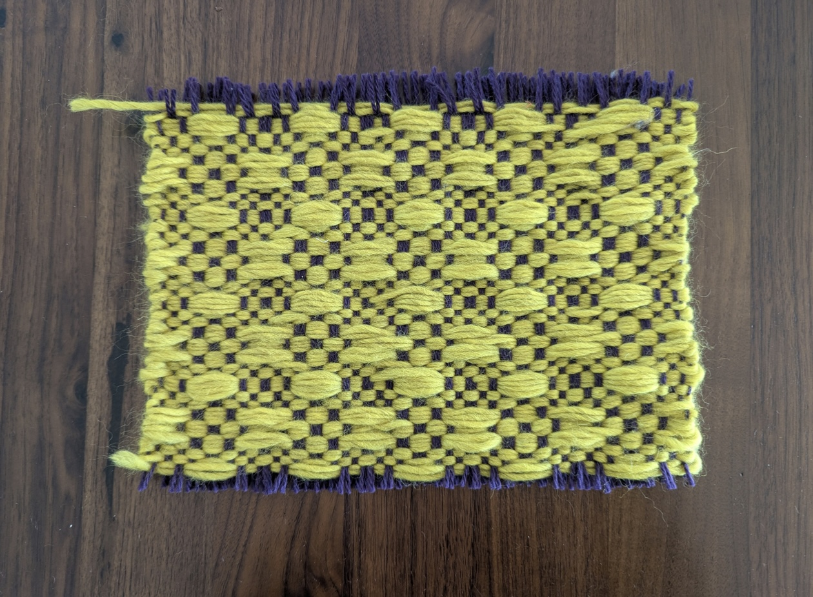
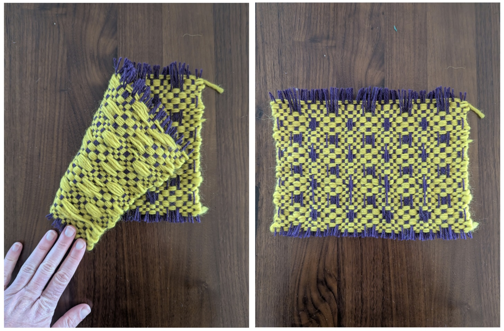

## Strategy 2: Interlace Wefts

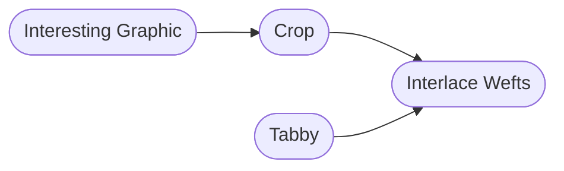

For patterns that have large regions of black or white draft cells (e.g. long floats) your modification might need to add structure to the design. I do this using <OpLink name="interlace" /> and interlacing my design with tabby. The tabby rows will give the cloth structure while the floats will create a visible graphic on the cloth. To maintain that the graphic is visible, I usually use a thicker contrasting yarn for the floating graphic picks and a thinner yarn that is similar to the warp for the tabby picks. 

a.  Select or search for the  <OpLink name='interlace' /> operation from the list of operations on the left sidebar to add it to the workspace. 

b. Select or search for the  <OpLink name='tabby' /> operation from the list of operations on the left sidebar to add it to the workspace. 

c. Connect the [ <FAIcon icon="fa-solid fa-circle-arrow-down" size="1x" /> outlet](../../reference/glossary/outlet.md) of the crop operation and connect it to the first [ <FAIcon icon="fa-solid fa-circle-arrow-down" size="1x" /> inlet](../../reference/glossary/inlet.md) on the interlace wefts operation. This should make a second inlet pop-up, ready to accept another draft to interlace with the draft you have already added. Connect the [ <FAIcon icon="fa-solid fa-circle-arrow-down" size="1x" /> outlet](../../reference/glossary/outlet.md) of the tabby operation and connect it to the newly created draft [ <FAIcon icon="fa-solid fa-circle-arrow-down" size="1x" /> inlet](../../reference/glossary/inlet.md) on the interlace wefts operation. This will create a new draft that mixes the two connected drafts in a row-by-row fashion. Specifically, it will make a draft that uses 1 pick of your pattern draft, then 1 of tabby, then the next pattern, then the next tabby, etc. 

As a preview, here is what the output of this dataflow produced when we weave the tabby pics with a thin dark green yarn and a thicker and woolier orange/blue yarn on the pattern rows.

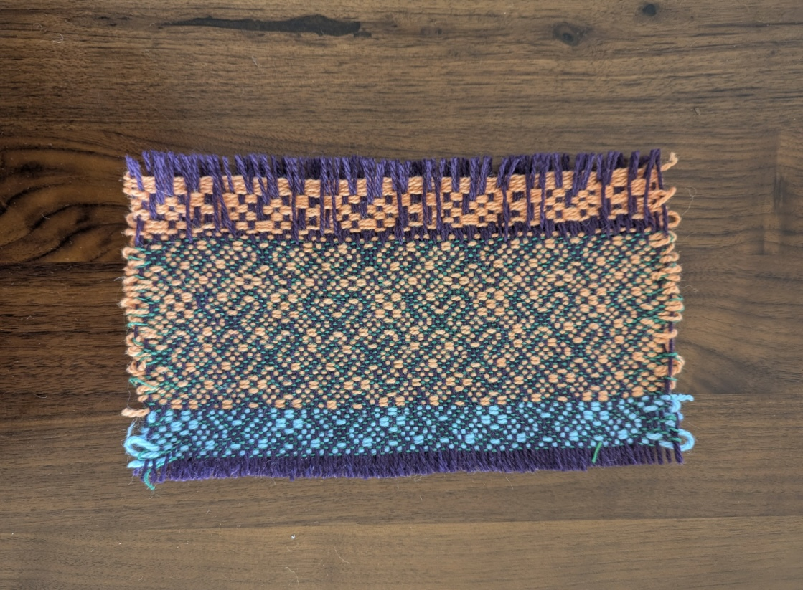
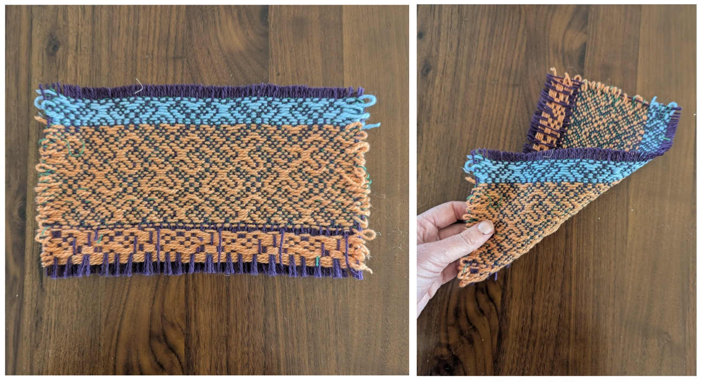

## Strategy 3: Fill 

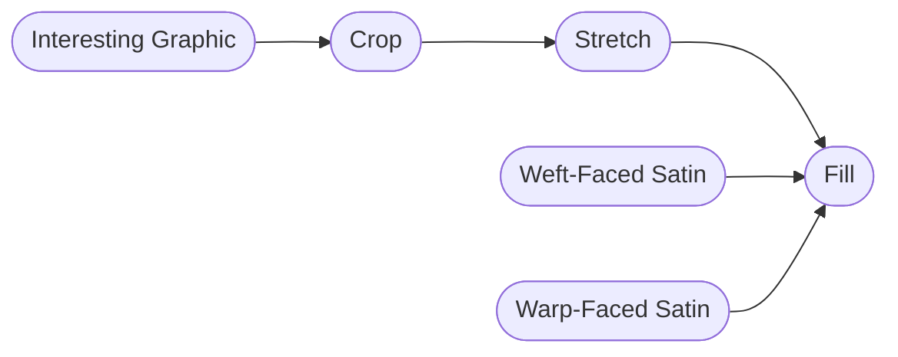

One of the most straightforward ways to create a graphic on a cloth is to use contrasting or "shaded" structures with contrasting warps and wefts in different regions of the design. Say, a warp-faced <OpLink name="satin" />, <OpLink name="shaded_satin" /> or <OpLink name="twill" /> in the black regions and the inverse, weft-facing structure in the white. This works best if you have large regions of black and white and enough frames or jacquard heddles to weave the varying regions. 

In more limited settings, such as our 24-shaft AVL, we have to think about designs that create strong visual contrast even with relatively small regions. Here, we experimented with a huck-lace like structure. We selected part of the bitfield design, stretched it a little bit and then "filled" the black regions of the stretched design with <OpLink name="tabby" /> while leaving the white floats as is. To maintain some kind of structural integrity, we spliced in a tabby row every 4 picks using <OpLink name="splice_in_wefts" />

a.  Select or search for the  <OpLink name='fill' /> operation from the list of operations on the left sidebar to add it to the workspace. 

b. Select or search for the  <OpLink name='tabby' /> operation from the list of operations on the left sidebar to add it to the workspace. 

c. Connect the [ <FAIcon icon="fa-solid fa-circle-arrow-down" size="1x" /> outlet](../../reference/glossary/outlet.md) of the crop operation and connect it to the `pattern` [ <FAIcon icon="fa-solid fa-circle-arrow-down" size="1x" /> inlet](../../reference/glossary/inlet.md) on the fill operation. Connect the [ <FAIcon icon="fa-solid fa-circle-arrow-down" size="1x" /> outlet](../../reference/glossary/outlet.md) of the tabby operation and connect it to the `black cell structure` [ <FAIcon icon="fa-solid fa-circle-arrow-down" size="1x" /> inlet](../../reference/glossary/inlet.md) on the fill operation. This will create a new replaces all the black cells in the pattern with the structure provided, in this case, tabby. 

d.  Next, select or search for the  <OpLink name='splice_in_wefts' /> operation from the list of operations on the left sidebar to add it to the workspace. 

e. Then, select or search for the  <OpLink name='tabby' /> operation from the list of operations on the left sidebar to add it to the workspace. 

f. Connect the [ <FAIcon icon="fa-solid fa-circle-arrow-down" size="1x" /> outlet](../../reference/glossary/outlet.md) of the fill operation and connect it to the `receiving draft` [ <FAIcon icon="fa-solid fa-circle-arrow-down" size="1x" /> inlet](../../reference/glossary/inlet.md) on the splice in pics operation. Connect the [ <FAIcon icon="fa-solid fa-circle-arrow-down" size="1x" /> outlet](../../reference/glossary/outlet.md) of the tabby operation and connect it to the `splicing draft` [ <FAIcon icon="fa-solid fa-circle-arrow-down" size="1x" /> inlet](../../reference/glossary/inlet.md) on the splice in pics operation. This will create a new draft that mixes the two connected drafts in a row-by-row fashion while also letting you determine the ratio between the rows. For us, we want to add one tabby row after every 4 pattern rows, just to give the structure some integrity. To do this, we change the `pics between insertion` [parameter](../../reference/glossary/parameter.md) to 4. 

As a preview, here is what the output of this dataflow produced when we weave the pattern with a silky purple yarn and tabby pics with a contrasting and thicker tan yarn.

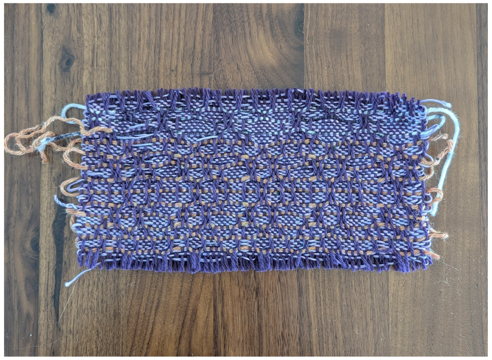
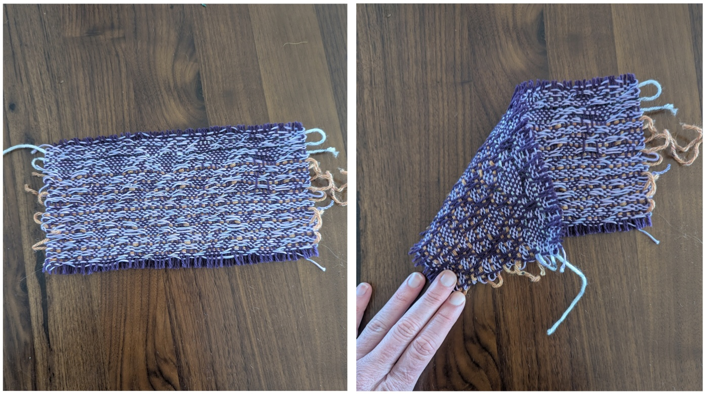

##  Play
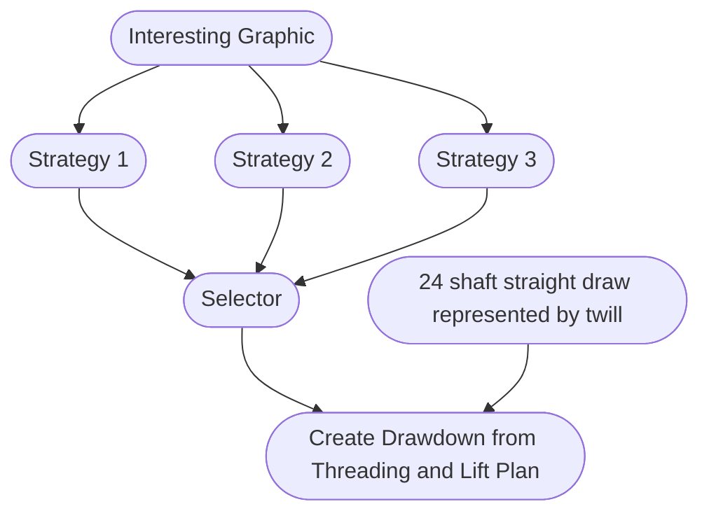

We created a workspace [link here!](https://adacad.org/?share=14197547) that includes all three of these approaches so that you can compare, contrast and play. 

In the dataflow for each strategy, you'll see that we used <OpLink name="apply_materials" /> to experiment with different colors. To do this we: 

1. Select or search for the  <OpLink name='apply_materials' /> operation from the list of operations on the left sidebar to add it to the workspace.  Connect the [ <FAIcon icon="fa-solid fa-circle-arrow-down" size="1x" /> outlet](../../reference/glossary/outlet.md) of the draft you want to preview with colors operation and connect it to the `draft` [ <FAIcon icon="fa-solid fa-circle-arrow-down" size="1x" /> inlet](../../reference/glossary/inlet.md) set materials and systems operation. 

2. Now you need to create a color palette. click the [+ <FAIcon icon="fa-solid fa-chess-board" size="1x" /> add draft](../../reference/interface/workspace#a-add-drafts-or-notes-to-workspace). When prompted to enter the number or warps and wefts to use in this blank draft you need to think about the colors you'd like to apply. IF you are going to use single color warp and weft, then just enter 1 and 1. If you want your warps to alternative 2 colors, then you'd enter 2 in the warps field. The key here is that you'll be defining a single "repeat" of your color pattern and the <OpLink name='apply_materials' /> will repeat that sequence across your entire draft. 

3. After adding your warp and wefts, and selecting 'OK', AdaCAD will drop a new blank draft onto the workspace. To edit this draft in more details, double-click it and then select **“open in editor”**. And voila, you’ll see the draft in the draft editor. I prefer to set my  [loom type, which can be adjusted in the left sidebar](../../reference/interface/draft_editor.md#c-adjust-loom-and-draft-settings), to “Jacquard” so the view is simple. Then, and then [select a color from the drafting pencil tab](../../reference/interface/draft_editor.md#changing-systems-and-materials). If you click the colored circles on the warp with this colored pencil, you’ll assign that color to the respective warp.  Repeat the process for each color in your sequence. 

3. Toggle back to the dataflow view and connect the [ <FAIcon icon="fa-solid fa-circle-arrow-down" size="1x" /> outlet](../../reference/glossary/outlet.md) of the color palette draft you just created to the `systems and materials` [ <FAIcon icon="fa-solid fa-circle-arrow-down" size="1x" /> inlet](../../reference/glossary/inlet.md) on the set materials and systems operation. You should now be able to click the output and see your draft, wtih the colors applied in the viewer. You can edit this palette at any time by opening your color pattern draft, and changing the pattern. 

:::tip
If you prefer a programatic way of describing color sequences, check out the <OpLink name="material_sequence" /> operation.
:::

:::tip
And while our workspace starts with a graphic created by the <OpLink name="bitfield" /> operation, you could also experiment with any structures or drafts that you create. For example, you can try weaving the outputs of <OpLink name="random" />, <OpLink name="glitchsatin" />, <OpLink name='sierpinski_square' />, or just by creating a blank draft and free-hand drawing a graphic. 
:::

## Weave
To create our samples, we needed to produce a .WIF file to import to our AVL workshop dobby loom. We do this using the <OpLink name="directdrawdown" /> operation. This operation takes a threading and lift plan and generates the associated drawdown. When you export it as a .wif, it will be correctly formatted with the threading and lift-plan specified. 

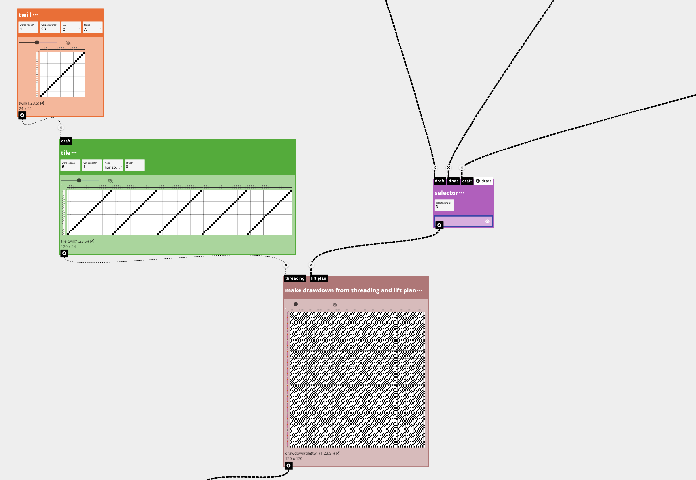

1. Select or search for the  <OpLink name='directdrawdown' /> operation from the list of operations on the left sidebar to add it to the workspace.  Connect the [ <FAIcon icon="fa-solid fa-circle-arrow-down" size="1x" /> outlet](../../reference/glossary/outlet.md) of the draft you want to use as your lift plan (e.g. the design you want to repeat across the cloth) to the `lift plan` [ <FAIcon icon="fa-solid fa-circle-arrow-down" size="1x" /> inlet](../../reference/glossary/inlet.md). 

2. Next, you'll need to tell the <OpLink name='directdrawdown' /> operation what your threading is. We're using a straight draw so rather than creating a blank draft that is 24 picks high and 120 wide (e.g. our number of warps) and manually clicking the pixels, I use the <OpLink name="twill" /> operation instead. Specifically, I add the twill operation and set the parameters to 1 and 23 to represent I create one "straight" threading unit. I then repeat that across by 5 using <OpLink name="tile" /> to represent that my threading repeats 5 times. This makes my threading draft, and I connect the [ <FAIcon icon="fa-solid fa-circle-arrow-down" size="1x" /> outlet](../../reference/glossary/outlet.md) of the threading draft to the `threading` [ <FAIcon icon="fa-solid fa-circle-arrow-down" size="1x" /> inlet](../../reference/glossary/inlet.md) on the <OpLink name='directdrawdown' /> operation. 

3. The outcome of <OpLink name='directdrawdown' /> creates a drawdown, offering me a privew of the cloth I'm eventually going to weave. To create the .WIF file, I double-click the drawdown created and then select **“open in editor”** so I can verify that my design is formatted as I intend,
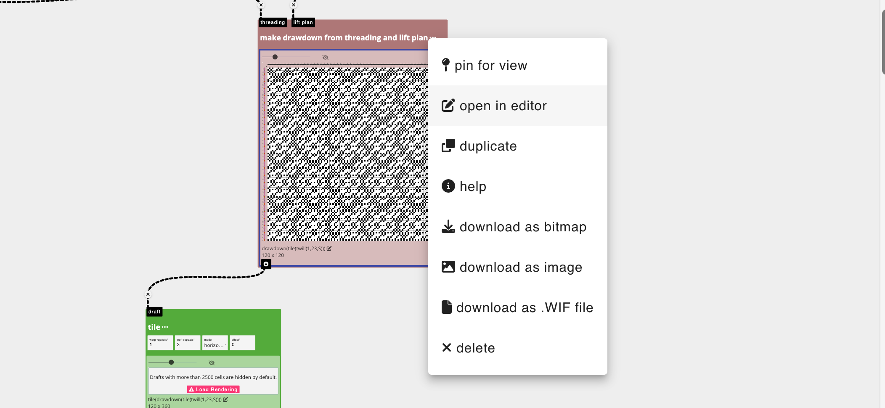

 4. And then hit the download button in the lower right corner of the interface and select "Export Draft as .WIF". From there, I load it up on my AVL loom and weave!

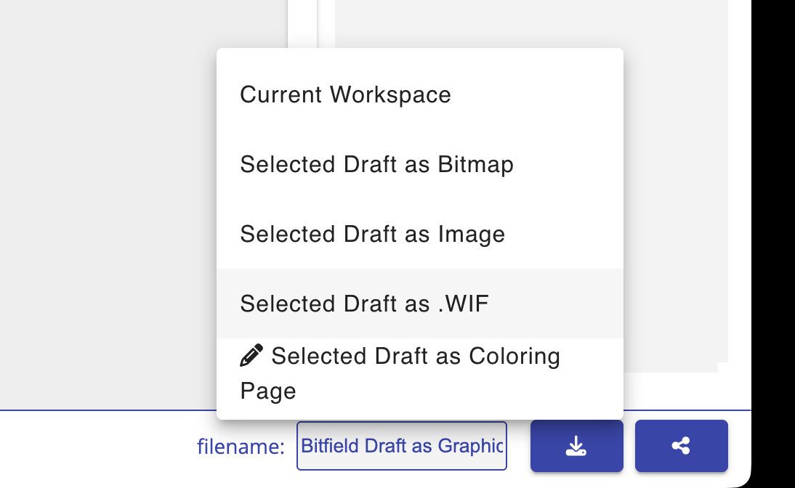

Happy weaving, from my living room loom to yours....

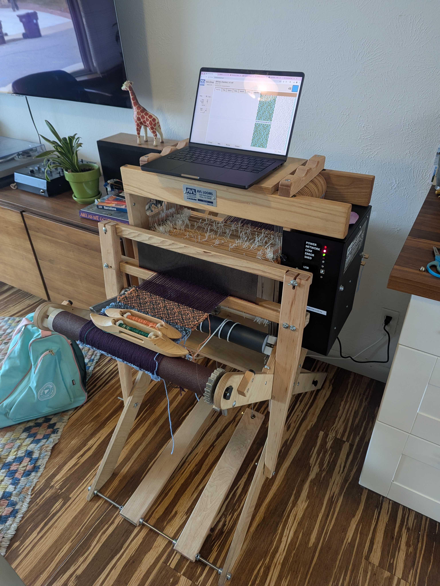

:::tip
For more specific instructions about exporting and weaving on Dobby Looms, you can read our tutorial: [Weaving on Dobby Looms](./weave_avl.md)
:::

