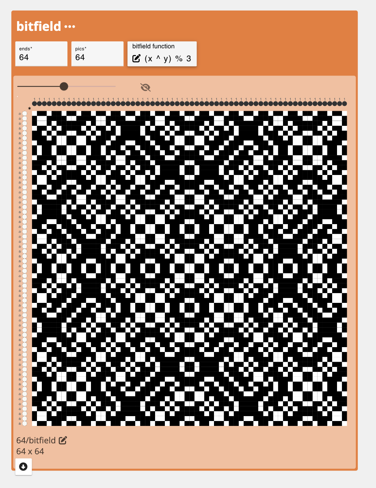
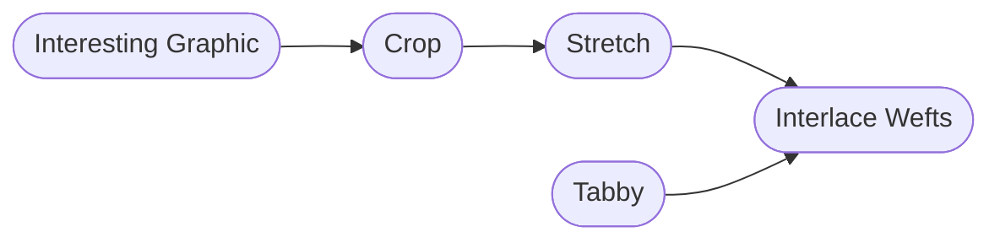
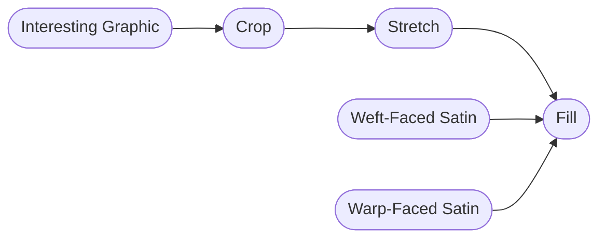
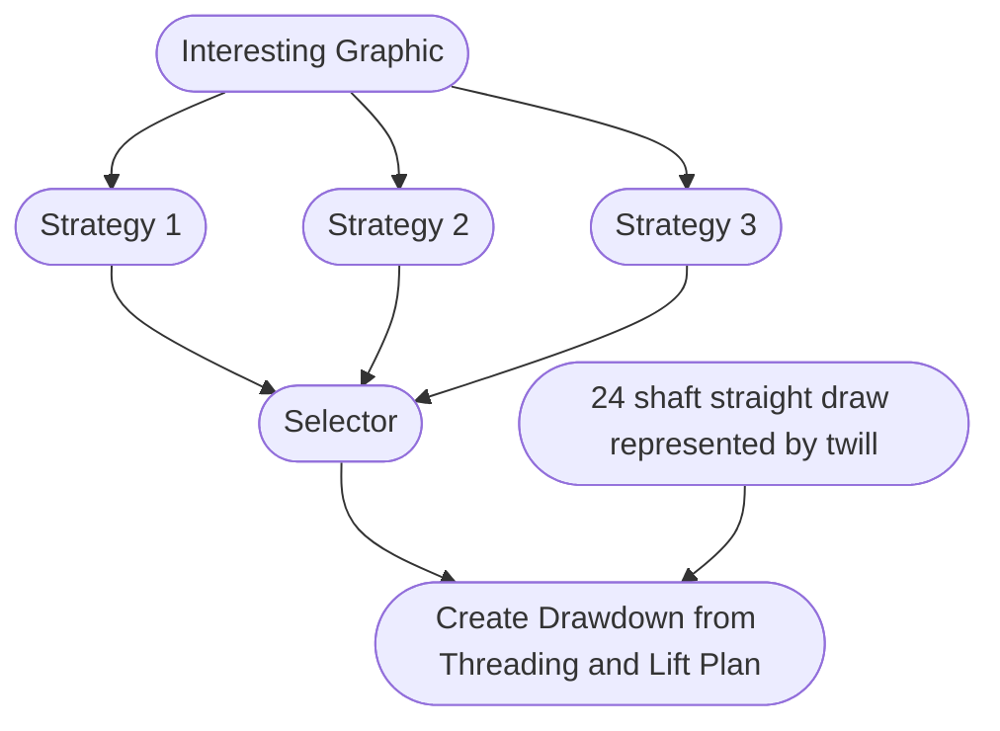

import {OpLink} from '@site/src/components/OpLink';

# Using Drafts as Graphics

Sometimes we end up creating a draft whose pattern we really love and want to "see" in the final cloth. This tutorials offers a few possible ways of translating interesting drafts into cloth designs that will retain that draft as a visual graphic in the cloth.  

## Operations Explored
<OpLink name = "bitfield" /> <OpLink name = "selector" /><OpLink name = "interlace" /><OpLink name = "stretch" /><OpLink name = "crop" /><OpLink name = "fill" />

## Loom Used Focus
- 24-Shaft AVL Workshop CompuDobby warped with a straight draw. 

## What You'll Need

- A Pen and Pencil (optional)
- A blank workspace at [adacad.org](https://adacad.org). 

## Motivation

Cloth does not always look like it's draft. Sometimes, especially with beginning weavers, we get enamored with a particular design that we've created in black and white pixels and expect that design to translate to woven cloth only to be disappointed when the cloth falls apart and doesn't really look like what we intended. Alternatively, sometimes we create compelling and generative visual patterns using AdaCAD operations and then struggle with what those mean in terms of the cloth. For example, consider this draft created by the <OpLink name="bitfield" />  operation. 

It's interesting visually, but if we were to directly translate each pixel to a warp and weft thread, and depending on our density, we would probably get a cloth result where the pattern is no longer as crisp and compelling. 

This tutorial offers a few strategies for using these visually compelling drafts as starting points and manipulating them in ways that preserve their graphic integrity in cloth. I'm also going to do this with an eye towards weaving the patterns on non-jacquard looms. 

## Strategy 1: Stretch

You can make weaves, and their graphics, chunkier and more visible using the <OpLink name="stretch" /> operation. Stretch repeats each end and pick in a draft according to your preferences. So, if you are working on a high density warp, you might stretch your design 4x across the warps (end-wise) so that groups of 4 warps act like a single warp. I usually start by determining the warp stretch I want and then adjusting the weft stretch so that the outcome weaves square. 

Because I'm working on 24 shafts, I have to first pick a section of the draft to stretch and repeat. To do this, I use the <OpLink name="crop" /> operation to find a 12x12 the region of the design that I like best. I then stretch it by 2 along the ends and picks and then export that design to my loom. 

## Strategy 2: Interlace Wefts

For patterns that have large regions of black or white draft cells (e.g. long floats) your modification might need to add structure to the design. I do this using <OpLink name="interlace" /> and interlacing my design with tabby. The tabby rows will give the cloth structure while the floats will create a visible graphic on the cloth. To maintain that the graphic is visible, I usually use a thicker contrasting yarn for the floating graphic picks and a thinner yarn that is similar to the warp for the tabby picks. 

## Strategy 3: Fill 

One of the most straightforward ways to create a graphic on a cloth is to use contrasting or "shaded" structures with contrasting warps and wefts in different regions of the design. Say, a warp-faced <OpLink name="satin" />, <OpLink name="shaded_satin" /> or <OpLink name="twill" /> in the black regions and the inverse, weft-facing structure in the white. This works best if you have large regions of black and white and enough frames or jacquard heddles to weave the varying regions. In more limited settings, such as our 24-shaft AVL, we have to think about designs that create strong visual contrast even with relatively small regions. Here, we experimented with a huck-lace like structure. We selected part of the bitfield design, stretched it a little bit and then "filled" the black regions of the stretched design with <OpLink name="tabby" /> while leaving the white floats as is.

##  Play

We created a workspace that includes all three of these approaches so that you can compare, contrast and play. In the dataflow for each strategy, you'll see that we used <OpLink name="apply_materials" /> to experiment with different colors. Then, we connect all the outcomes into a <OpLink name="selector" /> operation that can let you easily toggle  

You can switch between the strategy used by changing the number on the <OpLink name="selector" /> operation. 

Now that you have a few options and 

Start by finding an operation where you like the look of the draft is creates. Some of our favorites include <OpLink name="bitfield" />, <OpLink name="random" />, <OpLink name="glitchsatin" />, <OpLink name='sierpinski_square' />, or just by creating a blank draft and free-hand drawing a graphic. 
