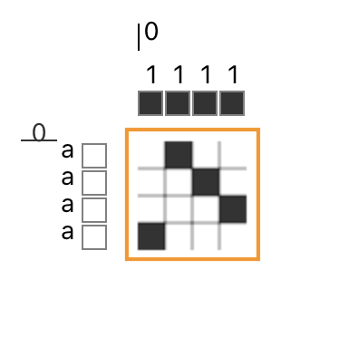

# Draft

A draft is an abstract representation of a [cloth](cloth.md). For example, the two images below show the correspondence between a simulated cloth and the draft that would be used to create the cloth.  In AdaCAD, each square in the draft (which we call a draft cell), represents a location at which a single [warp](warp.md) [end](end.md) and [weft](weft.md) [pick](pick.md) cross. A black cell represents a place where the warp is lifted when the weft is passed through, and a white cell is a location where the warp remains lowered. 

## Parts of A Draft

In AdaCAD, a Draft contains several related pieces of information. 

### Drawdown

The [drawdown](drawdown) describes the cloth [structure](structure.md) and the specific way that each warp will travel over each weft. A drawdown may represent an entire piece of cloth, or, a structure that might repeat in one section of the cloth. 

### Weft Materials

The row of cells on the side of the drawdown indicate correspond to different materials that will be used within the [weft](weft.md). The color of the cell can change to describe the color or type of yarn to be used on each [pick](pick.md). 

### Warp Materials

The row of cells on the top of the drawdown correspond the different materials that will be used within the [warp](warp.md). The color of the cell can change to describe teh color or type of yarn to be used on each warp [end](end.md). 

### Weft Systems

The letters on side of the drawdown indicate the [weft system](system.md) each [pick](pick.md) is associated with. You can learn more about how and why you would use weft systems [here](system.md). 

### Warp Systems

The letters on top of the drawdown indicate the [warp system](system.md) that this [end](end) is associated with. You can learn more about how and why you would use warp systems [here](system.md). 

