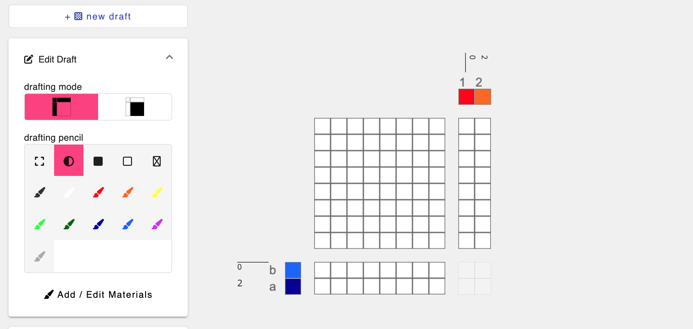
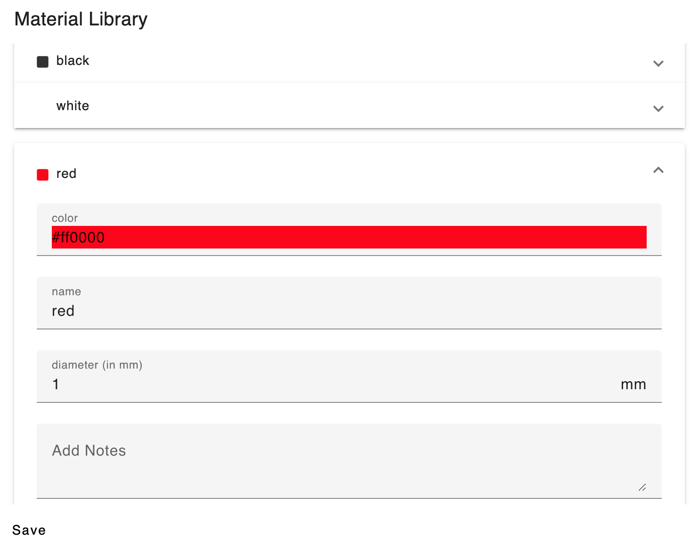

# Material

AdaCAD uses colors to represent and at times, simulate, the color of materials to be used when weaving the cloth.  

## Adding and Editing Materials
By default, AdaCAD lets the user choose between 11 different materials, represented by the colored paintbrushes on the draft editor view. 

You can add or edit those materials or the colors used to represent them by clicking "Add/Edit Materials" from the Draft editor "Edit Draft" panel or by clicking the palette icon on the top bar of AdaCAD.  

From there, you can change the name, the color, and the diameter of the material. All materials default to a diameter of 1mm. 

:::info
AdaCAD offers only limited support for representing and simulating the interactions of materials with different widths. Currently, the diameter information is only considered on the (in progress) simulation feature. 
:::

## Assigning Materials to Drafts

There are several ways to specify materials in AdaCAD. 

### 1. Assigning Material Information To a "Seed" Draft
A seed draft is a draft on the workspace that has not been generated by an [Operation](operation). Instead, it was created using the "Add Draft" button.  Put another way, it is a "seed" to the [dataflow](dataflow) and it is visually marked within a plain white box. 

You can modify the material information of these seed drafts directly from the workspace viewer by clicking the material squares to change them to the next material in the sequence of allowable materials. 

Alternatively, you can open this seed draft in the draft editor by clicking on the draft and then switching from "Workspace" to "Draft" mode in the top toolbar or clicking the `...` icon on the top right of the seed draft and selecting "open in editor." You can modify the material information on the editor by clicking the material squares to change them to the next color in the sequence.  Alternatively, by selecting any one of those brushes and "painting" it over the materials blocks on the [draft](draft), you can assign materials more quickly. 

### 2. Assigning Material Information To a Draft in the Dataflow

If you would like to set the material information for a draft that is part of the dataflow, you must use the <OpLink name="apply_materials"/> as shown below. This operation will apply the materials (and [systems](system)) from one draft to the other, and will repeat the color sequences as required to account for every warp and weft. 

