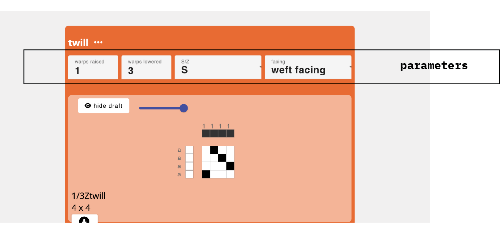
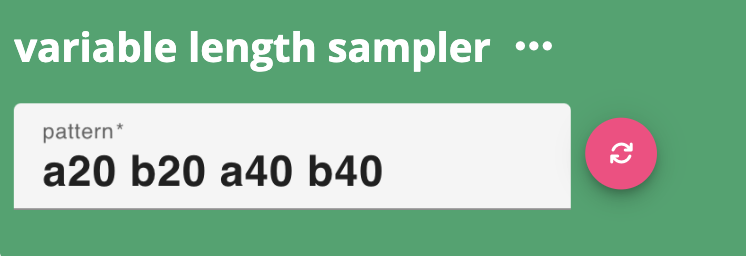

# Parameter

Parameters are parts of AdaCAD [operations](./operation.md). They allow the user to define specific values that will affect how the input drafts are manipulated when producing out put drafts.

Changing the parameters changes the way that the input draft or draft that is generated by the operation is manipulated. For example, the image below shows several variations of twills that are generated by changing the values of the parameters

## Parameter Types

AdaCAD operations can accept parameters of different types:

### Number

Numeric parameters provide numeric values and change be changed though typing or clicking up and down arrows on the keyboard. 

### Text

Text input params allow you to type text that is parsed and interpreted by the operation. For example, <OpLink name="sample_length"/> allows the user to input a series of letter/number pairs. The specific  sequence of letters generates inlets (for draft a and b) and then the operation repeats those structures for the amount of weft picks specified. The pink "refresh" button must be pressed to update the draft based on the text. 

### Select List

Select params allow you to select from one of several possible actions.

### Upload File

An upload parameter allows the use to upload a file from their computer and then that image is processed and used by the AdaCAD operation. For example <OpLink name="imagemap"/> allows the user to upload an image and then generates [inlets](./inlet.md) based on the colors found in the image. You can assign drafts to different color regions of the image by assigning a draft to the corresponding colored inlet. 

