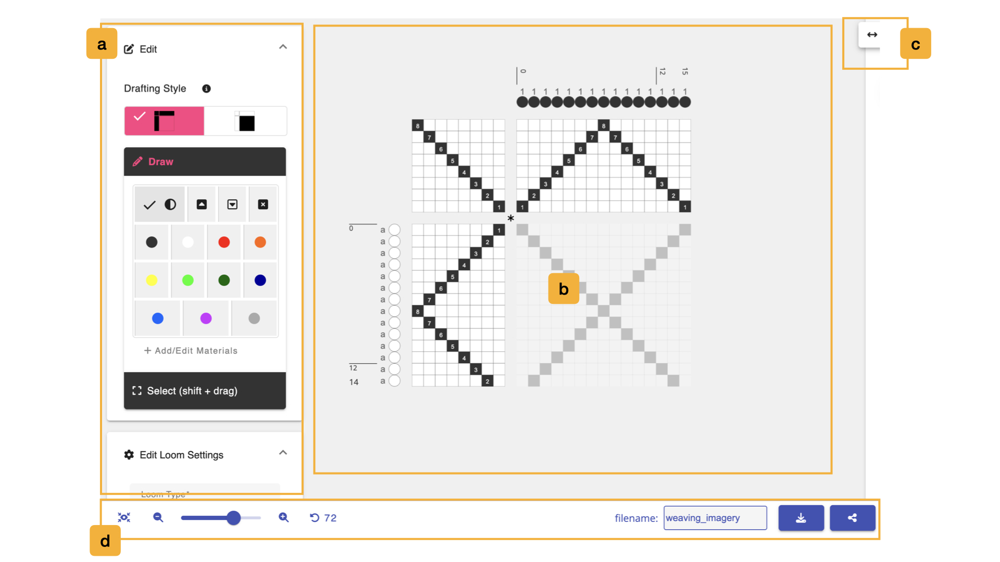
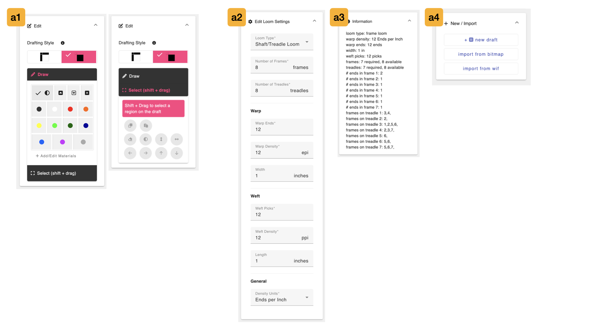
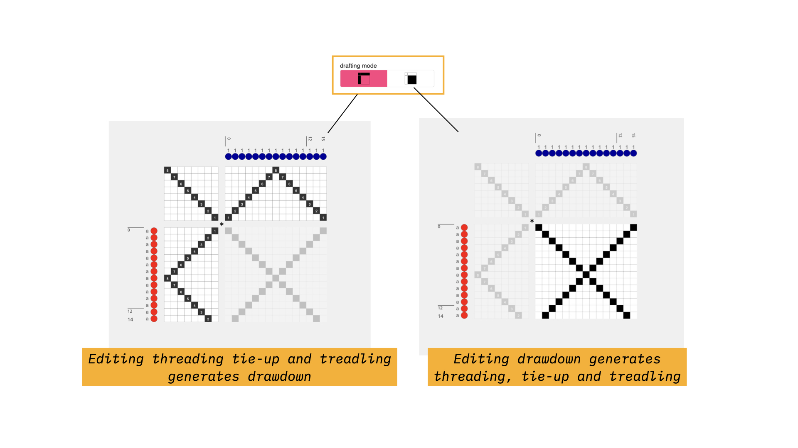
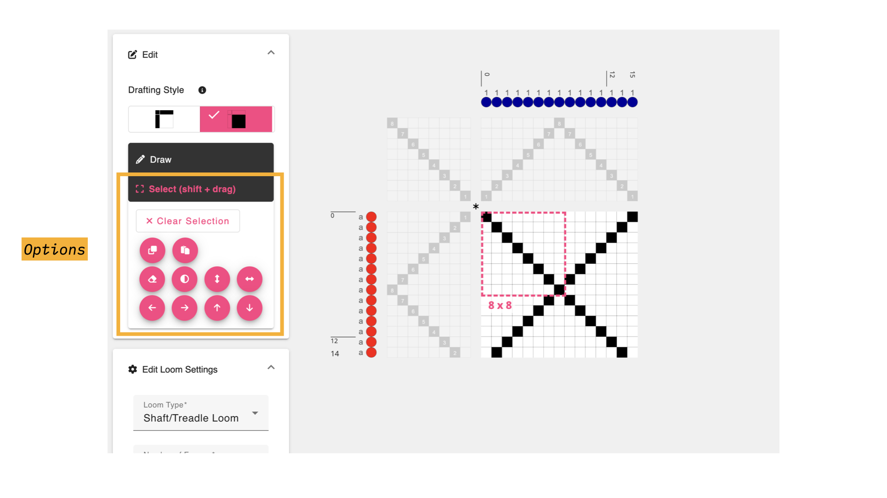
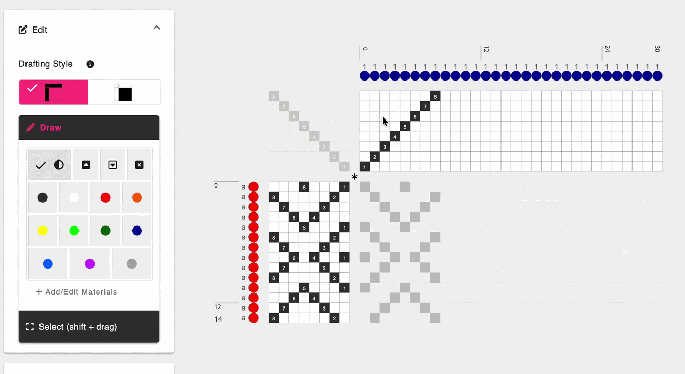
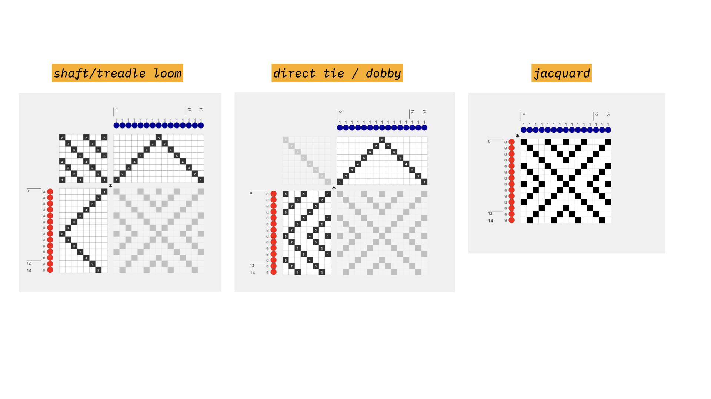
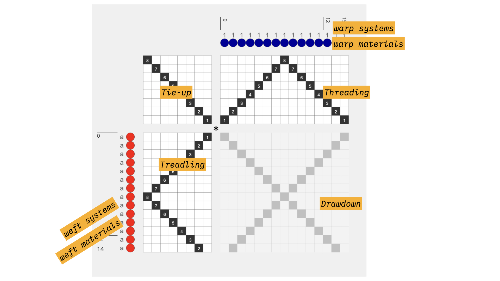
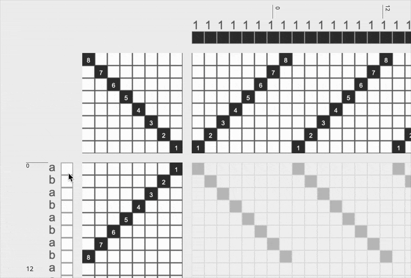

# Draft Editor
In this mode, you can create a draft of specific dimensions and for different loom types by marking cells in the threading, treadling and tieup, or, by modifying the drawdown and generating the threadings. 

## Overview

The editor is split in two. On the left is a sidebar of four panels: **Edit**, **Edit Loom Settings**, **Information**, and **New / Import**. On the right is the draft itself, which you design by clicking and dragging on its cells.

## a. Editing Tools

The **Edit** panel holds everything you use to design upon the draft.This window scrolls, revealing the sections titled a1 - a4 in the image above. 

- The **Drafting Style Toggle** switches between the two [drafting styles](../glossary/drafting-style.md) that the editor supports. In the first, marked **threading-first**, the drawdown is generated based on the edits made in the threading, treadling, and tie-ups. In the other, marked **drawdown-first**, the threading, treadling and tie-ups will be generated by edits in the drawdown. This toggle is hidden when the loom type is set to Jacquard, since a jacquard loom has no threading to design.

### a1. Draw & Select

The **Draw** section holds the **Drafting Pencils**, the tools you use to set the value of individual cells.

- <FAIcon icon="fa-solid fa-adjust" size="1x" /> **Toggle Heddle**: toggles the value of a given draft cell. If the cell is black, it turns the cell white and vice versa. If used on the materials or systems, it will toggle through all available colors and/or systems in use. 
- <FAIcon icon="fa-solid fa-square-caret-up" size="1x" /> **Set Heddle Up**: set the value of a given draft cell to black, meaning the heddle is raised.
- <FAIcon icon="fa-solid fa-square-caret-down" size="1x" /> **Set Heddle Down**: set the value of a given draft cell to white, meaning the heddle is lowered.
- <FAIcon icon="fa-solid fa-square-xmark" size="1x" /> **Unset Heddle**: set the value of a given draft cell to unset, meaning that no yarn will travel over this warp at all. Unset cells are useful when shape weaving or integrating inlays into portions of the draft.

Below these, AdaCAD adds one <FAIcon icon="fa-solid fa-circle" size="1x" /> **material pencil** for every material in your [materials library](./library.md#e-materials). Each one is drawn in that material's color and sized relative to its diameter, and hovering over it shows the material's name. Drawing with a material pencil on the warp or weft materials simply paints that color into the region. Drawing it anywhere else on the draft assigns both the pick and the end associated with the selected cell to that material.

- <FAIcon icon="fa-solid fa-plus" size="1x" /> **Add/Edit Materials** takes you to the [library](./library.md#e-materials), where you can add, delete, or edit the materials available while drafting.

The **Select (shift + drag)** section is where you modify whole regions of the draft rather than one cell at a time.

To make a selection, hold `shift` and drag across the area you want. This works on every part of the draft, including the materials and systems, so you can for instance copy a color sequence across all of the warps. Once you have a selection, the buttons in this section become available:

| Button | What it does |
| ------ | ------------ |
| <FAIcon icon="fa-solid fa-clone" size="1x" /> **Copy** | copies the selected region. Also `command` + `c` |
| <FAIcon icon="fa-solid fa-paste" size="1x" /> **Paste** | pastes what you copied into the current selection. Also `command` + `v` |
| <FAIcon icon="fa-solid fa-eraser" size="1x" /> **Erase** | clears the selected region |
| <FAIcon icon="fa-solid fa-adjust" size="1x" /> **Invert** | swaps raised and lowered cells |
| <FAIcon icon="fa-solid fa-arrows-alt-v" size="1x" /> **Flip** | mirrors the selection vertically |
| <FAIcon icon="fa-solid fa-arrows-alt-h" size="1x" /> **Flip** | mirrors the selection horizontally |
| <FAIcon icon="fa-solid fa-arrow-left" size="1x" /> <FAIcon icon="fa-solid fa-arrow-right" size="1x" /> <FAIcon icon="fa-solid fa-arrow-up" size="1x" /> <FAIcon icon="fa-solid fa-arrow-down" size="1x" /> **Shift** | moves the contents of the selection one cell in that direction |

<FAIcon icon="fa-solid fa-times" size="1x" /> **Clear Selection** releases the selection without changing anything.

Some of these actions are greyed out depending on where your selection is, because they would not make sense there:

- on a **warp** row, shifting up or down, flipping vertically, and inverting are unavailable.
- on a **weft** column, shifting left or right, flipping horizontally, and inverting are unavailable.
- on the **threading**, inverting is unavailable.
- on the **treadling**, inverting is unavailable unless you are on a direct tie loom.

### a2. Adjust Loom and Draft Settings
The **Edit Loom Settings** panel lets you control how the draft is represented based on the type and features of the loom you are using. 

- **Loom Type**: AdaCAD currently supports three types of looms, listed here as **Direct Tieup Loom**, **Shaft/Treadle Loom**, and **Jacquard**.

Changing the loom type changes the view as shown above.
    - **Shaft/Treadle**: this view is configured with an editable tie-up, threading and treadling. Only one treadle can be selected on each pic. 
    - **Direct Tie / Dobby**: this view is configured with a threading and lift plan, acknowledging that on each pic, more than one frames could be raising in tandem. The tie-up is fixed with one frame associated/attached to each "pedal". 
    - **Jacquard**: because a jacquard loom does not operate with frames (e.g. every heddle is individually controllable), this view only shows the [drawdown](../glossary/drawdown.md)

Beneath the loom type, the remaining fields are grouped into warp, weft, and general settings.

| Field | What it does |
| ----- | ------------ |
| **Number of Frames** | the total number of frames to be represented on the draft. Hidden if the loom type is Jacquard. If your design needs more frames than you have set, a note appears telling you how many it requires |
| **Number of Treadles** | the total number of treadles to be represented on the draft. Only shown for a Shaft/Treadle loom, and likewise warns you if your design needs more |
| **Warp Ends** | changes the number of ends on the draft |
| **Warp Density** | does not change the view of the draft in the editor, but is used to calculate the width of the cloth. This value is also considered in how the [simulation](./viewer.md#the-simulation) is rendered |
| **Width** | the predicted width of the cloth, based on the current number of warp ends and the warp density. Changing this value changes the number of warp ends such that the resulting cloth, woven at the specified density, would come out to the specified width |
| **Weft Picks** | changes the number of picks on the draft |
| **Weft Density** | the weft equivalent of warp density, used to calculate the length of the cloth |
| **Length** | the predicted length of the cloth, based on the current number of weft picks and the weft density. Changing it changes the number of picks in the same way that Width changes the number of ends |
| **Density Units** | specify if density should be measured in ends per inch or ends per 10cm. This is set for the whole workspace, so changing it here changes it everywhere |

### a3. Draft Information

The **Information** panel summarizes what you would need to know to dress your loom for this draft. What it reports depends on the loom type: every draft lists its loom type, densities, warp ends, width, and weft picks, while direct tie looms add the number of ends in each frame, and shaft/treadle looms add which frames are tied to each treadle.

### a4. Start a New Draft
The **New / Import** panel at the bottom of the sidebar is where drafts come from.
-  \+ <FAIcon icon="fa-solid fa-chess-board" size="1x" /> **new draft**, will create a new blank draft within the editor. Behind the scenes, the old draft and this new one you are creating are both added to the Workspace, should you need to access them again. 
- **import from bitmap** and **import from wif** let you bring in a draft made elsewhere. You can select several files at once, and each becomes its own draft.

## b. Draft Editor

The draft editor offers a space to point-and-click draft cells in order to design cloth. The specific way that the draft is rendered, and the options for editing allowed depend on the [loom type](#c-adjust-loom-and-draft-settings) selected. The origin for this view (e.g. the position of the first end and first pick) is placed on the top left by default. This can be changed in the  <FAIcon icon="fa-solid fa-gear" size="1x" /> settings menu on the [topbar](./topbar.md#b-application-settings-and-support)

You can click draft cells to change their values, and the value change depends on the currently selected [drafting pencil](#b-editing-tools).

### Editing a Draft Made by an Operation
If you open a draft that was generated by an [operation](../glossary/operation.md) in the [workspace](./workspace.md), a banner appears telling you that edits are disabled, and naming the operation responsible. This is deliberate: anything you drew would be overwritten the next time that operation ran. If you want to edit it anyway, click **Enable Edits**.

### Changing Systems and Materials

- **Materials/Colors**: You can associate each warp end or weft pick with a color. To assign or change the color associated, you can either draw with one of the <FAIcon icon="fa-solid fa-circle" size="1x" />  material pencils or simply just click upon any material cell on the draft. When you click, it will cycle through each of the colors currently available in your materials library. 

- **Warp and Weft Systems**: If you are weaving with multiple warp and weft [systems](../glossary/system.md), or making a draft that requires that you specify systems (e.g. <OpLink name="notation" />  or <OpLink name="assign_systems" />) you can click on the warp or weft system to change it. Warp systems are represented as numbers and weft systems as single letters. This means you can have an infinite number of warp systems but only 26 different weft systems.

Each time you click on the letter or number associated with a pick or end, it will increase the value by one. It will only increase to one value beyond the highest value used. So, if your draft uses weft systems 1 and 2, you would click through values 1, 2, 3 before it started repeating on 1 again. Put another way you cannot assign something to warp system 4 if you haven't first assigned something to systems 1, 2, and 3.

### Key Commands

Mac users should read `command` below; Windows and Linux users should read `control`.

| Action | How |
| ------ | --- |
| Select a region | hold **shift** and **drag** across the draft |
| Switch to the select tool | `command` + `r` |
| Switch to the draw tool | `command` + `d` |
| Copy the selection | `command` + `c` |
| Paste into the selection | `command` + `v` |
| Undo | `command` + `z` |
| Zoom in / out | `command` + `+` / `command` + `-` |
| Save to your AdaCAD account | `command` + `s` |

Holding `shift`, `command`, or `control` while you are drawing temporarily switches you into select mode, so you can grab a region without changing tools.

## c. Resize Window
You can press this button and drag to the left or right to expand/contract the amount of the screen that is devoted to the Draft Editor. 

## d. Adjust View, Save and Share
The footer along the bottom of the screen is shared with every other mode, and is described in full on the [topbar](./topbar.md#e-footer) page. It holds the zoom controls, the undo button, the filename field, and the download and share buttons.
