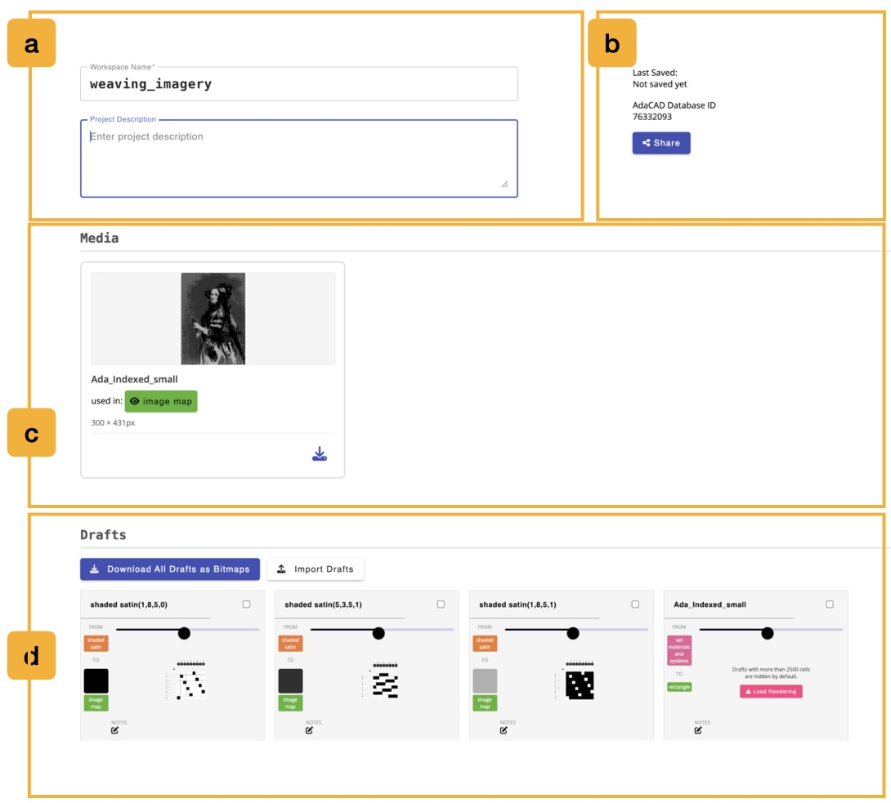
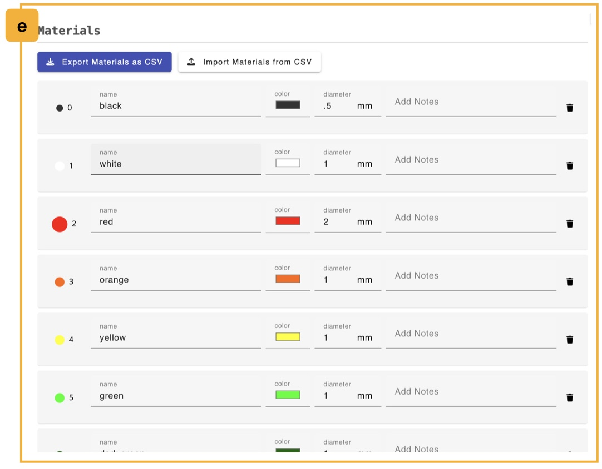
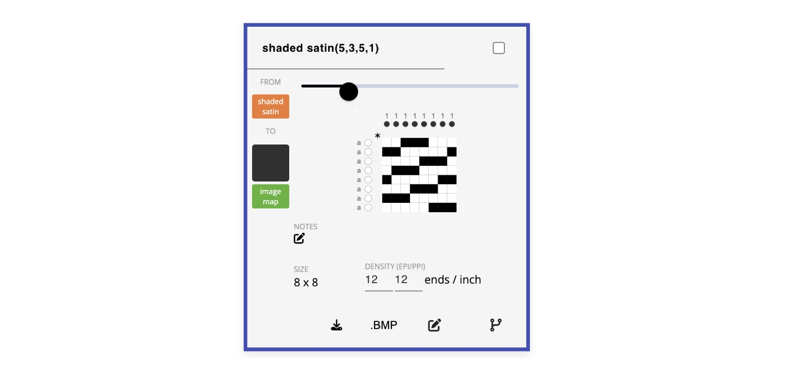

# Library

The library is where you manage everything that belongs to your current workspace file: its name and description, the images you have uploaded, every draft you have made, and the materials you are drafting with.

Where the [workspace](./workspace.md) shows your drafts as nodes in a dataflow and the [draft editor](./draft_editor.md) shows one draft at a time, the library shows you *all* of your drafts at once as a grid of cards. This is especially useful when you are matching drafts to the colors of an image, or when you want to export a batch of drafts to use in another program like Photoshop.

You enter the library by clicking the <FAIcon icon="fa-solid fa-book-open" size="1x" /> book icon in the **design mode** toggle on the [topbar](./topbar.md#c-design-mode-toggle). You can also arrive here from the draft editor by clicking its **Add/Edit Materials** button, which opens the library and scrolls down to the materials section.

<!-- TODO (screenshot): capture a labeled overview of Library mode as img/library_key.jpeg, with regions lettered a-e to match the sections below: (a) project info, (b) media, (c) drafts, (d) a single draft info card, (e) materials. -->

## a. Project Info

The panel at the top of the library describes the workspace file as a whole.

- **Workspace Name**: the name of this file. This is the same name shown in the `filename` box in the footer, and it is the name used when you download the file (e.g. `your_name.ada`) or save it to your AdaCAD account. A **Save** button appears next to the field once you start typing.
- **Project Description**: a longer free-text description of what this workspace is for. This description is also shown to other people if you share the file publicly. A **Save** button appears once you edit it.
- **Last Saved**: the date and time this file was last saved to your AdaCAD account. This only appears if the file has been saved.
- **AdaCAD Database ID**: the unique id AdaCAD uses to store this file. It is useful to include this number if you are reporting a bug about a specific file.
- **Shared file credit line**: if you opened this workspace from someone else's shared link, this shows who made it.
- <FAIcon icon="fa-solid fa-share-nodes" size="1x" /> **Share**: opens the same sharing options as the **Share** button in the footer, letting you publish a link to this workspace, pick a license, and write a credit line.

## b. Media

Some operations, like <OpLink name="imagemap" />, take an image as an input. Every image you upload into the workspace is collected here so you can see what you have imported and where it is being used.

Each media card shows:

- a thumbnail of the image and its name,
- **used in:** followed by one button per operation that currently uses this image. Clicking that button, marked with the <FAIcon icon="fa-solid fa-eye" size="1x" /> eye icon and colored to match the operation's category, jumps you to that operation in the [workspace](./workspace.md).
- the image's pixel dimensions, written as `width × height px`.

Two actions are available on each card:

- <FAIcon icon="fa-solid fa-download" size="1x" /> **Download media item**: saves the original image back to your computer.
- <FAIcon icon="fa-solid fa-trash" size="1x" /> **delete media item**: removes the image from the workspace. This button only appears for images that are not currently used by any operation, so you cannot accidentally break a dataflow.

If you have not uploaded any images, this section reads *No media uploaded to this workspace.*

## c. Drafts

This section lists every draft in the workspace as a grid of [draft info cards](#draft-info-cards). Above the grid are actions that apply to the whole collection:

- <FAIcon icon="fa-solid fa-download" size="1x" /> **Download All Drafts as Bitmaps**: saves every draft in the workspace as a bitmap file. If you have checked the box on one or more cards, this button instead reads **Download Selected Drafts as Bitmaps** and only exports those.
- <FAIcon icon="fa-solid fa-eye-slash" size="1x" /> **Hide Selected Drafts**: hides the checked drafts. Hiding a draft removes it from this grid and from the workspace view, which is a good way to reduce clutter and speed up a large file. This button only appears once you have checked at least one card.
- <FAIcon icon="fa-solid fa-eye" size="1x" /> **Show N Hidden Drafts**: brings all hidden drafts back into view. This button only appears if there are hidden drafts.
- <FAIcon icon="fa-solid fa-upload" size="1x" /> **Import Drafts**: opens a menu with **...from Bitmap(s)** and **...from .WIF File(s)**, letting you bring drafts made elsewhere into this workspace. You can select multiple files at once. This button is disabled when you are offline.

If the workspace has no drafts, this section reads *No drafts in this workspace.*

## d. Materials

The materials library lists every yarn or color available to use in this workspace. In earlier versions of AdaCAD this lived behind a palette icon on the topbar; it now lives here.

Every material has:

- **name**: a label for the yarn, such as "cotton 8/2 red".
- **color**: a color picker. This color is what gets drawn when the material is used in the [viewer's](./viewer.md) color pattern and simulation renderings, and it is the color you paint with when you use a material pencil in the [draft editor](./draft_editor.md#a-editing-tools).
- **diameter**: the thickness of the yarn in millimeters. This affects how the yarn is drawn in the simulation and in the viewer's "actual" size rendering.
- **Add Notes**: free text for anything else you want to record about the yarn, such as a supplier or a fiber content.
- <FAIcon icon="fa-solid fa-trash" size="1x" /> a delete button, available as long as more than one material remains.

Below the list, the **Add New Material** row has the same fields plus a <FAIcon icon="fa-solid fa-plus" size="1x" /> button to add the new material to the library.

Two buttons above the list let you move a material palette between workspaces or spreadsheets:

- <FAIcon icon="fa-solid fa-download" size="1x" /> **Export Materials as CSV**: downloads the current material list as a spreadsheet.
- <FAIcon icon="fa-solid fa-upload" size="1x" /> **Import Materials from CSV**: replaces the current material list with one loaded from a spreadsheet. AdaCAD will ask you to confirm before replacing your existing materials.

## Draft Info Cards

Each card represents one draft. Clicking anywhere on a card selects that draft, which loads it into the [viewer](./viewer.md) on the right of the screen. The selected card is outlined so you can tell which one you are looking at.

### Information shown on a card

- **Name**: an editable text field at the top of the card. Press `enter` or click **Save** to apply a new name.
- **Checkbox**: in the top right, used to include this draft in the bulk download and hide actions described above.
- **From**: the [operation](../glossary/operation.md) that generated this draft, colored by that operation's category. If the draft was not made by an operation, this reads `seed`, meaning it is a [seed draft](../glossary/seed-draft.md) you created or imported yourself.
- **To**: every operation that this draft is currently connected into as an input. This lets you see at a glance where a draft is being used downstream. Drafts feeding an <OpLink name="imagemap" /> operation show a color swatch indicating which color in the image they have been assigned to.
- **Preview**: a small rendering of the draft, with a slider above it to zoom the preview in and out.
- **notes**: any notes you have written about this draft, with an <FAIcon icon="fa-solid fa-pen-to-square" size="1x" /> edit button that opens the **Update Draft Info** dialog.
- **size**: the dimensions of the draft, written as ends by picks.
- **density (epi/ppi)**: the warp and weft density recorded for this draft, along with the current units.

### Actions on a card

- <FAIcon icon="fa-solid fa-download" size="1x" /> **download draft**: opens a menu offering the draft as a **Bitmap**, an **Image**, a **.WIF** file, or a **Coloring Page**.
- **.BMP**: a shortcut that immediately downloads the draft as a bitmap, without opening the menu.
- <FAIcon icon="fa-solid fa-pen-to-square" size="1x" /> **open the draft in the editor**: switches to the [draft editor](./draft_editor.md) with this draft loaded.
- <FAIcon icon="fa-solid fa-code-branch" size="1x" /> **open the draft in the mixer**: switches to the [workspace](./workspace.md) and scrolls to this draft's node.