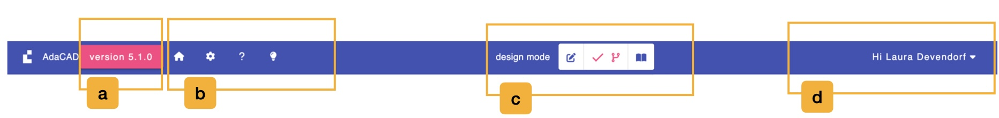
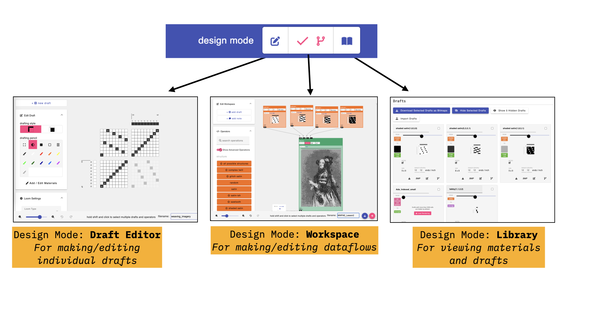
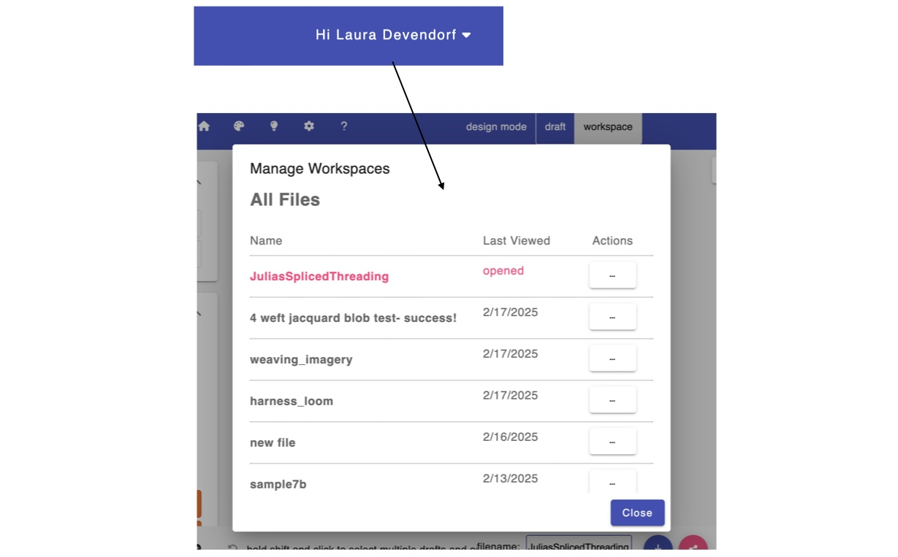

# Topbar

The topbar consists of a series of menus and functions that manage the AdaCAD application overall. 

The topbar is split into several regions, and we'll explain the function of each region below: 

## a. Version Information
This shows the current version of AdaCAD. As a work in progress, we're continually making updates to the software. When this number changes, it means we added or changed something.

Clicking it opens the **Welcome to AdaCAD 5** window, which lists the newest features, points you at the places you can report a bug (the [GitHub issue tracker](https://github.com/UnstableDesign/AdaCAD/issues), the [Discord server](https://discord.gg/Be7ukQcvrC), or email), and gives you buttons to **Use AdaCAD 4** or **Use AdaCAD 3** if you need to go back to an older version of the software.

## b. Application Settings and Support
This collection of buttons gives you access to functions, settings, and resources that are used in all parts of the application.

- <FAIcon icon="fa-solid fa-house" size="1x" /> **Files**: opens the file menu, described in detail [below](#the-file-menu).
- <FAIcon icon="fa-solid fa-gear" size="1x" /> **Workspace Settings**: opens the settings for this workspace, described in detail [below](#workspace-settings).
- <FAIcon icon="fa-solid fa-question" size="1x" /> **Get Help**: opens a menu with three links: **Open Documentation** (this site), **Ask Questions on Discord**, and **Report Issue on GitHub**.
- <FAIcon icon="fa-solid fa-lightbulb" size="1x" /> **Explore Examples**: opens the examples window. It has two tabs: **AdaCAD Templates**, which are workspaces we built to demonstrate a particular technique, and **Community Projects**, which are workspaces that other AdaCAD users have chosen to share publicly. Each example offers an **Open** button to load it, and a **Learn More** button if there is a tutorial or writeup to go with it.

:::info

In earlier versions of AdaCAD, a <FAIcon icon="fa-solid fa-palette" size="1x" /> palette button on the topbar opened the materials library. Materials are now managed in the [library](./library.md#d-materials) instead.

:::

### The File Menu

The <FAIcon icon="fa-solid fa-house" size="1x" /> house icon opens a menu for loading, saving, importing, and exporting your work.

- **New Workspace**: clears the screen and starts over with a blank workspace.
- **Manage Saved Files**: opens the file browser for the workspaces saved to your AdaCAD account. Requires that you are logged in and online.
- **Open .Ada Workspace**: opens a submenu with two choices. **From Computer** loads a `.ada` file from your own machine. **From AdaCAD Cloud** opens the file browser for your saved files.
- **Import Draft(s)**: opens a submenu offering **...from Bitmap(s)** and **...from .WIF File(s)**. You can select several files at once, and each one becomes its own draft in your workspace.
- **Export**: opens a submenu for saving things to your computer. **Current Workspace** downloads the whole file as `.ada`. The remaining options act on whichever draft is currently selected in the [viewer](./viewer.md), and let you save it as a **Bitmap**, an **Image**, a **.WIF** file, or a **Coloring Page**.
- **Save**: saves the workspace to your AdaCAD account. Requires that you are logged in and online. You can also do this by pressing `command` + `s`.
- **About**: opens this documentation site.

Menu items that need an internet connection or an account are greyed out when you are working offline or logged out.

### Workspace Settings

The <FAIcon icon="fa-solid fa-gear" size="1x" /> gear button opens the **Workspace Settings** window. These settings apply to the whole workspace rather than to a single draft.

#### Origin
Specifies the orientation of your drafts and structures, meaning where the first end and first pick sit. You can choose **top right**, **bottom right**, **bottom left**, or **top left**. AdaCAD uses **top left** by default.

#### Default Loom Type
Assigns a type of loom as the default for this workspace, so that every new draft is created for that loom. You can choose **Direct Tieup Loom**, **Shaft/Treadle Loom**, or **Jacquard**. The **Overwrite** button applies your current selection to every draft already in the workspace, not just to new ones.

#### Units
Sets the unit of measurement used for density throughout the interface: **Ends per Inch** or **Ends per 10cm**.

#### Warp Density
Sets the default warp density for all drafts. This does not change how a draft looks in the [draft editor](./draft_editor.md), but it does determine the predicted width of the cloth and how the draft is drawn in the [simulation](./viewer.md#simulation).

#### Hide Drafts on All Operations
The **Hide Drafts** toggle controls whether you see the draft that each operation produces, or just the operation itself. Hiding drafts saves a lot of space on the workspace, and is worth turning on if you are experiencing slowdowns.

#### Operations
The **Show Advanced Operations** toggle controls whether advanced operations appear in the [operation search panel](./workspace.md#b-add-operations-to-workspace). This is the same setting as the **Show Advanced** toggle in the workspace sidebar.

#### Optimize
These controls help when a workspace has grown large enough to slow the software down.

- **Hide all Drafts**: turns on the hide-drafts setting described above. Useful when you have many large drafts in one dataflow.
- **Convert all Drafts to Jacquard**: changes every draft to the jacquard loom type. Because jacquard drafts do not require AdaCAD to compute a threading, tie-up, and treadling, this speeds up computation considerably.
- **Maximum Draft Area**: the largest size, in total cells, that any single draft is allowed to reach. It is set to 2500 x 2500 (6,250,000) by default. Raising it may slow down the interface. Click **Save** to apply a new value.
- **Draft Rendering Hidden Area**: the largest number of cells a draft can have before AdaCAD stops drawing it automatically. It is set to 50 x 50 (2,500) by default. Click **Save** to apply a new value.

## c. Design Mode Toggle
This lets you switch between the three modes of working in AdaCAD:

- <FAIcon icon="fa-solid fa-pen-to-square" size="1x" /> the [draft editor](./draft_editor.md), for designing one draft at a time using a point paper drafting style.
- <FAIcon icon="fa-solid fa-code-branch" size="1x" /> the [workspace](./workspace.md), for building dataflows that generate drafts. This is where AdaCAD starts.
- <FAIcon icon="fa-solid fa-book-open" size="1x" /> the [library](./library.md), for managing this file's drafts, media, and materials.

The [viewer](./viewer.md) is not one of these modes. It stays on the right-hand side of the screen no matter which mode you are in, so you can always see a rendering of the draft you have selected.

<!-- TODO (screenshot): img/topbar_modes.jpeg predates AdaCAD 5 and shows only two design modes. Re-capture showing all three (editor, workspace, library). -->

## d. Login or Manage Your Account
Users who create an AdaCAD account are able to save files online. Creating an account requires an email and is managed through Google. We only do it so we can associate the workspaces that you are working on with your email so that you can save, edit, and share them as you wish. If you do have an account, and you click your username, it will open a menu that lets you **Manage Saved Files** or **Log Off**.

If AdaCAD cannot reach the internet, this area instead reads *No Internet Connection, Working in Offline Mode*. You can keep drafting while offline, but anything that involves your account or uploading a file will be unavailable until the connection comes back.

<!-- TODO (screenshot): img/topbar_files.jpeg is from AdaCAD 4. Re-capture the current file browser, which now has "Your Files" and "Shared Files" tabs. -->

## e. Footer

The footer runs along the bottom of the screen and, like the topbar, is present in every mode.

On the left are the view controls:

- <FAIcon icon="fa-solid fa-arrows-to-eye" size="1x" /> **Fit to Window**: resizes and scrolls the view so that your entire dataflow is visible. If you have selected or multi-selected drafts and operations, this fits the view to your selection instead.
- <FAIcon icon="fa-solid fa-search-minus" size="1x" /> **Zoom Out**: zooms out. You can also do this by pressing `command` + `-`.
- **Zoom Slider**: reflects the current level of zoom and can be moved freely to zoom in and out.
- <FAIcon icon="fa-solid fa-search-plus" size="1x" /> **Zoom In**: zooms in. You can also do this by pressing `command` + `+`.
- <FAIcon icon="fa-solid fa-rotate-left" size="1x" /> **Undo**: steps back through your edits. You can also do this by pressing `command` + `z`. The number beside the button tells you how many edits are currently stored.

The center of the footer is used by the [workspace](./workspace.md#e-adjust-view-save-and-share) for its multi-select controls.

On the right are the options for naming, downloading, and sharing:

- the **filename** text box gives this workspace a name. This is the name used when you download the file (e.g. `your_name.ada`) or save it to your AdaCAD account. Press `enter` or click **Save** to apply it.
- <FAIcon icon="fa-solid fa-download" size="1x" /> **Download**: offers the same export options as the file menu, letting you save the workspace as a `.ada` file or the selected draft as a bitmap, image, `.WIF`, or coloring page.
- <FAIcon icon="fa-solid fa-share-nodes" size="1x" /> **Share**: creates a link to your workspace. In the sharing window you can turn sharing on or off, choose a Creative Commons license, write a description and credit line, add an image, and opt to have your file included in the **Community Projects** tab of the examples window.
