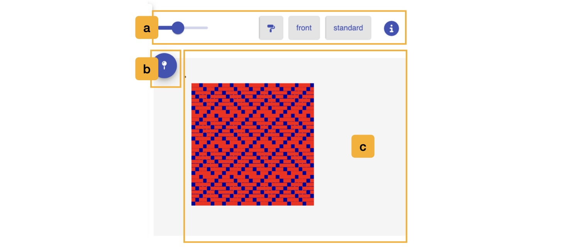
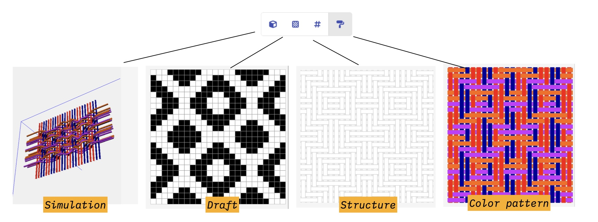
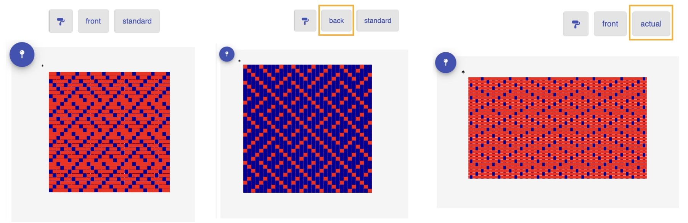
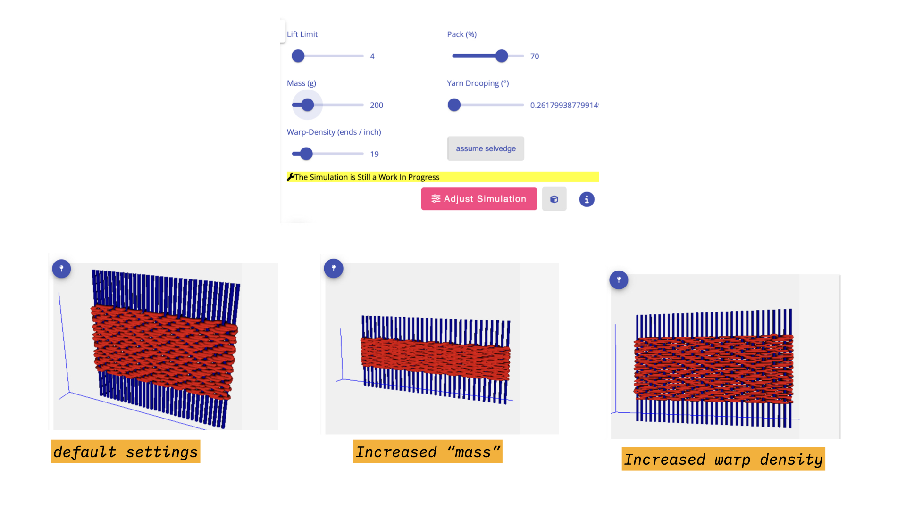

# Viewer

The viewer allows you to view a specific draft in a variety of formats. 

## Overview

The viewer occupies the right-hand side of the screen. Unlike the [workspace](./workspace.md), [draft editor](./draft_editor.md), and [library](./library.md), it is not one of the design modes: it stays visible no matter which mode you are working in, so you can always see a rendering of the draft you have selected.

##  Selecting the Draft to View
The draft that is currently on view in the Viewer is based on which draft is currently selected in the [workspace](./workspace.md), the current draft on view in the [draft editor](./draft_editor.md), or the draft card you last clicked in the [library](./library.md). In the workspace, you select a draft by clicking upon it. A dotted border appears around the draft to show that it is actively on view. 

If nothing is selected, the viewer reads *no draft selected, select a draft to visualize*.

## a. View Controls

- <FAIcon icon="fa-solid fa-eye" size="1x" /> **Rendering Mode**: AdaCAD offers four different ways of rendering the draft, demonstrated in the image above: 
    - <FAIcon icon="fa-solid fa-cube" size="1x" /> **view in 3D**: offers a 3D rendering of the draft. See [the simulation](#the-simulation) below.
    - <FAIcon icon="fa-solid fa-chess-board" size="1x" /> **view as draft**: draws only the draft as represented by black and white cells. 
    - <FAIcon icon="fa-solid fa-hashtag" size="1x" /> **view structure**: draws warp and weft floats that would be produced by the draft, without color so as to aid in visualizing the cloth structure. 
    - <FAIcon icon="fa-solid fa-paint-roller" size="1x" /> **view color pattern**: draws warp and weft floats that would be produced by the draft and also draws the colors that would be visible on the surface of the cloth. 

- **front / back**: switches between looking at the face of the cloth and looking at its reverse. This is useful for double cloth and any other structure where the two sides differ.

- **actual / standard**: controls whether the rendering uses each material's real diameter, set in the [materials library](./library.md#e-materials) and the looms warp density, set in the [draft editor](./draft_editor.md#a2-adjust-loom-and-draft-settings), or draws every yarn at the same uniform size. "Actual" gives a better sense of how a cloth woven with mixed yarn weights will really look; "standard" keeps the structure easier to read.

- <FAIcon icon="fa-solid fa-circle-info" size="1x" /> **Draft Information**: opens a small panel above the rendering showing the draft's **name**, its **dimensions** in ends by picks, and any **notes** you have written. The name and notes each have an <FAIcon icon="fa-solid fa-pen-to-square" size="1x" /> edit button that opens the **Update Draft Info** dialog.

The front/back and actual/standard toggles, along with the zoom slider, are hidden while you are in the 3D simulation, since they do not apply there.

###  Simulation

The <FAIcon icon="fa-solid fa-cube" size="1x" /> 3D view builds a simulation of the woven cloth rather than a flat drawing of it. It is still a work in progress, as the banner in the viewer notes, and it will only work for drafts of a modest size. If a draft is too big, the viewer shows a **Size Error** asking you to reduce the number of warps and wefts.

You can orbit, pan, and zoom the 3D view by dragging in it with your mouse.

Clicking <FAIcon icon="fa-solid fa-sliders" size="1x" /> **Adjust Simulation** reveals a set of sliders that change the physical assumptions the simulation makes:

| Control | What it changes |
| ------- | --------------- |
| **Lift Limit** | a number used to determine how agressively the simulation should try to identify layers. A higher number will be more aggressive  |
| **Pack (%)** | how tightly the picks are beaten together. A higher number would indicate a stronger beat after each pick.|
| **Mass (g)** | an abstract value given to each "interlacement", or place where the weft crosses sides of the cloth. The simulation uses these values to determine how much interlacements should repel one another. This allows us to get teh simulation to behave similarly to how packing interlacements density creates less packed cloth. A higher map means that the interlacements will repel less. High mass, low repulsion; low mass, high replusion.   |
| **Yarn Drooping (°)** | how far a yarn is allowed to bend away from straight as it crosses a float |
| **Warp-Density** | the spacing of the warps, in the units set in your [workspace settings](./topbar.md#units). This starts from the density recorded for the draft in the [draft editor's loom settings](./draft_editor.md#c-adjust-loom-and-draft-settings) |
| **no selvedge / assume selvedge** | whether the simulation treats each pick as written, which might lead to subsequent wefts pulling out if no selvedge has been added, or assumes the weft turns at a selvedge and carries through |

## b. Pin Draft
<FAIcon icon="fa-solid fa-map-pin" size="1x" /> **Pin Draft**: Clicking this "pins" the currently selected draft to the viewer, meaning that this draft will remain selected even if another draft upon the workspace is clicked (for instance, to change the value of a parameter). You might use this to visualize how changes made upstream of this draft affect its appearance. 

## c. Rendering
The rendering of the draft is drawn into this window. If the rendering is larger than the view window, you can use the zoom bar and or scroll bars to explore it. 

