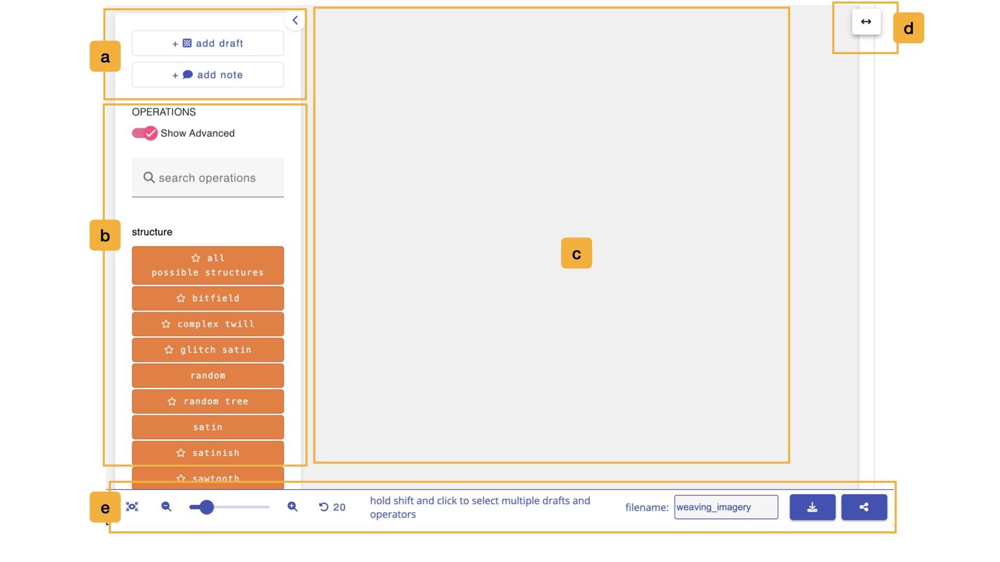
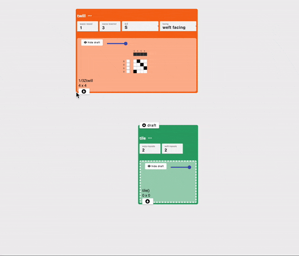

# Workspace

The workspace mode is where you create [dataflows](../glossary/dataflow) to generate drafts. You create dataflows by adding [drafts](../glossary/seed-draft.md) and [operations](../glossary/operation.md) to the workspace and chaining them together into draft generating workflows. 

<!-- TODO (screenshot): img/workspace_key.jpeg is from AdaCAD 4 and is out of date. It predates the collapsible sidebar and the multi-select controls in the footer. Re-capture and re-letter as: (a) add drafts or notes, (b) add operations, (c) dataflow canvas, (d) resize window, (e) footer. -->

## a. Add Drafts or Notes to Workspace
The buttons in this window let you add new kinds of nodes to your dataflow workspace. Specifically, you can add drafts or notes.
-  \+ <FAIcon icon="fa-solid fa-chess-board" size="1x" /> add draft,  will open a window to ask for  you to the number of warps and wefts and then will add a blank draft of those dimensions to workspace.
- \+ <FAIcon icon="fa-solid fa-comment" size="1x" /> add note, it will automatically add a note onto the workspace. You can use this note to jot down any additional text information about your workspace. 

You can collapse this whole sidebar to give the canvas more room by clicking the <FAIcon icon="fa-solid fa-chevron-left" size="1x" /> **Collapse sidebar** button at its edge. When collapsed, the sidebar shrinks to three icons, <FAIcon icon="fa-solid fa-chess-board" size="1x" /> **Add Draft**, <FAIcon icon="fa-solid fa-comment" size="1x" /> **Add Note**, and <FAIcon icon="fa-solid fa-search" size="1x" /> **Search Operations**, the last of which opens the operation search in a pop-up window instead. Click <FAIcon icon="fa-solid fa-chevron-right" size="1x" /> **Expand sidebar** to bring it back.

## b. Add Operations to Workspace
This side panel allows you to search through and add operations to your workspace. By default, it only shows basic operations. To see all operations, you must enable the **Show Advanced** toggle. 
- <FAIcon icon="fa-solid fa-search" size="1x" /> type in the name of the operation you are looking for into this search box. As you type, the operations below will only include those that match your search. Pressing `enter` adds the first matching operation straight to the workspace and clears the search.
- the **Show Advanced** toggle is used to show or hide operations that we consider to be advanced. We use it to reduce clutter for new users but once you get a hang of things, flip this toggle to show and explore all the operations AdaCAD has to offer. Advanced operations are marked with a <FAIcon icon="fa-solid fa-star" size="1x" /> star so you can tell them apart. This is the same setting as **Show Advanced Operations** in the [workspace settings](./topbar.md#operations).
- The rest of the window is devoted to showing one button for each [operation](../glossary/operation.md) that AdaCAD supports. Clicking on any of the operations in this list adds it to your workspace. Operations are grouped and color-coded based on how they tend to be used in the drafting process. Hovering over an operation shows a short description of what it does. You can explore these groupings and all the operations we currently offer by clicking [Reference->Operations(A-Z)](../operations/index.md) in the left sidebar of this page. 

## c. Dataflow Workspace

This area is used to create your [dataflows](../glossary/dataflow.md). You can do this by adding drafts and operations using the interface buttons listed above and then "connecting" them together by connecting the [outlet](../../reference/glossary/outlet.md) of one operation or draft node to the [inlet](../../reference/glossary/inlet.md) of an operation. 

To create a connection, start by clicking the outlet of one node (node a - twill in the example below) to the inlet of another (node b - tile in the example below). This action tells AdaCAD to take the draft created node a and use it as an input to the operation at node b. Node b then runs the operation, and manipulates the draft in accordance with that operations specific code and user-defined parameters. 

### Video
We also offer this video overview of the process of making dataflows: 

<iframe width="560" height="315" src="https://www.youtube.com/embed/kqIYEEV04kM?si=9pgVrze9bFJbVu4K" title="YouTube video player" frameborder="0" allow="accelerometer; autoplay; clipboard-write; encrypted-media; gyroscope; picture-in-picture; web-share" allowfullscreen></iframe>

### Key Commands

Mac users should read `command` below; Windows and Linux users should read `control`.

| Action | How |
| ------ | --- |
| Select a draft and show it in the [viewer](./viewer.md) | **click** it |
| Add to a multi-selection | hold **shift** and **click** each node |
| Select everything in a region | hold **shift** and **drag** across empty canvas |
| Clear the selection | **click** empty canvas |
| Move nodes | **drag** them. Multi-selected nodes move together |
| Open a node's menu | **double click** it |
| Copy the selection | `command` + `c` |
| Paste the selection | `command` + `v` |
| Undo | `command` + `z` |
| Save to your AdaCAD account | `command` + `s` |
| Zoom in / out | `command` + `+` / `command` + `-` |
| Zoom at the cursor | hold `command` and use the **track pad or mouse-wheel** |
| Scroll the workspace | **track pad or mouse-wheel** |
| Pan the workspace | hold **space** and **drag**, or **drag** with the middle mouse button |
| Pan in steps | the **arrow keys** |
| Bump the dataflow back into view | `command` + `b` |
| Spread the dataflow out | `command` + `e` |

The **bump** command is worth remembering. If a draft ends up scrolled somewhere you cannot reach, `command` + `b` moves the whole workflow down and to the right until it is back in view.

### Draft Nodes

Each draft on the workspace shows its rendering, its name, and its dimensions written as ends by picks. Along its edges you will find:

- a **zoom slider** that scales just this one draft's rendering, which is handy for shrinking a large draft without zooming the whole workspace.
- <FAIcon icon="fa-solid fa-eye-slash" size="1x" /> **hide**, which collapses the rendering down to a small bar. Once hidden, an <FAIcon icon="fa-solid fa-eye" size="1x" /> button brings it back.
- <FAIcon icon="fa-solid fa-edit" size="1x" /> **rename**, which opens a dialog to change the draft's name and notes.
- <FAIcon icon="fa-solid fa-circle-down" size="1x" /> the **outlet**, at the bottom of the draft. Click it to start a connection into an operation.
- <FAIcon icon="fa-solid fa-map-pin" size="1x" /> a **pin indicator**, shown only if this draft is currently pinned in the viewer. Clicking it unpins the draft.

Clicking the <FAIcon icon="fa-solid fa-ellipsis" size="1x" /> **View Options** button, or double-clicking the draft, opens a menu with:

- <FAIcon icon="fa-solid fa-map-pin" size="1x" /> **pin for view** / **unpin from view**: keeps this draft in the [viewer](./viewer.md) even as you click around elsewhere.
- <FAIcon icon="fa-solid fa-pen-to-square" size="1x" /> **open in editor**: opens the draft in the [draft editor](./draft_editor.md).
- <FAIcon icon="fa-solid fa-clone" size="1x" /> **duplicate**: makes a copy of the draft on the workspace.
- <FAIcon icon="fa-solid fa-download" size="1x" /> **download as bitmap**, <FAIcon icon="fa-solid fa-image" size="1x" /> **download as image**, and <FAIcon icon="fa-solid fa-file" size="1x" /> **download as .WIF file**.
- <FAIcon icon="fa-solid fa-times" size="1x" /> **delete**.

Drafts that were produced by an operation show a reduced set of these controls, because the operation, not you, decides what they contain.

### Operation Nodes

An operation node shows its name, its [inlets](../glossary/inlet.md) along the top, its [parameters](../glossary/parameter.md) in the middle, and the drafts it produces at the bottom. If the operation cannot run with the inputs it has been given, a red banner appears across the top explaining what went wrong; click it to dismiss the message.

Operations offer the same <FAIcon icon="fa-solid fa-ellipsis" size="1x" /> **View Options** menu as drafts, with one addition: <FAIcon icon="fa-solid fa-circle-info" size="1x" /> **help**, which opens this documentation site at the reference page for that specific operation.

Parameters appear as different kinds of controls depending on what they accept:

| Parameter type | What you see |
| -------------- | ------------ |
| number | a number field, with the allowed minimum and maximum enforced |
| boolean | a dropdown with two named choices |
| select | a dropdown listing the available options |
| string | a button showing the current value, which opens a larger text editor. These fields also accept pasted `.csv` data, which is useful for long lists such as sensor or climate data |
| file | an upload control for `.jpg`, `.png`, and `.bmp` images, plus buttons to **Replace Image** or **View/Edit Image** |
| canvas | a small drawing canvas embedded in the operation |

Inlets accept different kinds of input too. Most take a draft, but some take a number, a [system](../glossary/system.md), a color, or [layer notation](../glossary/layer-notation.md). Connected inlets show what has been attached to them, and hovering a connection line reveals a <FAIcon icon="fa-solid fa-times" size="1x" /> button to disconnect it.

## d. Resize Window
You can press this button and drag to the left or right to expand/contract the amount of the screen that is devoted to the workspace. 

## e. Adjust View, Save and Share
The footer along the bottom of the screen is shared with every other mode, and is described in full on the [topbar](./topbar.md#e-footer) page. It holds the zoom controls, the undo button, the filename field, and the download and share buttons.

The center of the footer is used by the workspace alone. When nothing is selected, it reminds you that you can *hold shift and click to select multiple drafts and operators*. Once you have a selection, it turns into a set of buttons for acting on it:

- **Deselect**: clears the current selection.
- <FAIcon icon="fa-solid fa-copy" size="1x" /> **copy**: copies the selected nodes, along with any connections between them.
- <FAIcon icon="fa-solid fa-paste" size="1x" /> **paste**: drops that copy back onto the workspace.
- <FAIcon icon="fa-solid fa-trash" size="1x" /> **delete**: removes the selected nodes.
