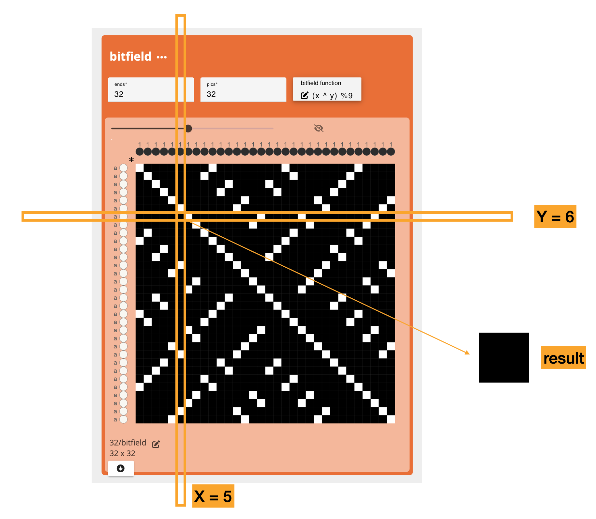

import {OperationHeader} from '@site/src/components/OperationPage';

<OperationHeader name='bitfield' />

## Parameters
- `ends`: the desired number of ends for the structure produced
- `pics`: the desired number of pics for the structure produced 
- `bitfield function`: a functions that will determine which heddles in the draft are  (white/false) or raised(black/true). Each bitfield function takes x and y as input, where x represents the warp number, or end, and y represents the weft number or pick. The x, y coordinate of the origin is 0, 0. You can use a combination of bitwise math and modulo statements to create various expressions and, if the expression returns "true or 1", the x,y pixel is marked with a heddle lowered (white) and if false or 0, heddle raised (black). 


### Understanding Bitfield Functions
One key to the working of these functions is that they can transition between evaluation as bits and evaluation as numbers, for instance, let's figure out the value of pick 5 and end 6 in the statement (x ^ y) % 9:

5, in binary, can be represented as 101. 
6, in binary, can be represented as 110. 

5 ^ 6 = 101 ^ 110, where ^ represents a bitwise XOR operation which returns 1 if the two values it is comparing are different. Specifically we compare the first bits 1 ^ 1, to get 0, the second bits would be 0 ^ 1, which is 1 and the thrid is 1 and 0, which is 1

So, 5 ^ 6 = 101 ^ 110 = 011, which is the same as 3
5 ^ 6 = 3

We then compute 3 % 9 using standard math, which is 3. 

since 3 !== 0, the result is "false" and heddle is raised/black. 





### Bitfield Operators
- x ^ y  XOR: returns true if x and y have different values
- x & y  AND: returns true is both x and y are true
- x | y  OR: returns true if either x or y is true
- ~x     NOT: returns the opposite, if x is true, returns false. 
- x == y EQUALS: returns true if x and y share the same value
- x + y  Addition: Sums the values of x and y
- x - y  Subtraction: Subtracts the value of y from x
- x / y  Division: divides the value of y by x
- x * y  Multiplication: multiplies x and y
- x % y  Modulo: returns the remainder of x divided by y, for example 3 % 2 = 1

Here are a few examples: 

```
(x ^ y) % (x + y)
```


```
(2x * y) % (x ^ y)
```


```
(2x * y) % (x ^ 3)
```


```
(x % y) % 7
```


#### Application
A fun way to think about defining structures mathematically and designing some unexpected patterns. 


### Additional Info
- [https://tixy.land/](https://tixy.land/)
- [Forum Discussion](https://forum.algorithmicpattern.org/t/bytebeat-tixyland-and-other-functions-of-time/396)
- [Another Forum Discussion](https://www.metafilter.com/192164/Patterns)


## Developer
adacad id: `bitfield`

```ts reference
https://github.com/UnstableDesign/AdaCAD/tree/main/packages/adacad-drafting-lib/src/operations/bitfield/bitfield.ts
```