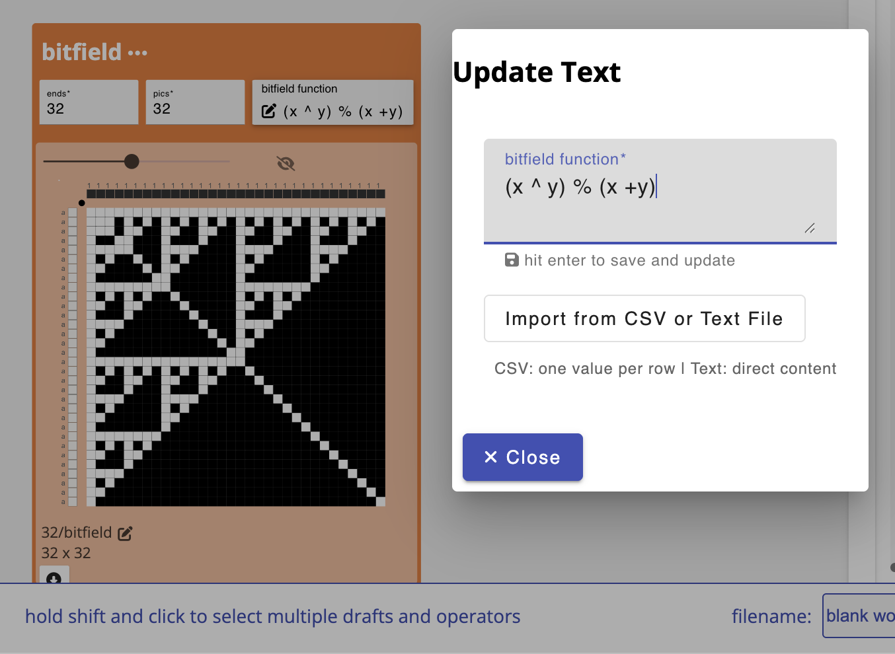
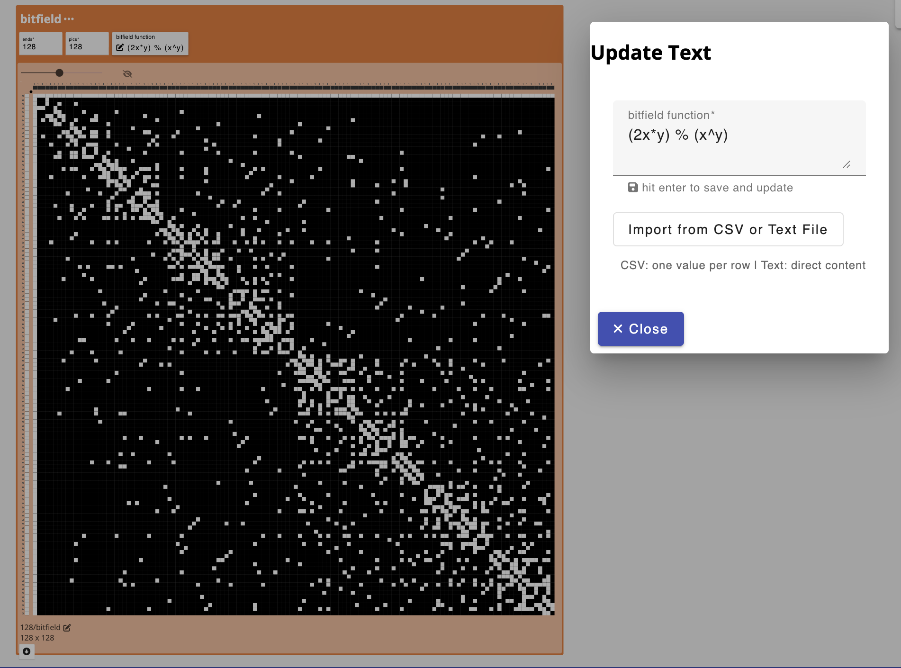
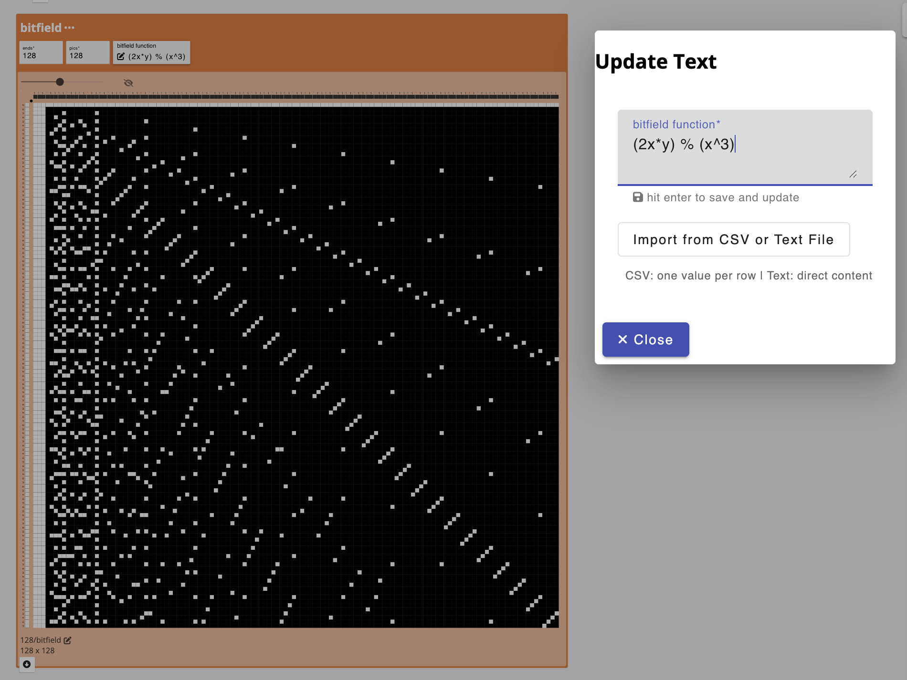
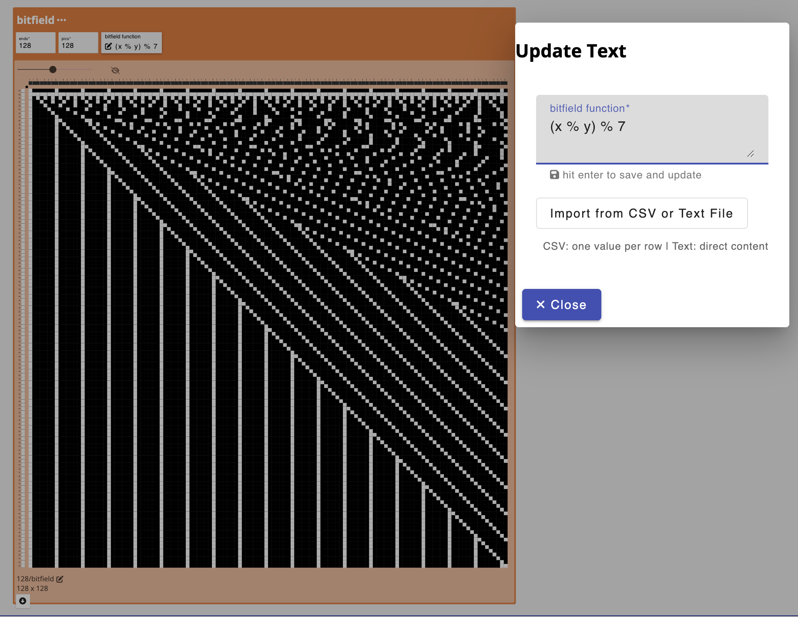

import {OperationHeader} from '@site/src/components/OperationPage';

<OperationHeader name='bitfield' />

## Parameters
- `ends`: the desired number of ends for the structure produced
- `pics`: the desired number of pics for the structure produced 
- `bitfield function`: a functions that will determine which heddles in the draft are lowered or raised. Each bitfield function takes x and y as input, where x represents the warp number, or end, and y represents the weft number or pick. The x, y coordinate of the origin is 0, 0. 0, when evaluated as binary, correlates to the value FALSE. Any non-zero value evaluates to "TRUE".  You can use a combination of bitwise math and modulo statements to create various expressions and, if the expression returns "true", the x,y pixel is marked with a heddle raised and if false, heddle lowered. 


### Operations
- x ^ y  XOR: returns true if x and y have different values
- x & y  AND: returns true is both x and y are true
- x | y  OR: returns true if either x or y is true
- ~x     NOT: returns the opposite, if x is true, returns false. 
- x == y EQUALS: returns true if x and y share the same value
- x + y  Addition: Sums the values of x and y
- x - y  Subtraction: Subtracts the value of y from x
- x / y  Division: divides the value of y by x
- x * y  Multiplication: multiplies x and y
- x % y  Modulo: returns the remainder of x divided by y, for example 3 % 2 = 1

Here are a few examples: 

```
(x ^ y) % (x + y)
```


```
(2x * y) % (x ^ y)
```



```
(2x * y) % (x ^ 3)
```



```
(x % y) % 7
```



#### Application
A fun way to think about defining structures mathematically and designing some unexpected patterns. 


### Additional Info
- [https://tixy.land/](https://tixy.land/)
- [Forum Discussion](https://forum.algorithmicpattern.org/t/bytebeat-tixyland-and-other-functions-of-time/396)


## Developer
adacad id: `bitfield`

```ts reference
https://github.com/UnstableDesign/AdaCAD/tree/main/packages/adacad-drafting-lib/src/operations/bitfield/bitfield.ts
```