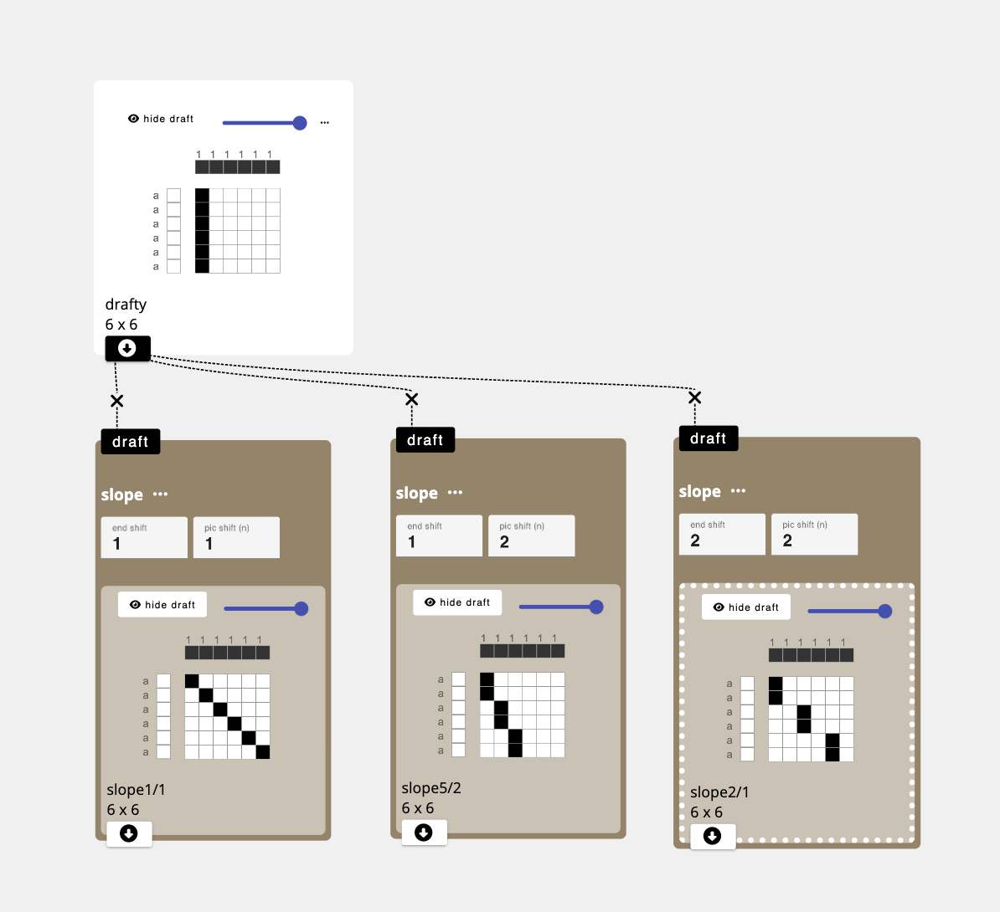

import {OperationHeader} from '@site/src/components/OperationPage';

<OperationHeader name='slope' />

## Parameters
- `end shift`: the number of ends to shift the pattern to the right.
- `pic shift`: the number of pics to count before the slope is applied. 


:::note
this application applies the slope progressively. For instance, if the slope:
-  is 1 pic by 1, it will move the first pic by 1 end, then the second pick by 2 ends (relative to the original), etc.
- is 2 pics by 1 end, the first pic shifts 1 end to the right, second pic also shifts 1 to the right, and the third pic moves 2 to the right. 

These relationships are best visualized by the shift operation being applied to a draft is one single column of raised warps. 




:::

## Application
We do not know of an existing reason, but essentially slants the input draft, which can be fun and delightfully chaotic

## Developer
adacad id: slope

```ts reference
https://github.com/UnstableDesign/AdaCAD/tree/main/packages/adacad-drafting-lib/src/operations/slope/slope.ts
```